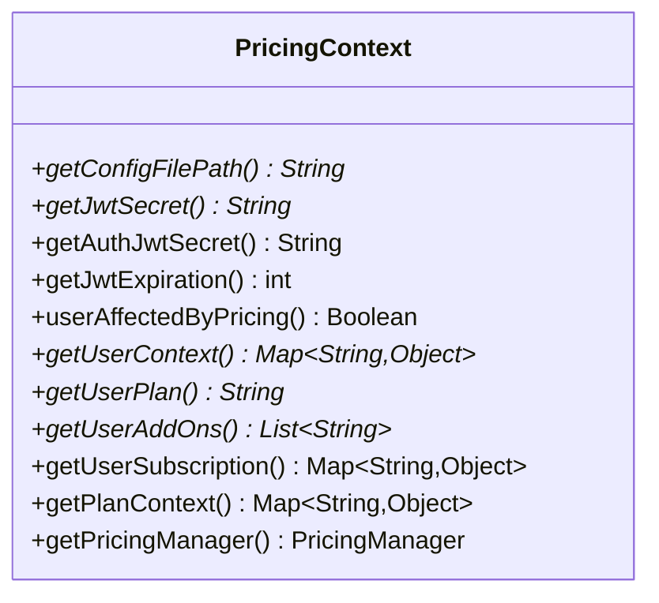

# Class PricingContext

`io.github.isagroup.PricingContext`

This abstract class is the key to manage the YAML configuration inside a Spring application. It provides a set of configurable methods that need to be implemented inside a new `@Component` that extends this class to use other classes of the package. An
implementation of `PricingContext` class may look like the following (Snippet extracted from Petclinic
[demo](https://github.com/isa-group/petclinic-react/blob/master/src/main/java/org/springframework/samples/petclinic/configuration/PricingConfiguration.java)):

```java
@Component
public class PricingConfiguration extends PricingContext {

    @Autowired
    private UserService userService;

    @Value("${petclinic.app.jwtSecret}")
    private String jwtSecret;

    @Override
    public String getConfigFilePath() {
        return "pricing/petclinic.yml";
    }

    @Override
    public String getJwtSecret() {
        return jwtSecret;
    }

    @Override
    public Boolean userAffectedByPricing(){
        Authentication userAuth = SecurityContextHolder.getContext().getAuthentication();

        UserDetailsImpl userDetails = (UserDetailsImpl) userAuth.getPrincipal();
        List<String> roles = userDetails.getAuthorities().stream().map(item -> item.getAuthority())
            .collect(Collectors.toList());

        return roles.contains("OWNER");
    }

    @Override
    public Map<String, Object> getUserContext() {
        try {
            return userService.findUserContext();
        } catch (AuthException e) {
            return new HashMap<>();
        }
    }

    @Override
    public String getUserPlan() {
        try {
            String userPlan = userService.findUserPlan();
            return userPlan;
        } catch (AuthException e) {
            return "BASIC";
        }
    }
}
```

By creating this component inside your project, spring will be able to use this information wherever it is needed.

The class also provides a set of methods that can be used to retrieve information about the pricing configuration anywhere in the app. By injecting the component in any class, the following methods can be used:

- **getPlanContext**: Returns a `Map<String, Object>` that represents the plan context that is going to be evaluated.

- **getPricingManager**: Maps the information of the YAML configuration file to a PricingManager object to easily operate with pricing properties.

## Method summary



## Method details

### getConfigFilePath

`public abstract String getConfigFilePath()`

Returns the path to the Pricing2Yaml configuration file. The `String` path given to the implementation
of this method should point to `Pricing2Yaml` file under `resources` folder.

**Returns:** a path as `String` to a Pricing2Yaml configuration file relative to the resources folder

**Usage:**

Given a `Pricing2Yaml` file located in `src/main/resources/en/pricing.yaml` in this
directory structure:

```txt
src/
├─ java/
├─ main/
│  ├─ resources/
│  │  ├─ en/
│  │  │  ├─ pricing.yaml
│  │  ├─ es/
│  │  │  ├─ pricing.yaml
├─ test/
```

```java
@Override public String getConfigFilePath() {
    return "en/pricing.yaml";
}
```

### getJwtSecret

`public abstract String getJwtSecret()`

Returns the secret used to encode the pricing `JWT`.

**Returns:** JWT secret String

### getAuthJwtSecret

`public String getAuthJwtSecret()`

Returns the secret used to encode the authorization `JWT`

**Returns:** a secret used to sign authorization

### getJwtExpiration

`public int getJwtExpiration()`

Returns the expiration time of the `JWT` in milliseconds.

**Returns:** JWT expiration time in milliseconds

### userAffectedByPricing

`public Boolean userAffectedByPricing`

This method can be used to determine which users are affected by the pricing,
so a pricing-driven `JWT` will be only generated for them.

**Returns:** A `Boolean` indicating the condition to include, or not, the
pricing evaluation context in the `JWT`. Set to `true` by default.

**See also:** [`PricingEvaluatorUtil.generateUserToken()`](pricing-evaluator-util.md)

### getUserContext

`public abstract Map<String,Object> getUserContext()`

This method should return the user context that will be used to evaluate
the pricing plan. It should consider which users has accessed the service
and what information is available.

**Returns:** a Map with the user context

### getUserPlan

`public abstract String getUserPlan()`

This method should return the plan name of the current user. With this information, the library will be able to build the [Plan](./classes-to-manage-pricing/plan.md) object of the user from the configuration.

**Returns:** a `String` with the current user's plan name that is subscribed.

### getUserAddOns

`public abstract List<String> getUserAddOns()`

This method should return a list with the name/s of the add-ons contracted by
the current user. If the pricing **does not include add-ons**, then just return an **empty array**.
With this information, the library will be able to build the subscription of
the user from the configuration.

**Returns:** a `List<String>` with the current user's contracted add-ons. Add-on names
should be the same as in the pricing configuration file.

### getUserSubscription

`public final Map<String, Object> getUserSubscription()`

Returns a list with the full subscription contracted by the current user
(including plans and add-ons).

- Key `plans` contains the plan name of the user.
- Key `addOns` contains a list with the add-ons contracted by the user.

**Returns:** a `Map<String,Object>` with the current user's contracted subscription.

### getPlanContext

`public final Map<String, Object> getPlanContext()`

This method returns the plan context of the current user, represented by a
`Map`. It's used to evaluate the pricing plan.

**Returns:** current user's plan context

### getPricingManager

`public final PricingManager getPricingManager()`

This method returns a [PricingManager](./classes-to-manage-pricing/pricing-manager.md) instance that represents
your Pricing2Yaml configuration file in a Java object.

**Returns:** a [PricingManager](./classes-to-manage-pricing/pricing-manager.md) object
