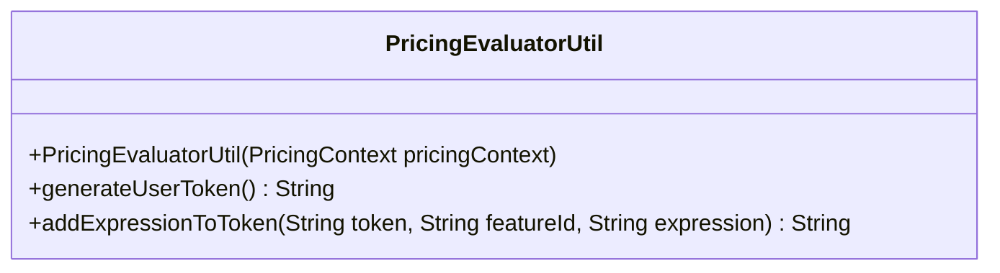

# Class PricingEvaluatorUtil

**Package** `io.github.isagroup`

`public class PricingEvaluatorUtil extends Object`

Utility class that provides methods to generate and manage JWT that contains
the pricing plan evaluation context.

It can be used to evaluate the context of an user compared to his plan and
**generate a JWT** with the results, using a single java method. This class
consumes the information of the configured
[PricingContext](pricing-context.md) to perform its operations.

Once a class that extends from [PricingContext](pricing-context.md) exists inside your Spring application,
`PricingEvaluatorUtil` can be injected in any bean by using `@Autowired`. Once declared, the token can
be generated using the [generateUserToken](#generateusertoken) method:

```java
import io.github.isagroup.PricingEvaluatorUtil;

@Component
public class MyComponent {

    @Autowired
    private PricingEvaluatorUtil pricingEvaluatorUtil;

    public String myMethod() {
        String token = pricingEvaluatorUtil.generateUserToken();
        String newToken = pricingEvaluatorUtil.addExpressionToToken(
            firstToken,
            "feature1",
            "userContext['feature1use'] < planContext['usageLimits']['feature1']");
        return token;
    }
}
```

Considering one `BOOLEAN` and two `NUMERIC` features, `myMethod` may generate a JWT with the following payload:

```json
{
  "features": {
    "feature1": {
      "eval": "userContext['feature1use'] < planContext['usageLimits']['feature1Limit']",
      "used": 2,
      "limit": 2
    },
    "feature2": {
      "eval": true,
      "used": 1,
      "limit": 5
    },
    "feature3": {
      "eval": false,
      "used": null,
      "limit": null
    }
  },
  "sub": "Default",
  "exp": 1746083891,
  "userContext": {
    "feature1use": 2,
    "feature2use": 1
  },
  "iat": 1745997491,
  "planContext": {
    "name": "BASIC",
    "description": null,
    "price": 0,
    "unit": "user/month",
    "isPrivate": false,
    "features": {
      "feature1": false,
      "feature2": true,
      "feature3": false
    },
    "usageLimits": {
      "feature1Limit": 2,
      "feature2Limit": 5
    }
  }
}
```

## Method summary



## Constructor details

### PricingEvaluatorUtil

`public PricingEvaluatorUtil(PricingContext pricingContext)`

**Parameters:**

`pricingContext` - The corresponding implemented [PricingContext](pricing-context.md) object

## Method details

### generateUserToken

`public String generateUserToken()`

Generate a user authentication JWT that **includes** the pricing **plan evaluation context**.
This token is generated by using the information provided by the configured [PricingContext](pricing-context.md).

**Returns:** a `String` with the encoded JWT that contains all the information

### addExpressionToToken

`public String addExpressionToToken(String token, String featureId, String expression)`

Modifies the given JWT by changing the evaluation of the given feature by a
`String` expression that will be evaluated on the client side of the application.

**Parameters:**

`token` - JWT returned generated by [generateUserToken](./pricing-evaluator-util.md#generateusertoken) method

`featureId` - the name or id of the feature that is defined inside the token body

`expression` - the expression of the feature that will replace its evaluation

**Returns:** a modified version of the provided JWT that contains the new expression in the `eval` attribute
of the feature inside `features` claim.

**Usage:**

```java
public class Example {

    private PricingEvaluatorUtil pricingEvaluatorUtil;

    public Example(PricingEvaluatorUtil pricingEvaluatorUtil) {
      this.pricingEvaluatorUtil = pricingEvaluatorUtil;
    }

    public static void main(String[] args) {
        String firstToken = pricingEvaluatorUtil.generateUserToken();
        String newToken = pricingEvaluatorUtil.addExpressionToToken(
            firstToken,
            "feature1",
            "userContext['feature1use'] < planContext['usageLimits']['feature1']");
    }
}
```

The new payload for the JWT token will have:

```json
{
  "features": {
    "feature1": {
      "eval": "userContext['feature1use'] < planContext['feature1']",
      "limit": 2,
      "used": 2
    }
    // other claims...
  }
}
```
