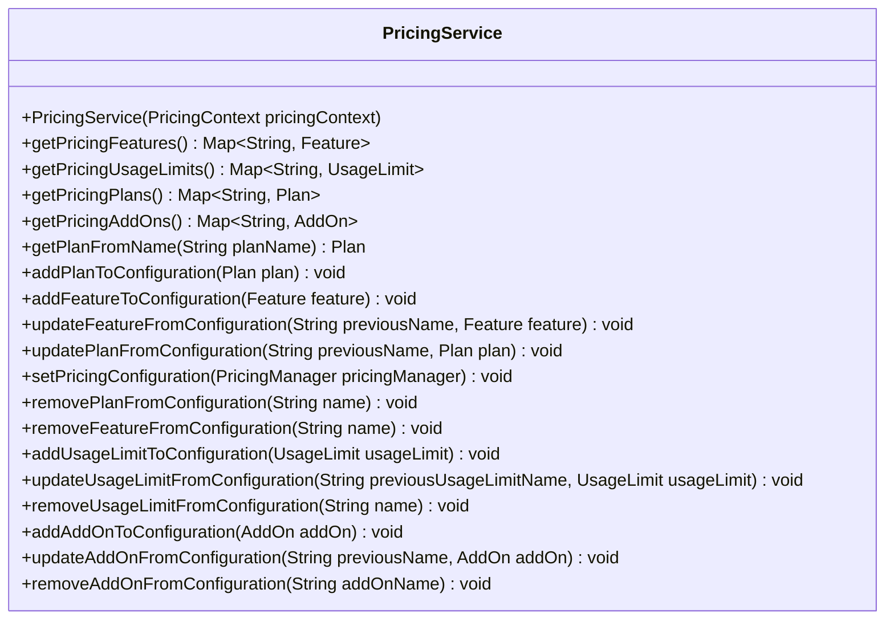

# Class PricingService

**Package** `io.github.isagroup`

`public class PricingService extends Object`

This class offers a set of methods that can be used to manage the pricing configuration without manually modifying the YAML file. It can be used to retrieve, add, remove or modify plans and features.

To use this class in a Spring application, it must be injected in any bean
using `@Autowired`. Once declared, the methods can be used to manage the
pricing configuration.

```java
import io.github.isagroup.PricingService;

@Component
public class MyComponent {

    @Autowired
    private PricingService pricingService;

    public Map<String, Plan> getPricingPlans() {
        Map<String, Plan> plans = pricingService.getPricingPlans();
        return plans;
    }
}
```

As any other spring service, to use this class it must be injected in any bean using @Autowired. Once declared, the methods can be used to manage the pricing configuration.

## Method summary



## Method details

### getPricingFeatures

`public Map<String, Feature> getPricingFeatures()`

**Returns:** the features defined in the current pricing configuration

### getPricingUsageLimits

`public Map<String, UsageLimit> getPricingUsageLimits()`

**Returns:** the usage limits defined in the current pricing configuration

### getPricingPlans

`public Map<String, Plan> getPricingPlans()`

**Returns:** the plans defined in the current pricing configuration

### getPricingAddOns

`public Map<String, AddOn> getPricingAddOns()`

**Returns:** the add-ons defined in the current pricing configuration

### getPlanFronName

`public Plan getPlanFromName(String planName)`

**Parameters:**

`planName` - name of the plan defined in the pricing configuration file

**Returns:** the [Plan](./classes-to-manage-pricing/plan.md) object of the configuration that matches the given `planName`

**Throws:**

`IllegalArgumentException` - if the plan does not exist in the current pricing configuration

### addPlanToConfiguration

`public void addPlanToConfiguration(Plan plan)`

Adds a new plan to the current pricing configuration. The plan must not exist
and must contain all the features declared on the configuration.

It is recommended to use the [PricingManager](./classes-to-manage-pricing/pricing-manager.md)
to get the list of features and usage limits that appear in the configuration.

**Parameters:**

`plan` - [Plan](./classes-to-manage-pricing/plan.md) object that includes the
details of the plan that is going to be added

**Throws:**

`IllegalArgumentException` - if the `plan` does already exist in the
current pricing configuration

### addFeatureToConfiguration

`public void addFeatureToConfiguration(Feature feature)`

Creates a new global feature in the pricing configuration and adds it to all
the plans using its default value.

**Parameters:**

`feature` - [Feature](./classes-to-manage-pricing/feature.md) object that includes
the details of the feature that is going to be added

**Throws:**

`IllegalArgumentException` - if the `feature` does already exist in the
current pricing configuration

### updateFeatureFromConfiguration

`public void updateFeatureFromConfiguration(String previousName, Feature feature)`

Updates a feature in the pricing configuration.

**Parameters:**

`previousName` - name of the feature previous to its update

`feature` - [Feature](./classes-to-manage-pricing/feature.md) object that includes the details of the
feature that is going to be updated

**Throws:**

`IllegalArgumentException` - if the feature with `previousName` name does exist in the
current pricing configuration

### updatePlanFromConfiguration

`public void updatePlanFromConfiguration(String previousName, Plan plan)`

Updates a plan in the pricing configuration.

**Parameters:**

`previousName` - name of the plan previous to its update

`plan` - [Plan](./classes-to-manage-pricing/plan.md) object that includes the
details of the plan that is going to be updated

**Throws:**

`IllegalArgumentException` - if the plan with `previousName` name does exist in the
current pricing configuration

### setPricingConfiguration

`public void setPricingConfiguration(PricingManager pricingManager)`

Receives a [PricingManager](./classes-to-manage-pricing/pricing-manager.md) object and writes it to the pricing
configuration file.

**Parameters:**

`pricingManager` - the [PricingManager](./classes-to-manage-pricing/pricing-manager.md) object that models the
pricing configuration

### removePlanFromConfiguration

`public void removePlanFromConfiguration(String name)`

Removes a plan from the pricing configuration. In order to do that, it must
exist in the [PricingManager](./classes-to-manage-pricing/pricing-manager.md) that is being used.

**Parameters:**

`name` - the name of the plan that is going to be removed

**Throws:**

`IllegalArgumentException` - if the plan with `name` does not exist in the current
pricing configuration

### removeFeatureFromConfiguration

`public void removeFeatureFromConfiguration(String name)`

Removes a feature from the pricing configuration. In order to do that, it must
exist in the [PricingManager](./classes-to-manage-pricing/pricing-manager.md) that is
being used. The method also removes the feature from all the plans that include it.

**Parameters:**

`name` - the `name` of the feature that is going to be removed

**Throws:**

`IllegalArgumentException` - if the feature with `name` does not exist in the current
pricing configuration

### addUsageLimitToConfiguration

`public void addUsageLimitToConfiguration(UsageLimit usageLimit)`

Creates a new global usageLimit within the pricing configuration and adds
it to all the plans using its default value.

**Parameters:**

`usageLimit` - type of usage limit [UsageLimit](./classes-to-manage-pricing/usage-limit.md) you want to add
Possible subclasses are `Renewable`, `NonRenewable`, `TimeDriven` and `ResponseDrive`

**Throws:**

`CloneUsageLimitException` - if the `usageLimit` with given name already exists in the current
pricing configuration

### updateUsageLimitFromConfiguration

`public void updateUsageLimitFromConfiguration(String previousUsageLimitName, UsageLimit usageLimit)`

Update an existing usage limit in the pricing configuration.

**Parameters:**

`previousUsageLimitName` - usage limit name previous to its update

`usageLimit` - type of usage limit [UsageLimit](./classes-to-manage-pricing/usage-limit.md) you want
to add. Possible subclasses are `Renewable`, `NonRenewable`, `TimeDriven` and`ResponseDriven`

**Throws:**

`IllegalArgumentException` - if the usage limit with `previousUsageLimitName` does not exist in the current
pricing configuration

### removeUsageLimitFromConfiguration

`public void removeUsageLimitFromConfiguration(String name)`

Deletes an usage limit from the configuration.

**Parameters:**

`name` - name of the usage limit to delete in the pricing configuration

**Throws:**

`IllegalArgumentException` - if usage limit with `name` does not exists in the configuration

### addAddOnToConfiguration

`public void addAddOnToConfiguration(AddOn addOn)`

Adds a new add on to the current pricing configuration. The add on must not
exist and must contain all the features declared on the configuration.
It is recommended to use the [PricingManager](./classes-to-manage-pricing/pricing-manager.md) to get
the list of features and usage limits that appear in the configuration.

**Parameters:**

`addOn` - [AddOn](./classes-to-manage-pricing/add-on.md) object to add

**Throws:**

`IllegalArgumentException` - if the add on with the given name already exists within the pricing

### updateAddOnFromConfiguration

`public void updateAddOnFromConfiguration(String previousName, AddOn addOn)`

Updates an add on of the pricing configuration.

**Parameters:**

`previousName` - name of the add on previous to the update
`addOn` - [AddOn](./classes-to-manage-pricing/add-on.md) object to add

**Throws:**

`IllegalArgumentException` - if the add-on with `previousName` does not exist
in the pricing configuration

### removeAddOnFromConfiguration

`public void removeAddOnFromConfiguration(String addOnName)`

Deletes an add on from the configuration.

**Parameters:**

`addOnName` - name of the add on to delete in the precing configuration

**Throws:**

`IllegalArgumentException` - if the add on with `addOnName` does not exist within the pricing configuration
