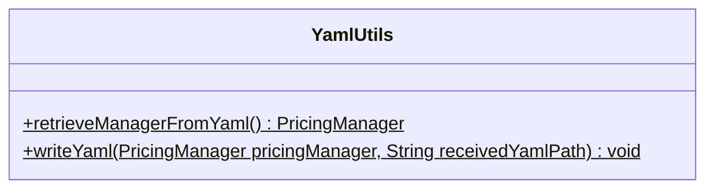

# Class YamlUtils

**Package** `io.github.isagroup.services.yaml`

`public class YamlUtils extends Object`

Utility class to handle YAML files. This class contains two static methods that can be used to parse the YAML specification of a pricing in the `Pricing2Yaml` syntax to a [PricingManager](./classes-to-manage-pricing/pricing-manager.md)
object and vice versa.

## Method summary



## Method details

### retrieveManagerFromYaml

`public static PricingManager retrieveManagerFromYaml(String receivedYamlPath)`

This method maps the content of the `Pricing2Yaml` configuration file located in `receivedYamlPath`.

**Parameters:**

`receivedYamlPath` - Path of the YAML file relative to the resources folder (`src/main/resources` or
`src/test/resources`)

**Returns:** a [PricingManager](./classes-to-manage-pricing/pricing-manager.md) object that
represents the content of the YAML file or `null` if something went wrong while invoking the
method

**Throws:**

[FilePathException](https://github.com/isa-group/Pricing4Java/blob/main/src/main/java/io/github/isagroup/exceptions/FilepathException.java) - If `receivedYamlPath` is null or it does not exist

**Usage:**

```java
import io.github.isagroup.models.PricingManager;
import io.github.isagroup.services.yaml.YamlUtils;

public class Example {

    public static void main(String[] args) {
        PricingManager pricingManager = YamlUtils.retrieveManagerFromYaml("pricing/pricing.yml");
    }
}
```

**See also:** Maven [resources](https://maven.apache.org/plugins/maven-resources-plugin/examples/resource-directory.html)

### writeYaml

`public static void writeYaml(PricingManager pricingManager, String receivedYamlPath)`

Writes a [PricingManager] object into a `YAML` file.

**Parameters:**

`pricingManager` - a [PricingManager](./classes-to-manage-pricing/pricing-manager.md) object that represents a
`Pricing2Yaml` configuration file

`receivedYamlPath` - A `String` path relative to the `resources` (`src/main/resources` or `src/test/resources`) folder

**Throws:**

[FilePathException](https://github.com/isa-group/Pricing4Java/blob/main/src/main/java/io/github/isagroup/exceptions/FilepathException.java) - If `receivedYamlPath` is null or the file does not exist in `receivedYamlPath` location

[SerializerException](https://github.com/isa-group/Pricing4Java/blob/main/src/main/java/io/github/isagroup/exceptions/SerializerException.java) - If `pricingManager` could not be serialized properly

**Usage:**

```java
import io.github.isagroup.models.PricingManager;
import io.github.isagroup.services.yaml.YamlUtils;

public class Example {

    public static void main(String[] args) {
        // Initialize PricingManager properly to serialize
        PricingManager pricingManager = new PricingManager();
        YamlUtils.writeYaml(pricingManager, "pricing/pricing.yml");
    }
}
```
