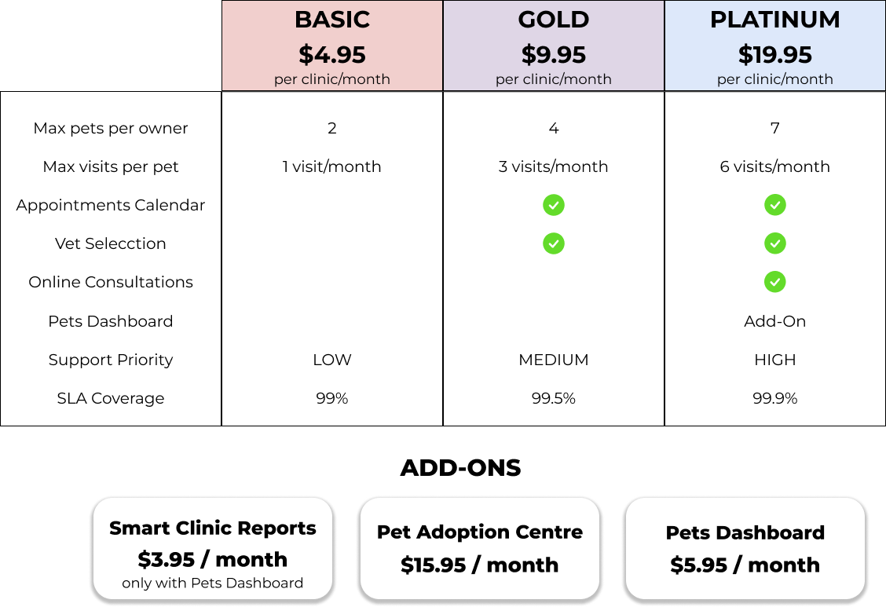

# Pricing

A pricing is a part of a SaaS customer agreement[^1]. It structures the
**features** of a service into **plans** and/or **add-ons** to control users'
access to such features [^2].

:::info Features of a service

Distinctive characteristics whose presence or absence may guide a user’s
decision toward a particular subscription

:::

When the pricing includes plans, users must subscribe to one of them and may
subscribe to as many add-ons as are available for the selected plan. In pricings
without plans, where only add-ons are offered, users can subscribe to the
allowed combination of add-ons of their choice.



The figure above illustrates a pricing for PetClinic, a sample veterinary clinic
management service that developers use to demonstrate the features of a
particular software framework or technology in a real-world scenario [^3]. It
includes ten features regulated by three plans and three add-ons (seven by
plans, three by add-ons) and imposes **usage limits** on the _pets_ and _visits_
features. Moreover, the _Pets Dashboard_ can be contracted only if the user
subscribes to the _PLATINUM_ plan.

Given this running example, it is important to note that not all pricing
features are necessarily translated into code within the service. Those that are
will be referred to as **functional features** (_Pets_, _Appointments Calendar_,
_Vet Selection_, _Online Consultations_ and _Pets Dashboard_), while those that
aren't will be referred to as **extra-functional features** (_Support Priority_
and _SLA Coverage_ represents service-level guarantees).

<details>
  <summary>Pricings as a new way of representing variability</summary>

Therefore, a SaaS pricing can be considered as the **intersection** of two distinct,
yet complementary, **paradigms**:

- The modularity and configurability typical of feature models (FMs) in Software
  Product Lines[^4] (SPLs)
- The guarantee-driven approach of service-level agreements[^5] (SLAs).

While FMs emphasize technical modularity, typically defining variability at the
functional feature level, SLAs focus on representing and enforcing
non-functional guarantees (e.g., coverage, support levels), i.e.
extra-functional features.

Pricing models **unify** these perspectives, capturing both dimensions in a
**single variability** structure. As a result, they become powerful artifacts for
addressing the broader business and technical needs of SaaS providers.

</details>

In order to interact with the service, a customer establishes a **contract**.
Through it, they accept the **terms and conditions** exposed in the service’s
customer agreement and select a **subscription**, i.e., a _bundle_ that may include
a plan and optionally a set of add-ons, ensuring that:

1. The subscription is not empty, i.e., it contains at least a plan or an
   add-on.
2. If the pricing do have plans, the subscription contains exactly one plan.
3. If the subscription includes a plan, all add-ons it contains must not be
   excluded for such plan, e.g., the _Pets Dashboard_ add-on of PetClinic is
   only available for the _PLATINUM_ plan, meaning the add-on is excluded for
   _BASIC_ and _GOLD_ plans.
4. All add-ons on which another add-on depends are also included in the
   subscription, e.g., in PetClinic, the _Pets Dashboard_ add-on depends on the
   _Smart Clinic Reports_ add-on, meaning that in order to include the former in
   a subscription, the latter must be contracted.

Once customers have made their selection, they commit to **paying** the
**periodic fee** associated with the selected subscription to access the
configuration of the SaaS that it grants them. In other words, they gain
**access** to a _version_ of the SaaS where features and usage limits are
enforced according to the selected plan and add-ons. For example, in PetClinic,
customers with a subscription to the _BASIC_ plan can register up to two pets in
their account, cannot select a vet, etc...

<details>
   <summary>Configuration space</summary>

Given this structure, determining the set of different configurations within a
pricing may become very challenging. We thus define the configuration space (the
set of different configurations within a pricing) as the first dimension of
variability in such models. In this regard, **add-ons** play a crucial role in
pricing design by enabling a compact set of plans to support a much larger
configuration space accommodating a wide range of user needs without
overwhelming customers with too many plan choices.

**Configuration space cardinality**

To calculate the cardinality of the configuration space we propose the following
formula:

- Let $C$ be the cardinality space
- Let $P$ be the set of plans in the pricing
- Let $m$ be the number of add-ons in the pricing
- Let $n$ be the number of plans in the pricing

```math
\max\ |C| =
\begin{cases}
  2^m - 1 & \text{if } P = \emptyset \\
  n \cdot 2^m & \text{if } P \neq \emptyset
\end{cases}
```

**Example**

Using the previous example we can calculate the cardinality of PetClinic:

- In this PetClinic has three plans so the set is the following: $P = \{Basic, Gold, Platinum\}$
- Since PetClinic has three addons: $m = 3$
- Since PetClinic has three plans: $n = 3$

According to the formula we use $n \cdot 2^m$ to calculate the
cardinality of Petclinic giving the following result:

$$
|C| = 3 \cdot 2^{3} = 3 \cdot 8 = 24
$$

This approach helps to mitigate **decision fatigue**, in line with the _Paradox
of Choice_[^6], which suggests that an excess of options can reduce satisfaction
and hinder decision-making. Unfortunately, such growth of the configuration
space also increases the complexity and cost of managing pricing-driven
development and operation tasks.

</details>

[^1]:
    García-Galán, J., Trinidad, P., Rana, O. F., & Ruiz-Cortés, A. (2016).
    Automated configuration support for infrastructure migration to the cloud.
    Future Generation Computer Systems, 55, 200–212.
    https://doi.org/10.1016/j.future.2015.03.006

[^2]:
    García-Fernández, A., Parejo, J.A., Ruiz-Cortés, A. (2024). Pricing4SaaS:
    Towards a Pricing Model to Drive the Operation of SaaS. In: Islam, S.,
    Sturm, A. (eds) Intelligent Information Systems. CAiSE 2024. Lecture Notes
    in Business Information Processing, vol 520. Springer, Cham.
    https://doi.org/10.1007/978-3-031-61000-4_6

[^3]: Spring PetClinic. https://github.com/spring-projects/spring-petclinic
[^4]:
    Benavides, D., Segura, S., & Ruiz-Cortés, A. (2010). Automated analysis of
    feature models 20 years later: A literature review. Information Systems,
    35(6), 615–636. https://doi.org/10.1016/j.is.2010.01.001

[^5]:
    Keller, A., Ludwig, H. The WSLA Framework: Specifying and Monitoring Service
    Level Agreements for Web Services. Journal of Network and Systems Management
    11, 57–81 (2003). https://doi.org/10.1023/A:1022445108617

[^6]:
    Schwartz, B. (2015). The Paradox of Choice. In Positive Psychology in
    Practice, S. Joseph (Ed.). https://doi.org/10.1002/9781118996874.ch8
