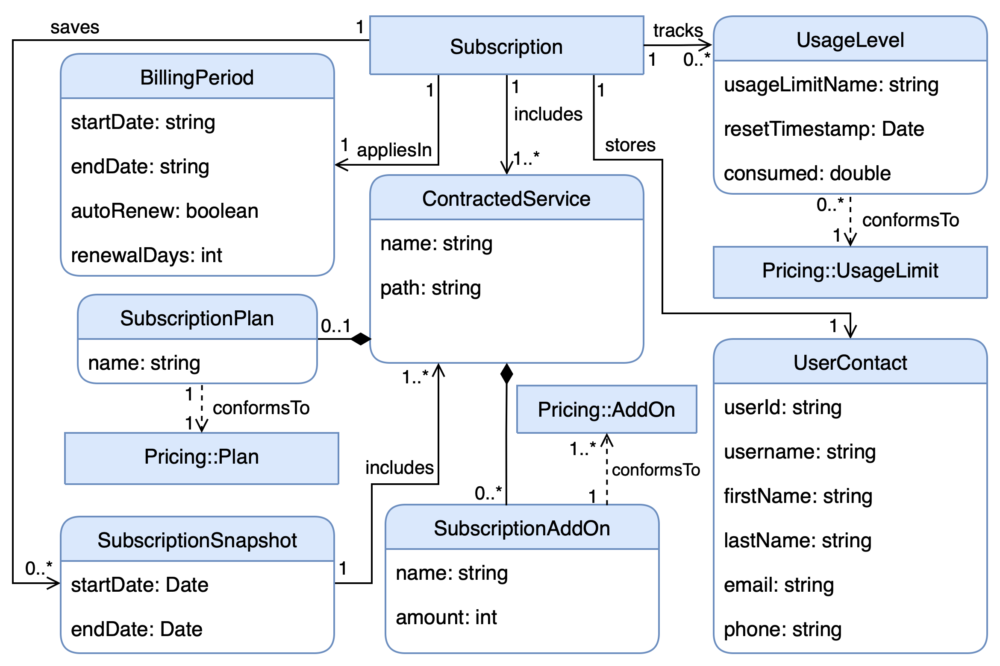

# iSubscription

## Overview

The **iSubscription** metamodel is a **machine-oriented abstraction** designed to formalize the representation of user subscriptions and their states –i.e. the selected configuration and current usage levels. Its essential for decoupling subscription management from the managed service, as it provides an standardized way of structuring subscription data.

## Components



According to the figure above, an **iSubscription** is associated with a single **iPricing** (see [iPricing](iPricing.md) for more details), which defines the available plans, add-ons, features, and usage limits. The iSubscription itself consists of:

1. **User information:** Links subscriptions to specific users. This enables direct user-to-subscription mapping and facilitates provider-side tooling, such as customer support portals and administrative dashboards.

2. **Billing period:** Defines the temporal scope of the subscription, including:

    - **Start and end dates:** When the subscription becomes active.
    - **Auto-renewal flag (autoRenew):** Indicates if the subscription will automatically renew at the end of the billing period.
    - **Renewal period (renewalDays):** Specifies the duration of the renewal period, typically in days. This will be only considered if `autoRenew` is `true`.

  This component is essential for automated lifecycle management, integration with payment systems, and to handle common cancellation scenarios (e.g., when a subscription is canceled but remains valid until the end of the current billing period).

3. **Usage Levels:** Tracks consumption of usage-limited features defined in the iPricing model. It supports:

    - **Renewable usage limits** with periodic resets.
    - **Non-renewable limits** flagged as trackable.

:::tip EXAMPLE
In Zoom, cloud storage could be tracked in terms of “consumed GBs”.
:::

4. **Active subscription:** The **core component** of iSubscription. It represents the user’s current configuration –that is, the selected plans and add-ons– which ultimately determines access to system functionalities. Key aspects include:

    - **Single- and multi-service support:**
        - Can represent simple cases (a single service with one pricing).
        - Can also handle complex ecosystems with multiple services, each with distinct pricings (e.g., [GitHub and GitHub Copilot](https://github.com/pricing)). For such scenarios, iSubscription maintains a separate active subscription for each service, linked to its corresponding iPricing.
    - **Add-on management:**
        - Records the **contracted quantity** of each add-on.
        - Supports **scalable add-ons** (e.g., additional storage, user seats).
        - Enables **pay-per-use strategies**, since usage-extendable add-ons can be purchased incrementally as quotas are consumed.

5. **Subscription Snapshots:** Stores **historical states** of the subscription, including timestamps. This allows:

    - Subscription rollback (see [SPACE's evaluation](../space/evaluation.md) for an example).
    - Restrospective analysis of user behavior.
    - Business trend analysis.

## Multi-service Subscription Modeling Example

Consider a user subscribed to both [GitHub](https://github.com/pricing) and [GitHub Copilot](https://github.com/features/copilot/plans#compare). In this case, the **iSubscription** metamodel represents the scenario by maintaining **separate active subscription components** for each service, each one linked to its corresponding iPricing model. For example, the user could have a _Team_ plan for GitHub and a _Pro_ plan for GitHub Copilot, each with distinct add-ons and usage limits. When expressed in JSON, the iSubscription structure for this scenario would look as follows:

```json
{
  "userInformation": {
    "userId": "user123"
  },
  "billingPeriod": {
    "startDate": "2025-09-25",
    "endDate": "2025-10-25",
    "autoRenew": true,
    "renewalDays": 30
  },
  "usageLevels": {
    "github": {
      "actionsMinutes": {
        "resetTimeStamp": "2025-10-25T00:00:00Z",
        "consumed": 1250
      },
      "githubPackagesStorage": {
        "consumed": 30
      }
    },
    "copilot": {
      "premiumRequests": {
        "resetTimeStamp": "2025-10-25T00:00:00Z",
        "consumed": 20
      }
    }
  },
  "contractedServices": {
    "github": "2025", // This is the version of the pricing to be considered
    "copilot": "2.0.1"
  },
  "subscriptionPlans": {
    "github": "TEAM",
    "copilot": "PRO"
  },
  "subscriptionAddOns":{
    "github": {
      "codespacesHours": 3,
      "codespacesStorage": 50
    }
  },
  "history": [
    {
      "startDate": "2024-06-25T00:00:00Z",
      "endDate": "2024-12-25T00:00:00Z",
      "contractedServices": {
        "github": "2024",
        "copilot": "1.5.0"
      },
      "subscriptionPlans": {
        "github": "FREE",
        "copilot": "PRO"
      },
      "subscriptionAddOns": {
        "github": {
          "codespacesHours": 10,
          "codespacesStorage": 25
        }
      }
    }
  ]
}
```