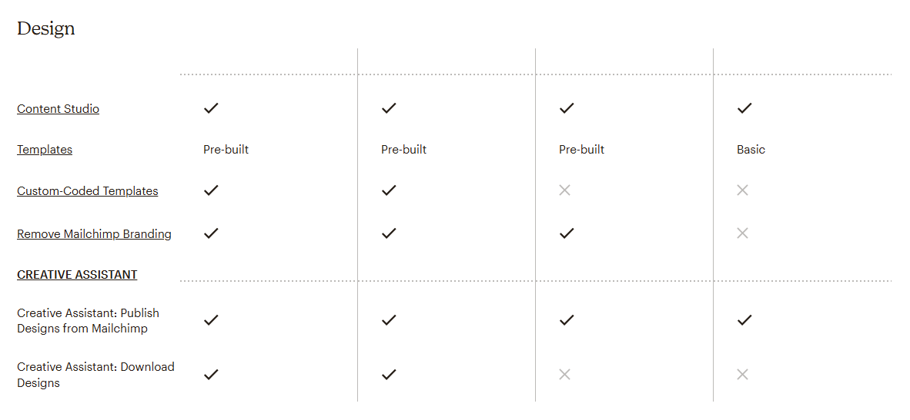
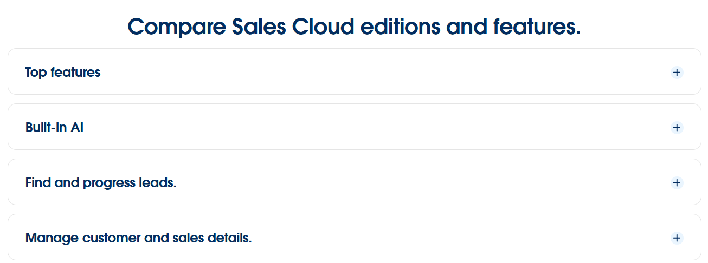
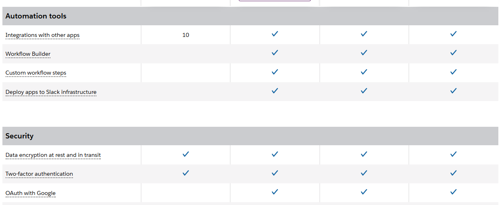
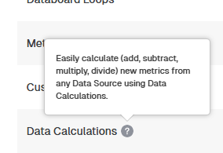
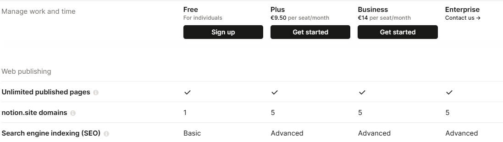
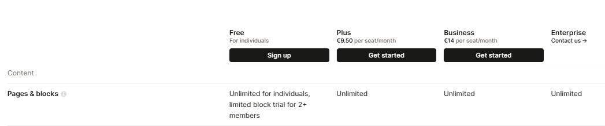
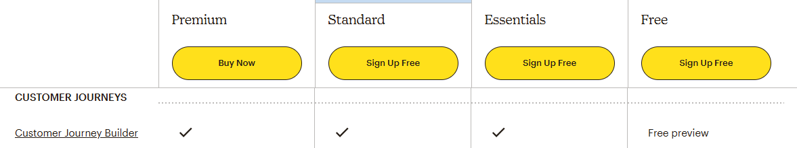
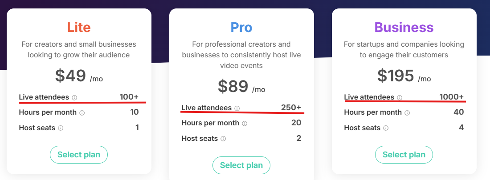

# Modeling good practices

## Use defensive pricing techniques

When it comes to modeling in `Pricing2Yaml` you are going to have several `NUMERIC`
usage limits linked to `BOOLEAN` features. You should be carefull when setting
their `defaultValue` as it can affect the feature evaluation.

:::info Terminology

- A **feature** is considered **enabled** if its `defaultValue` is `true`
- A **feature** is **disabled** if its `defaultValue` is `false`
- An **usage limit** is **enabled** if its `defaultValue` is greater than `0`
- An **usage limit** is **disabled** if its `defaultValue` is `0`
:::

Please be aware of the following rules:

- If a usage limit is linked to only **one feature** both should be enabled or disabled.
- An usage limit linked to multiple features does not follow this rule.

### Example

Good practice:

```yaml
features:
  featureA:
    valueType: BOOLEAN
    // highlight-next-line
    defaultValue: false
  featureB:
    valueType: BOOLEAN
    // highlight-next-line
    defaultValue: true
usageLimits:
  featureALimit:
    valueType: NUMERIC
    // highlight-next-line
    defaultValue: 0
    linkedFeatures:
    - featureA
  featureBLimit:
    valueType: NUMERIC
    // highlight-next-line
    defaultValue: 30
    linkedFeatures:
    - featureB
```

Bad practice:

```yaml
features:
  featureA:
    valueType: BOOLEAN
    // highlight-next-line
    defaultValue: false
  featureB:
    valueType: BOOLEAN
    // highlight-next-line
    defaultValue: true
usageLimits:
  featureALimit:
    valueType: NUMERIC
    // highlight-next-line
    defaultValue: 30
    linkedFeatures:
    - featureA
  featureBLimit:
    valueType: NUMERIC
    // highlight-next-line
    defaultValue: 0
    linkedFeatures:
    - featureB
```

:::warning Feature and usage limit inconsistencies

When it comes to modeling the following inconsistencies can happen:

- A feature is enabled and its linked usage limit is disabled
- A feature is disabled and its linked usage limit is disabled

### Feature is enabled and usage limit is disabled

```yaml
features:
  featureA:
    valueType: BOOLEAN
    // highlight-next-line
    defaultValue: true
usageLimits:
  featureALimit:
    valueType: NUMERIC
    // highlight-next-line
    defaultValue: 0
    linkedFeatures:
    - featureA
```

### Feature is disabled and usage limit is enabled

```yaml
features:
  featureB:
    valueType: BOOLEAN
    // highlight-next-line
    defaultValue: false
usageLimits:
  featureBLimit:
    valueType: NUMERIC
    // highlight-next-line
    defaultValue: 30
    linkedFeatures:
    - featureB
```

:::

### A story about bad modeling

The business ACME has a SaaS and they are planning to release an extra feature that enable users
to store files in the cloud. They have stablished the following usage restrictions:

|              |    Free      | Professional | Enterprise |
|--------------|--------------|--------------|------------|
| Data Storage | Not Included | 50 GB        | 200 GB     |

ACME is using `Pricing2Yaml` to model his pricing and they have included the file storage
feature like the following:

```yaml
features:
  # other features
  fileStorage:
    description: Keep your files securely stored, up to date, and accessible across devices
    valueType: BOOLEAN
    // highlight-next-line
    defaultValue: false
    expression: subscriptionContext['currStorage'] < pricingContext['usageLimits']['dataStorageLimit']
usageLimits:
  fileStorageLimit:
    valueType: NUMERIC
    // highlight-next-line
    defaultValue: 50
    unit: GB
    linkedFeatures:
    - fileStorage
plans:
  FREE:
    features: null
    usageLimits: null
  PROFESSIONAL:
    features:
      fileStorage:
        value: true
    usageLimits: null
  ENTERPRISE:
    features:
      fileStorage:
        value: true
    usageLimits:
      fileStorageLimit:
        value: 200
```

As explained in the [Pricing2Yaml syntax](./versions/pricing2yaml-v21-specification.mdx) section
all plans will inherit global features and usage limits `defaultValue` resulting in the
following interpreted values when parsing the config file:

|                    |    Free      | Professional | Enterprise |
|--------------------|--------------|--------------|------------|
| `fileStorage`      | false | true  | true     |
| `fileStorageLimit` | 50 | 50 |  200  |

The feature looks promissing and ACME decides to ship the feature. Months later,
they decide to **enable file storage** feature to **FREE** users after doing some analysis
on their data.

The developer in charge of mantaining the configuration file **enables** the
file storge feature **globally**, but **forgets** to update **global file storage limit**.

Here is the config file with the modification:

```yaml
features:
  fileStorage:
    description: Keep your files securely stored, up to date, and accessible across devices
    valueType: BOOLEAN
    // highlight-next-line
    defaultValue: true
    expression: subscriptionContext['currStorage'] < pricingContext['usageLimits']['dataStorageLimit']
usageLimits:
  fileStorageLimit:
    valueType: NUMERIC
    // highlight-next-line
    defaultValue: 50
    unit: GB
    linkedFeatures:
    - fileStorage
plans:
  FREE:
    features: null
    usageLimits: null
  PROFESSIONAL:
    usageLimits: null
  ENTERPRISE:
    usageLimits:
      fileStorageLimit:
        value: 200
```

Plans will inherit the following values from the configuration file:

|                    |    Free      | Professional | Enterprise |
|--------------------|--------------|--------------|------------|
| `fileStorage`      | true | true  | true     |
| `fileStorageLimit` | 50 | 50 |  200  |

A week later the development team finds out that FREE users were storing an unusual
amount of files and servers run out of disk space quickly. They tracked
what went wrong and discover that `fileStorageLimit` was too high, so they change
it accordinly.

```yaml
features:
  fileStorage:
    description: Keep your files securely stored, up to date, and accessible across devices
    valueType: BOOLEAN
    // highlight-next-line
    defaultValue: true
    expression: subscriptionContext['currStorage'] < pricingContext['usageLimits']['dataStorageLimit']
usageLimits:
  fileStorageLimit:
    valueType: NUMERIC
    // highlight-next-line
    defaultValue: 5
    unit: GB
    linkedFeatures:
    - fileStorage
plans:
  FREE:
    features: null
    usageLimits: null
  PROFESSIONAL:
    // highlight-start
    usageLimits:
      fileStorageLimit:
        value: 50
    // highlight-end
  ENTERPRISE:
    usageLimits:
      fileStorageLimit:
        value: 200
```

Plans will inherit the following values from the configuration file:

|                    |    Free      | Professional | Enterprise |
|--------------------|--------------|--------------|------------|
| `fileStorage`      | true | true  | true     |
| `fileStorageLimit` | 5 | 50 |  200  |

If they originally modeled the pricing with an usage limit of 0 GB, FREE
users would not be able to store any file after enabling `fileStorage` globally
and servers would not run out of space:

```yaml
features:
  # other features
  fileStorage:
    description: Keep your files securely stored, up to date, and accessible across devices
    valueType: BOOLEAN
    // highlight-next-line
    defaultValue: false
    expression: subscriptionContext['currStorage'] < pricingContext['usageLimits']['dataStorageLimit']
usageLimits:
  fileStorageLimit:
    valueType: NUMERIC
    // highlight-next-line
    defaultValue: 0
    unit: GB
    linkedFeatures:
    - fileStorage
plans:
  FREE:
    features: null
    usageLimits: null
  PROFESSIONAL:
    features:
      fileStorage:
        value: true
    usageLimits:
      fileStorageLimit:
        value: 50
  ENTERPRISE:
    features:
      fileStorage:
        value: true
    usageLimits:
      fileStorageLimit:
        value: 200
```

## Tag your features

If your pricing has a lot of features your potential users might
have trouble to mentally process them all at once. This could lead the user
to leave your page and choose another competitor due to the lack of structure of the
pricing.

To information saturatin group related features with `tags`. Your users will see the features
grouped by chunks small amounts, making the pricing easier to recall.
This technique is known in psychology as [chunking](https://en.wikipedia.org/wiki/Chunking_(psychology)).

Here are some SaaS providers using this technique:

[Mailchimp](https://mailchimp.com/pricing/marketing/compare-plans):



[Salesforce](https://www.salesforce.com/sales/pricing/):



[Slack](https://slack.com/pricing):



### Example

Good practice:

```yaml
syntaxVersion: '3.0'
saasName: Databox
url: https://web.archive.org/web/20250304080336/https://databox.com/pricing
tags:
- Data Collection
- Connect any Data Source
- Account management & security
features:
  dataSources:
    ...
    tag: Data Collection
  dataSyncFrequency:
    ...
    tag: Data Collection
  historicalData:
    ...
    tag: Data Collection
  warehouseDataStorage:
    ...
    tag: Data Collection
  databoxIntegrations:
    ...
    tag: Connect any Data Source
  thirdPartyIntegrations:
    ...
    tag: Connect any Data Source
  pushCustomDataToAPI:
    ...
    tag: Connect any Data Source
  customApiIntegrations:
    ...
    tag: Connect any Data Source
  sqlIntegrations:
    ...
    tag: Connect any Data Source
  spreadsheetsIntegration:
    ...
    tag: Connect any Data Source
  userManagement:
    ...
    type: Account management & security
  twoFactorAuthentication:
    ...
    tag: Account management & security
  singleSignOn:
    ...
    tag: Account management & security
  advancedSecurityManagement:
    ...
    tag: Account management & security
  ...
```

Bad practice

```yaml
syntaxVersion: '3.0'
saasName: Databox
url: https://web.archive.org/web/20250304080336/https://databox.com/pricing
features:
  dataSources:
    ...
  dataSyncFrequency:
    ...
  historicalData:
    ...
  warehouseDataStorage:
    ...
  databoxIntegrations:
    ...
  thirdPartyIntegrations:
    ...
  pushCustomDataToAPI:
    ...
  customApiIntegrations:
    ...
  sqlIntegrations:
    ...
  spreadsheetsIntegration:
    ...
  userManagement:
    ...
  twoFactorAuthentication:
    ...
  singleSignOn:
    ...
  advancedSecurityManagement:
    ...
  ...
```

## Use usage limits naming conventions

It is a good habit to name usage limits including part of the feature name that is linked,
for example:

- `<featureName>Limit`
- `<featureName>Uses`
- `<featureName>Cap`


### Example

Good practice:

```yaml
features:
  //highlight-next-line
  workspaces:
    valueType: BOOLEAN
    defaultValue: true
usageLimits:
  // highlight-next-line
  workspacesLimit:
    description: The number of workspaces you can use.
    valueType: NUMERIC
    defaultValue: 1
    unit: workspace
    type: NON_RENEWABLE
    linkedFeatures:
    - workspaces
```

Bad practice:

```yaml
features:
  //highlight-next-line
  workspaces:
    valueType: BOOLEAN
    defaultValue: true
usageLimits:
// highlight-next-line
  usageLimitWk:
    description: The number of workspaces you can use.
    valueType: NUMERIC
    defaultValue: 1
    unit: workspace
    type: NON_RENEWABLE
    linkedFeatures:
    - workspaces
```

## Provide descriptions

When modeling features, we tend to reduce the length of the name by identifying
it with a few keywords. However, understanding the functionality only looking at
the name can be a difficult task and subject to interpretation.

In cases where further context is greatly appreciated, write a brief summary of
the description in the `description` field. That way, users will be able to
understand your feature even better. As always, decide when it is
necessary to provide a little more context.

### Example

Here is an example extracted from [Databox](https://databox.com/pricing):



Good practice:

```yaml
features:
  dataCalculations:
    // highlight-start
    description: | 
      Easily calculate (add, subtract, multiply, divide) new metrics
      from any Data Source using Data Calculations.
    // highlight-end
    valueType: BOOLEAN
    defaultValue: true
    type: DOMAIN
```

Bad practice:

```yaml
features:
  dataCalculations:
    # What calculation are performed?
    valueType: BOOLEAN
    defaultValue: true
    type: DOMAIN
```

## Avoid using TEXT valueType

In 99.9% of total cases a pricing can be modeled with `BOOLEAN` features
and `NUMERIC` usage limits, but when `BOOLEAN` and `NUMERIC` `valueType`
are not enough you can use `TEXT` as a last resource. You should use `BOOLEAN`
and `NUMERIC` as much as possible.

### Example

Take a look at Search engine indexing (SEO) feature in [Notion](https://www.notion.com/pricing) pricing:



You could be tempted to model this as a `TEXT` feature, but there is another option that uses
`BOOLEAN` features. In this case we can model this feature as two `BOOLEAN` features,
`basicSearchEngineIndexing` and `advancedSearchEngineIndexing`. `basicSearchEngineIndexing` is
available for all plans and `advancedSearchEngineIndexing` is only available for Plus, Business and
Enterprise plans.

Good practice:

```yaml
features:
  // highlight-start
  basicSearchEngineIndexing:
    valueType: BOOLEAN
    defaultValue: true
  advancedSearchEngineIndexing:
    valueType: BOOLEAN
    defaultValue: false
  // highlight-end
plans:
  FREE:
    features: null
  PLUS:
    features:
      advancedSearchEngineIndexing:
        value: true
  BUSINESS:
    features:
      advancedSearchEngineIndexing:
        value: true
  ENTERPRISE:
    features:
      advancedSearchEngineIndexing:
        value: true
```

Bad practice

```yaml
features:
  // highlight-start
  searchEngineIndexing:
    valueType: TEXT
    defaultValue: Basic
  // highlight-end
plans:
  FREE:
    features: null
  PLUS:
    features:
      advancedSearchEngineIndexing:
        value: Advanced
  BUSINESS:
    features:
      advancedSearchEngineIndexing:
        value: Advanced
  ENTERPRISE:
    features:
      advancedSearchEngineIndexing:
        value: Advanced
```

## Avoid modeling trials

You might be tempted to model trial features or demos but in reality
those features are not granting users permanent access. In practice
if a feature is available for trial or a preview of it, that feature should not
be enabled for that particular plan.

Example from [Notion](https://www.notion.com/pricing) pricing:




### Example

Example from [Mailchimp](https://mailchimp.com/pricing/marketing/compare-plans/):




Good practice:

Customer Journey Builder has a free preview for Free plan, that feature is `false` by default even if the pricing offers a preview.

```yaml
features:
  customerJourneyBuilder:
    valueType: BOOLEAN
    // highlight-next-line
    defaultValue: false
plans:
  FREE:
    features: null
  ESSENTIALS:
    features:
      customerJourneyBuilder:
        value: true
  STANDARD:
    features:
      customerJourneyBuilder:
        value: true
  PREMIUM:
    features:
      customerJourneyBuilder:
        value: true
```

Bad practice:

Here security alerts is enabled for all plans permanently, but we only want FREE users
to use it temporarily. Disabling that feature is highly recommended.

```yaml
features:
  customerJourneyBuilder:
    valueType: BOOLEAN
    // highlight-next-line
    defaultValue: true
plans:
  FREE:
    features: null
  ESSENTIALS:
    features: null
  STANDARD:
    features: null
  PREMIUM:
    features: null
```

## Avoid modeling recommended usage limits

Saas providers instead of restricting a feature for a particular plan, they make
a suggestion for the ideal usage limit. These recommended users limit must not
be modeled since there is no restriction for that feature.

Example extracted from [Crowdcast](https://www.crowdcast.io/pricing) pricing:



### Example

|                    |    Free      | Professional | Enterprise |
|--------------------|--------------|--------------|------------|
| Online text editor experience     | Ideal for 1-3 concurrent users | Ideal for 5+ concurrent users  |  Ideal for 15+ concurrent users    |

Good practice:

```yaml
features:
  onlineTextEditor:
    valueType: BOOLEAN
    defaultValue: true
plans:
  FREE:
  PROFESSIONAL:
  ENTERPRISE:
    # .. Not modeled recommended usage limits present
```

Bad practice:

You should not model recommended usage limits

```yaml
features:
  onlineTextEditor:
    valueType: BOOLEAN
    defaultValue: true
usageLimits:
  // highlight-start
  onlineTextEditorConcurrentUsersPreference:
    valueType: TEXT
    defaultValue: Ideal for 1-3 concurrent users
    linkedFeatures:
    - onlineTextEditor
  // highlight-end
plans:
  // highlight-start
  FREE:
  PROFESSIONAL:
    usageLimits:
      onlineTextEditorConcurrentUsersPreference:
        value: Ideal for 5+ concurrent users
  ENTERPRISE:
    usageLimits:
      value: Ideal for 15+ concurrent users
  // highlight-end
```
