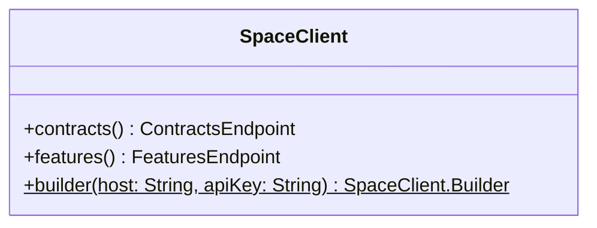
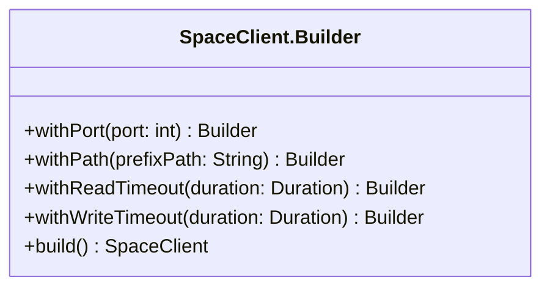
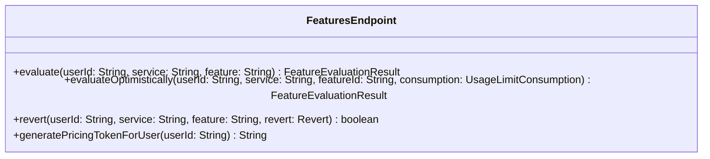
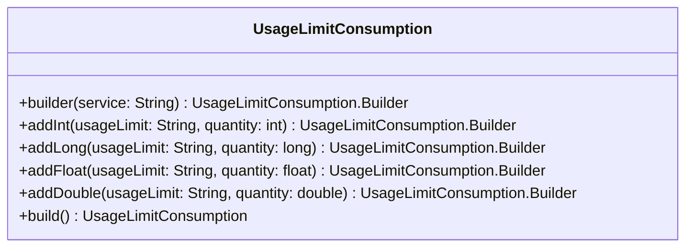
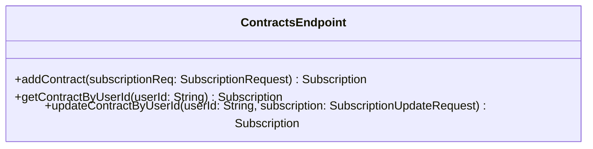
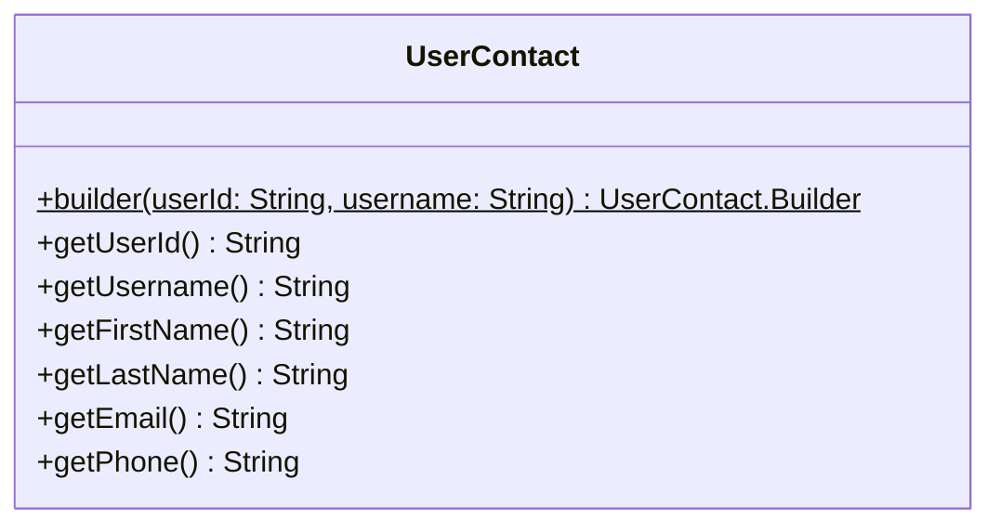
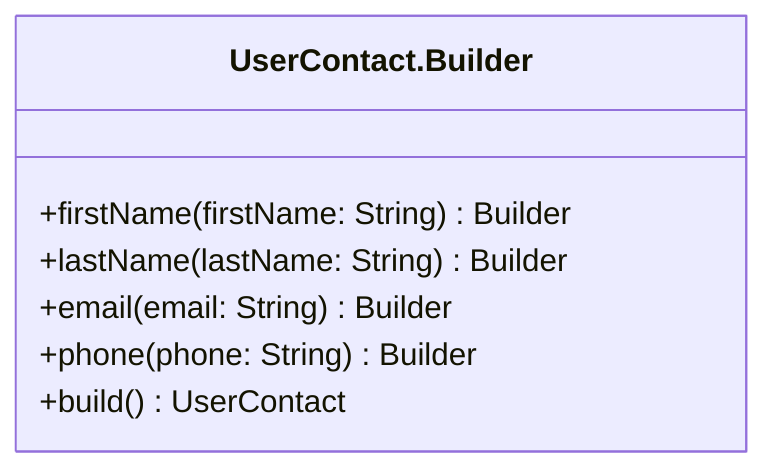

## 📦 Installation

### Requirements

- Java 11 or later
- Apache Maven 3.6.3 or later (excluding 4.X)

### Maven

Include the following Maven coordinates in your `pom.xml`:

```xml
<dependency>
    <groupId>io.github.pgmarc.space</groupId>
    <artifactId>space-client</artifactId>
    <version>0.0.1-SNAPSHOT</version>
</dependency>
```

### Gradle

Include the following Maven coordinates in your `build.gradle`:

```groovy
implementation 'io.github.pgmarc.space:space-client:0.0.1-SNAPSHOT'
```

## ✨ Features

- Read, create and update user's subscriptions
- Verify a user's feature availability based on their subscription
- Configure SPACE client with:
    - Host (required)
    - Port (optional, by default SPACE listens on port 5403)
    - SPACE URL path prefix (optional, by default space is under api/v1, i.e., http://example.com/api/v1)
    - Read and write timeout of HTTP client (optional, uses OkHTTP client under the hood)

## ⚡ Quick Start


### 1. Create a SpaceClient instance

```java
SpaceClient client = SpaceClient.builder("example.com", "YOUR_API_KEY").build();
```

### 2. Add a Contract


```java
UserContact contact = UserContact.builder("user-123", "testUser").build();

SubscriptionRequest createContract = SubscriptionRequest.builder(contact)
    .startService("News", "1.0")
        .plan("PREMIUM")
    .endService()
    .build();
Subscription subscription = client.contracts().addContract(createContract);
```


### 3. Evaluate a Feature

```java
FeatureEvaluationResult result = client.features().evaluate("user-123", "News", "sideAds");
boolean isSideAdsAvailable = result.isAvailable();
```

## 📚 API Overview

### 📜 Contracts

- `client.contracts.addContract()` → Adds a new contract.
- `client.contracts.updateContractSubscription(userId, subscription)` → Updates a user's subscription.

### 🎛️ Features

- `client.features().evaluate(userId: String, service: String, feature: String)` → Evaluates a feature for a user.
- `client.features().evaluateOptimistically(userId: String, service: String, featureId: String, consumption: UsageLimitConsumption)` → Evaluates a feature for a user taking into account the usage limit consumption specified.
- `client.features().revert(userId: String, service: String, feature: String, revert: Revert)` → Reverts the usage level update performed during a past evaluation.

:::warning Rollback evaluations
The `revert` method only works if the evaluation happened less than **2 minutes ago**.
Use it as a safety net when request processing fails in your service.
:::

- `client.features().generatePricingTokenForUser(userId: String)` → Generate a [Pricing Token](../../introduction.mdx#-communication-strategy-overview) with all evaluated features.


## 📚 API

### Class SpaceClient

`public final class SpaceClient`

This class implements the subscription management and feature evaluation
interfaces of SPACE API.



#### Method details

**contracts**

---

**features**


---

**builder**

### Class SpaceClient.Builder

This constructor class allows users to customize `SpaceClient` according to the 
configuration parameters of SPACE deployment.




#### Summary


**Example**

Required configuration:

```java
SpaceClient client = SpaceClient
    .builder("example.com", "c52a83122dc0403567dc1d1af2f261da5dce9c49bee7e199b96ce3f4bfc85ac6").build();
```

With optional configuration:

```java
SpaceClient client = SpaceClient
    .builder("example.com", "c52a83122dc0403567dc1d1af2f261da5dce9c49bee7e199b96ce3f4bfc85ac6")
    .withPort(8080)
    .withPath("space/api")
    .withReadTimeout(Duration.ofMillis(1500))
    .withWriteTimeout(Duration.ofMillis(1500))
    .build();
```


### Class FeaturesEndpoint

This class implements the feature evaluation interface of SPACE API.



#### Method Details

---

**evaluate**

`public FeatureEvaluationResult evaluate(String userId, String service, String feature) throws IOException`

Check wheter a *feature* is available within the *subscription* of an user.

**Parameters**:

- `userId` - Identificator of the user subscription specified in [UserContact](#usercontact)
- `service` - a Pricing2Yaml `saasName` of the particular service you want to evaluate (case insensitive)
- `feature` - Name of the feature (case sensitive)

**Throws**:

`IOException` - If a network problem occurs

**Returns**:

 a `FeatureEvaluationResult`

**Usage**:

```java
FeatureEvaluationResult result = client
    .features().evaluate("44c51386-3f71-4f42-bd73-440ff32dedc9", "News", "sideAds");
boolean isSideAdsAvailable = result.isAvailable();
```

---

**evaluateOptimistically**

`public FeatureEvaluationResult evaluateOptimistically(String userId, String service, String feature, UsageLimitConsumption usageLimitConsumption) throws IOException`

Register the consumption of the usage limits of the given *feature* and evaluates the availability of that feature.

**Parameters**:

- `userId` - Identificator of the user subscription specified in [UserContact](#usercontact)
- `service` - a Pricing2Yaml `saasName` of the particular service you want to evaluate (case insensitive)
- `feature` - the key of the *feature* in `features` section (case sensitive) of the given *service*
- `usageLimitConsumption` - a class containing the usage limit consumption of the specified *feature*

**Throws**:

`IOException` - If a network problem occurs


**Returns**:

a `FeatureEvaluationResult`


**Usage**:

```java
UsageLimitConsumption consumption = UsageLimitConsumption.builder("News")
    .addInt("maxNews", 1).build();
FeatureEvaluationResult newsFeature = client
    .features().evaluateOptimistically("44c51386-3f71-4f42-bd73-440ff32dedc9", "News", "news", consumption);
boolean isNewsAvailable = newsFeature.isAvailable();
```

---

**revert**

`public boolean revert(String userId, String service, String feature, Revert revert) throws IOException`

**Parameters**:

- `userId` - Identificator of the user subscription specified in [UserContact](#usercontact)
- `service` - a Pricing2Yaml `saasName` of the particular service you want to evaluate (case insensitive)
- `feature` - the key of the *feature* in `features` section (case sensitive) of the given *service*
- `revert` - a `Revert` enum that indicates wheter SPACE restore the newest or oldest value from cache

**Throws**:

`IOException` - If a network problem occurs

**Returns**:

a `boolean` that indicates if the operation has succeeded

**Usage**:

```java
boolean sucess = client.features().revert("44c51386-3f71-4f42-bd73-440ff32dedc9",
    "News", "news", Revert.NEWEST_VALUE)
```


---

**generatePricingTokenForUser**


### Class UsageLimitConsumption




### Class ContractsEndpoint



#### Method Details

**addContract**

Upload a subscription to SPACE calling `client.contracts().addContract(req: SubscriptionRequest)` method,
if the operation succeeds you will get a `Subscription` with all the details of the subscription.

**Returns**:

`Subscription`

**Usage**:

```java
UserContact contact = UserContact.builder("44c51386-3f71-4f42-bd73-440ff32dedc9", "johndoe").build();

SubscriptionRequest request = SubscriptionRequest.builder(contact)
    .startService("News", "1.0")
        .plan("PREMIUM")
    .endService()
    .build();
Subscription subscription = client.contracts().addContract(request);
```

---

**updateContract**

---

**getContractByUserId**


---


### Class UserContact

A `UserContact` objects holds information about the users of your SaaS. In order to
create an instance of it you will need to provide an `userId` and a `username` to
the builder method of `UserContact` class and then call `build()` to create an instance.

Optionally provide extra information by suplying the first name, last name, an email and a 
phone. You can do so by calling `firstName(name: String)`, `lastName(lastName: String)`



#### Method Details

---

**builder**

---

**getUserId**

---

**getUsername**

---

**getFirstName**

---

**getLastName**

---

**getEmail**

---

**getPhone**

---

### Class UserContact.Builder



**Usage**

Example with only required parameters:

```java
UserContact contact = UserContact.builder("3f5f934c-951b-4a2d-ad10-b1679ac9b7ba", "janedoe").build();
```

Example with required and optional parameters:

```java
UserContact contact = UserContact
    .builder("3f5f934c-951b-4a2d-ad10-b1679ac9b7ba", "janedoe")
    .firstName("Jane")
    .lastName("Doe")
    .email("janedoe@example.com")
    .phone("280-689-4646")
    .build();
```


## Disclaimer & License

This project is licensed under the MIT License. See [LICENSE](https://github.com/pgmarc/space-java-client/blob/main/LICENSE) for details.

:::warning
This SDK is part of **ongoing research** in pricing-driven devops.
It is still in an early stage and not intended for production use.
:::