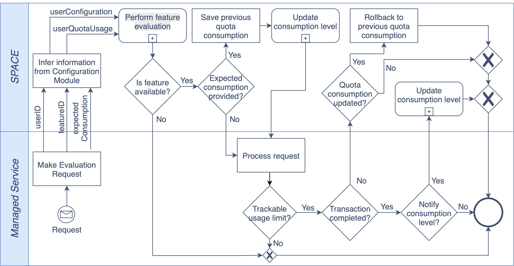

# 📊 SPACE Feature Evaluation Workflow

SPACE helps you decide whether a user can access a feature, while keeping **subscription states consistent** even under concurrency or partial failures.

---

## 🔑 Key Idea
To evaluate a feature, SPACE must receive:
- A **userId**.
- A **featureId**, which has the following **structure: `<serviceName>-<featureName>`. E.g.: petclinic-pets**.
- Optionally, an **expectedConsumption** (e.g., size of a video upload). 

  :::info
  If provided, this value enables **optimistic updates**, i.e. usage levels are *tentatively* increased **before** the request is processed.
  :::

---

## 🛠 How It Works
1. **Get the contract** for the given *userId* and infer his current subscription (which remember is attached to a configuration).
2. **Retrieve the configuration**  from the pricing using the information of the subscription.
3. **Evaluate access**.  
   - ❌ If denied → stop.  
   - ✅ If allowed → continue with one of the two paths below.

### ⚡ Path 1: With `expectedConsumption`

4. **Stores a snapshot** of the current usage levels (which is kept for **30–60s**).  
5. **Applies the expected increase**.  
6. **Return access verdict** to the managed service:

  - ✔️ If the request succeeds → **no more actions are needed**.
  - ❌ If it fails → **rollback must be triggered** during the snapshot window.  

👉 This is ideal for operations where you already know the consumption associated with a request (like the size of a file being uploaded).

### 📩 Path 2: Without `expectedConsumption`

4. **Return access verdict** to the managed service:
  - ✔️ If the request succeeds and the feature has associated usage limit/s → the managed service must **notify SPACE when it completes** so it can update usage levels.
  - ❌ Otherwise → **no more actions are needed**.

---

## ✅ Summary

- Use `expectedConsumption` → **optimistic updates**, better performance, but must be prepared to perform rollbacks in case of failures.

- Don’t use it → **explicit confirmation required**, safer for unknown or variable resource usage, but requires an extra request from the managed service.