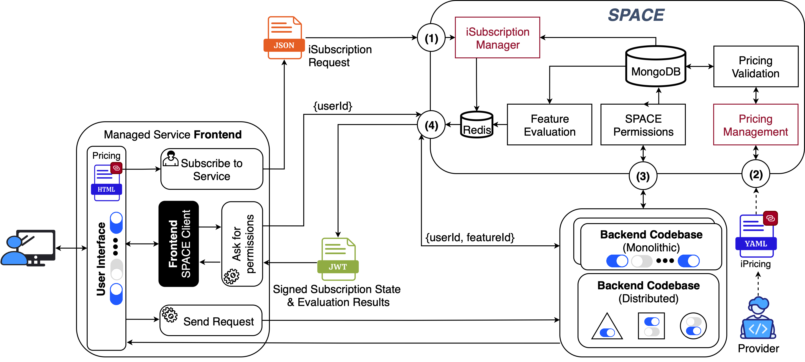

# What is SPACE?

**Subscription and Pricing Access Control Engine (SPACE)** is a pricing-driven self-adaptation solution. This means that its primary objective is to enable services to dynamically adjust their behavior based on the pricing model and contractual agreements of each user. In practice, this ensures that users can only access the features included in their subscription and are restricted according to the usage limits defined in their contracts.

## Scope

SPACE is designed to handle two main types of changes that can occur in a SaaS environment:

- Contract changes (also know as _novations_ in legal terms)
- Pricing updates (plan additions, plan removals, usage limits updates, etc...)

:::info What are contract novations?

The word _novate_ means to replace an old obligation with a new one [^1]. In the context of SaaS, a novation occurs when the customer and the provider renegotiate the terms of the contract. For example, this happens when a customer upgrades from a free subscription to a paid plan in a higher tier, gaining access to new features and extended usage limits.

:::

## Overview

Like other SPHERE pricing-driven self-adaptation solutions, SPACE leverages [iPricings](../core-concepts/iPricing.md) to orchestrate both contracts and variability. Its distinctive contribution lies in the fact that, unlike previous approaches, SPACE does not require the host application—i.e., the service integrating the solution—to embed a dedicated subscription management module. This represents a major architectural shift: **SPACE can be scaled and deployed independently from the managed service(s).** Consequently, the host application only needs to interact with SPACE through its **REST API** to query the current subscription state of a user, evaluate feature toggles, and enforce access control.

:::info Why externalizing subscription state?

Experience has shown that embedding subscription state logic directly into the managed application introduces significant complexity and long-term maintenance overhead [^2]. Each new plan or add-on further increases the difficulty of managing subscription states in a scalable manner. SPACE addresses these challenges by offloading subscription management to a dedicated external service that centralizes all data required for pricing-driven self-adaptation, thus improving performance and enabling seamless integration across heterogeneous environments.

| Advantages                                                                      | Potential Disadvantages                                                                |
| ------------------------------------------------------------------------------- | ------------------------------------------------------------------------------------ |
| Decouples subscription management from the managed system’s technology stack    | Introduce network latency                                                            |
| Provides centralized role-based permissions management                          | Requires integration of SPACE’s subscription module into the authentication workflow |
| Improves feature evaluation performance through caching mechanisms              | Learning curve for teams adopting SPACE’s configuration and workflows                |
| Eliminates the need for developers to implement and maintain subscription logic |                                                                                      |
| Supports management of multiple services and instances simultaneously           |                                                                                      |
| Offers a dedicated UI for managing pricing versions and permissions             |                                                                                      |

:::

## Architecture

The first major architectural difference with [Pricing4SaaS](../Pricing4SaaS/understanding/architecture.md) lies in the "_subscription manager_", which is now fully decoupled from the managed service. This allows SPACE to centralize all the data required for pricing-driven self-adaptation –i.e. pricings and subscription states–, thus improving performance. The second key difference concerns deployment: SPACE is designed as a standalone, on-premises, API-based component, which enables its integration into any environment and overcomes the monolithic limitations of Pricing4SaaS. Despite this shift, SPACE retains compatibility with existing toggling workflows by preserving feature flags as the variation points where feature access is evaluated –just as in Pricing4SaaS.

Beyond addressing the architectural limitations of the state of the art, SPACE also introduces several additional advantages:

1. It is agnostic to the technology stack of the managed system.
2. It can act as a pricing version control system due to its built-in MongoDB database.
3. It supports caching mechanisms to accelerate feature evaluations. Moreover, to further streamline integration and minimize boilerplate code, SPACE provides dedicated SDKs that encapsulate API interactions behind native methods tailored for managed applications (see SDKs section for more information).



Regarding its architecture (see image above), SPACE exposes four interfaces:

1. The **Subscription Manager** interface (1) allows CRUD of user subscription –including retrieval and auto-management of subscription states.
2. The **Pricing Management** interface (2) maintains validated versions of each service’s pricing. In large-scale SaaS ecosystems, where multiple services may coexist (e.g., GitHub and GitHub Copilot), distinct pricings per service can be managed through this interface.
3. The **Access Control Management** interface (3) controls access to SPACE’s operations, allowing restrictions to be set on which actors can perform specific actions.
4. The **Feature Evaluation** interface (4) supports two complementary uses. By sending just a user ID, it issues a JSON Web Token (JWT) encoding the user’s subscription state and a summary of their feature access permissions. These tokens are consumed by SPACE’s frontend clients to keep the UI consistent with the subscription. If both a user ID and a feature ID are sent, the interface evaluates whether the user has access to the indicated feature –returning a boolean result without issuing a JWT– nonetheless, this operation is intended for backend clients. No matter the use, evaluations always require information retrieved by interfaces (1) and (2).

## Communication Strategy Overview

**SPACE** uses **JSON Web Tokens (JWTs)** to transmit the results of pricing features evaluations from the server to the client. Along with the evaluation results, these tokens also encode both subscription and pricing information for the requesting user.

On the client side, SPACE expects the JWT to be stored in the browser’s local storage as a `String` under the key `pricingToken`. **Therefore, SPACE's client SDKs rely on this token to resolve feature access and enforce usage limits.**


:::tip Deployment and Security Best Practices

For security reasons, **SPACE should always be deployed on the server side** and remain inaccessible from the public internet. This ensures that sensitive operations –such as subscription management, feature evaluations, and token generation– are executed in a trusted environment, preventing exposure of internal APIs and secret keys.

Although technically possible, exposing a SPACE instance directly to the internet or allowing client-side applications to communicate with it bypasses these safeguards and increases the attack surface. Instead, the recommended approach is to restrict access to SPACE to backend services only, and let client-side applications to perform toggling exclusively through tokens securely issued by the server.

:::

### Token Structure

A typical pricing token has the following structure:

**SPACE** relies on JSON Web Tokens (JWT) to send from the server side the evaluation results of different pricing features for the user that makes the request. In order to be used by SPACE clients, the JWT must be stored as a `String` in the local storage of the browser, with the name `pricingToken`. 

The body of such token must have the following structure:
```
{
  "sub": String,
  "exp": timestamp,
  "iat": timestamp,
  "features": {
    "feature1": {
      "eval": "boolean|string",
      "used": "int",
      "limit": "int"
    },
    "feature2": {
      "eval": boolean|string,
      "used": int|null,
      "limit": int|null
    }
  },
  "subscriptionContext": { ... },
  "pricingContext": { ... }
}
```

### Field Description

- **Standard JWT claims:**
  - `sub`: Subject (the user identifier)
  - `exp`: Expiration time
  - `iat`: Issued-at timestamp

- **Custom claims added by SPACE:**
  - `features`: Contains the evaluation results for pricing features.
    - `eval`: A `boolean` indicating whether the user has access to the feature.
    - `used`: Current `usage level` for the feature (e.g., 3 predictions made). This field can be `null` if not applicable (e.g. because the feature is not linked to a usage limit).
    - `limit`: Maximum allowed usage for the feature (e.g., 10 predictions). Usually the value of the usage limit linked to the feature in the user's configuration.
      - If `used` and `limit` are set to null, the feature is considered unlimited (not bound by usage restrictions).
  - `subscriptionContext`: Optional object holding user-specific usage levels.
  - `pricingContext`: Optional object holding user's configuration details.

Both `subscriptionContext` and `pricingContext` are intended for client-side rendering of pricing information. If absent, they default to empty objects.

:::info Token Lifecycle
You don’t need to handle JWT generation manually. SPACE automatically issues pricing tokens when requested.
:::

:::warning Client-Side Token Handling
All SPACE SDKs are designed with a server-issued token workflow:

- **Server-side SDKs** provide methods to generate pricing tokens securely.
- **Client-side SDKs** only offer methods to retrieve and update the token from local storage, and to evaluate feature access (e.g., rendering or hiding UI components).

**Generating tokens on the client side is strongly discouraged**, as it would require embedding sensitive information (e.g., secret keys) into the client application. This creates a security risk, since such keys could be extracted and misused.

➡️ Always generate tokens in a secure server-side environment and deliver them to the client through controlled channels.
:::

[^1]:
    Hollenbeck, S. 2025-02-17. Novation Agreement Process: Step-by-Step Guide
    for Businesses. Retrieved from
    https://www.lexology.com/library/detail.aspx?g=77e34291-8595-4d73-9f1c-777db936ae17

[^2]: 
    García-Fernández, A., Parejo, J. A., & Ruiz-Cortés, A. (2025). iSubscription: Bridging the Gap Between Contracts and Runtime Access Control in SaaS. In: International Conference on Service-Oriented Computing.
