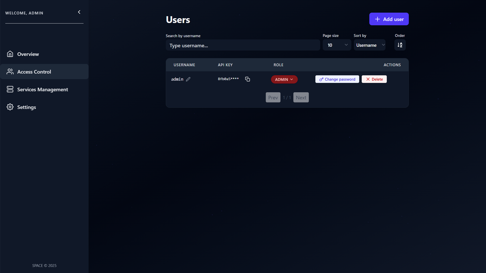

# 🔄 Manage Users

The **Users Management** view in **SPACE** allows administrators and managers to control access by updating roles and credentials of existing accounts.

From this view, you can:

- 🔑 **Change a user’s role**  
  Upgrade or downgrade a user’s role as long as you respect the permission restrictions:

  - **ADMIN** can change other users to any role.
  - **MANAGER** can change roles but cannot grant or remove ADMIN privileges.
  - **EVALUATOR** cannot manage users.

- 🔐 **Change a user’s password**  
  You can reset or update a user’s password.

  - This action is only allowed to be performed on users with **your same role or lower**.

  👉 For example, a MANAGER can update the password of another MANAGER or EVALUATOR, but never an ADMIN.

- 🗑️ **Delete users**  
  While the interface provides this option, details are covered in the dedicated [Delete Users](./delete-users.md) guide.

---

:::warning ⚠️ Important
There must **always be at least one ADMIN user** in SPACE.  
If you attempt to delete or downgrade the **last administrator**, SPACE will block the operation and return an error.  
:::
