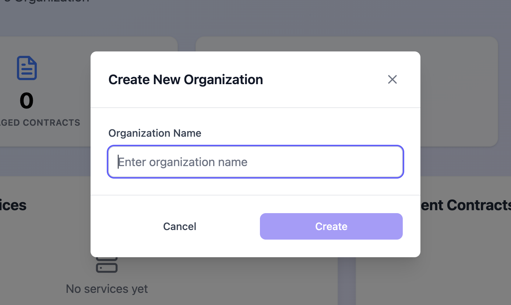

# ➕ Create Organization

Organizations are the top-level entities in SPACE. They represent your company and act as containers for all related resources, including services, contracts, API keys, etc. All manageable components in SPACE are created within the scope of an organization. Consequently, deleting an organization will permanently remove all associated resources.

## 1. Create Organizations

Organizations in SPACE are expected to be created from its UI. Nonetheless, `ADMIN` users can also create organizations programmatically using the **SPACE API**. To create an organization, follow these steps:

1. Log in to SPACE.
2. Display the organization selector in the left sidebar and click on **Create new organization**.

3. A modal will appear asking for the new organization’s name. Fill in the required field and click **Create**.

