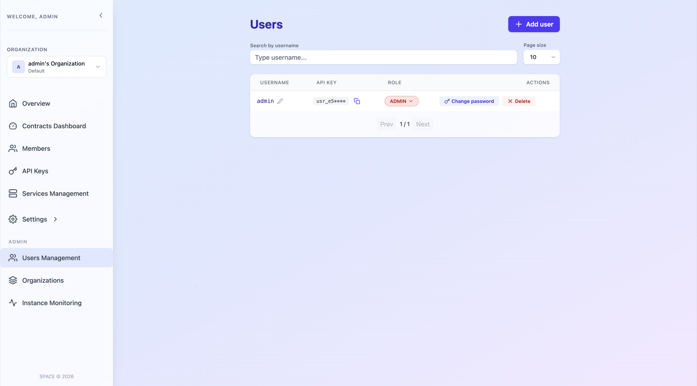
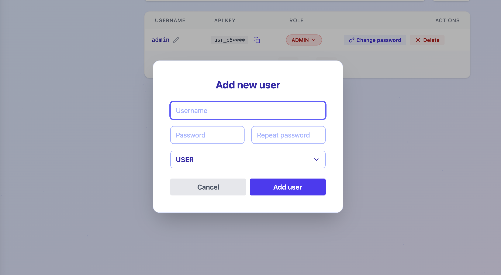
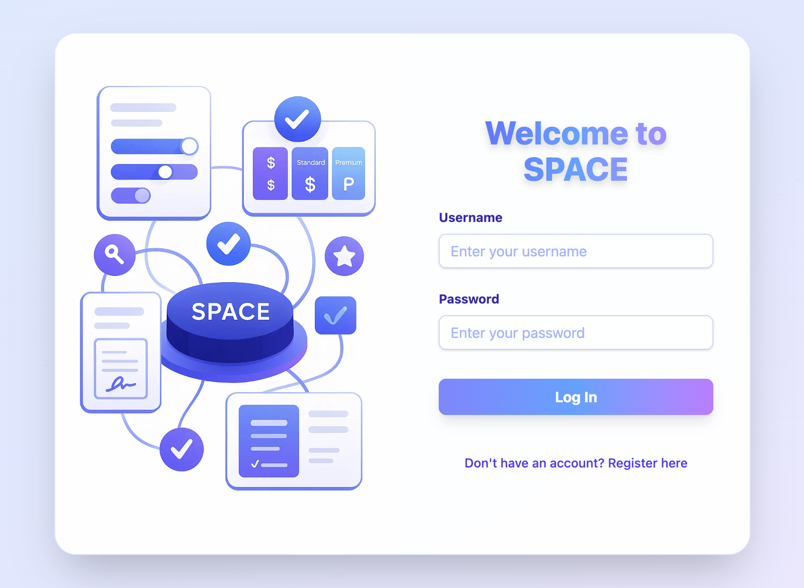
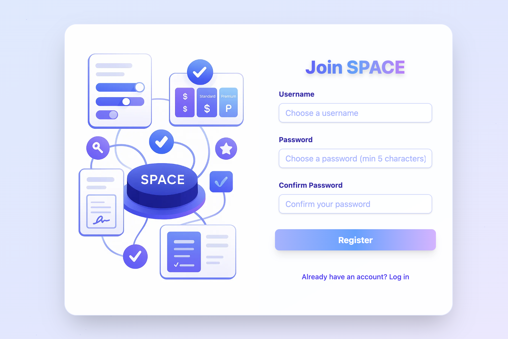
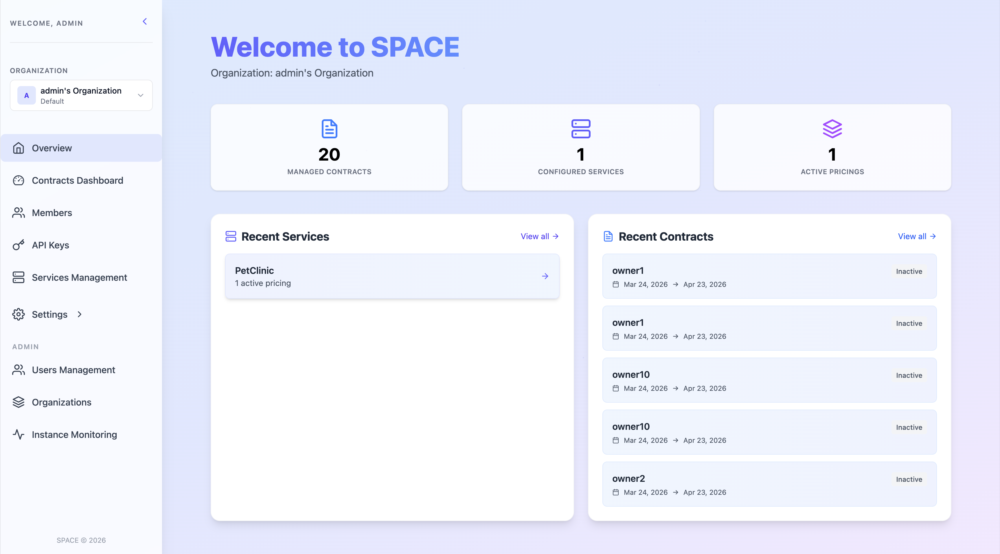

# ➕ Create User

Remember, in **SPACE**, users are not end-users of your SaaS application, but accounts used to manage permissions, members, services, and other administrative aspects within a SPACE organization.

Each account is assigned a **role**, which determines the operations they can perform.  
As a **quick reminder**, SPACE defines two user level roles:

- 👑 **ADMIN** – Has full control over all organizations and users within SPACE. Additionally, this role provides access to the instance monitoring module, enabling the analysis of usage patterns to detect anomalous or improper behaviors.
- 👤 **REGULAR USER** – Can potentially manage the organizations they are in. Depending on the role they have within each organization, their access can be more or less limited.
  👉 For more details, check [manage members](./manage-members.md).

To create a new user in SPACE, follow these steps:

## 1. Create Users via the UI (ADMIN only)

To create a new user account:  

1. Log in to SPACE with an **ADMIN** account.
2. Go to **Users Management** in the side panel.  
3. Click **Add User** at the top-right corner.  



A dialog will appear asking for the new user’s data.



4. Fill in the required fields, select a role, and click **Add user**.

---

## 2. Create Users via the UI (all users)

To create a new user account:  

1. Go to the SPACE auth page.



2. Press on `register here`.



3. Fill the form and press **Register**. You will then be redirected to the main SPACE dashboard. Your default personal organization will be automatically created and selected.



---

## 2. Create Users via the API

You can also create users programmatically using the **SPACE API**. To do this, you either an `ADMIN` user-level API key.

### Example with **curl**

```bash
curl --header 'x-api-key: <your_api_key>' \
  --json '{"username":"johndoe","password":"foobarbaz","role":"MANAGER"}' \
  http://localhost:5403/api/v1/users
```

### Simplified `POST /api/v1/users` request:

```http
POST /api/v1/users HTTP/1.1
Host: localhost:5403
Accept: application/json
Content-Type: application/json
x-api-key: <your_api_key>

{
  "username": "johndoe",
  "password": "foobarbaz",
  "role": "MANAGER"
}
```