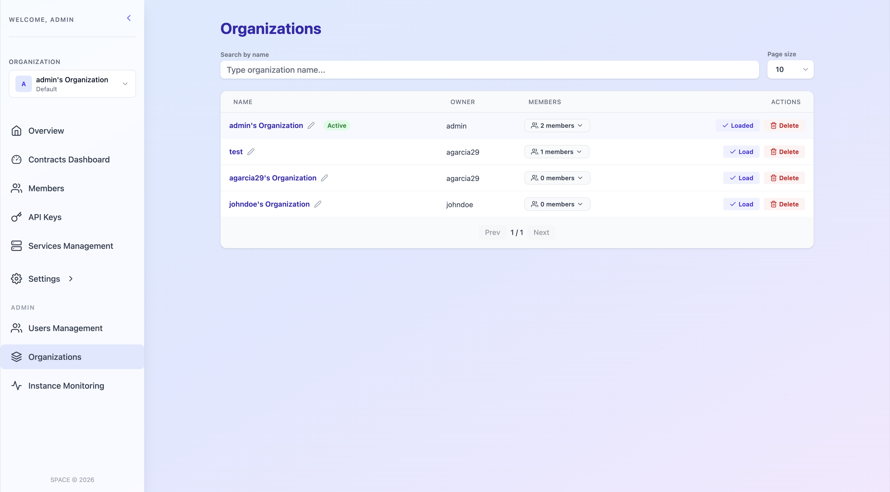

# 🗑️ Delete Organizations (Admins only)

SPACE administrators can delete organizations from the **Organizations** view, accessible from the left sidebar under the **ADMIN** section.



In addition to browsing and filtering all organizations within the SPACE instance, administrators can delete any organization by clicking the corresponding delete action on the organization card.

Deleting an organization is an **irreversible** operation and should be performed with caution. This operation triggers a **cascading deletion**, meaning that all resources associated with the organization are automatically and permanently removed.

Specifically, deleting an organization will result in:

1. **Deletion of all contracts**  
   All contracts defined within the organization will be permanently removed.

2. **Deletion of all services**  
   All services belonging to the organization will be permanently removed.

3. **Revocation of member access**  
   All members will lose access to the organization and its resources.

4. **Invalidation of all API keys**  
   Any API key associated with the organization will become immediately invalid.

The cascading nature of this operation is illustrated below:

```mermaid
graph TD
    Trigger[Delete Organization Request] --> Step1[Delete Contracts]
    Step1 --> Step2[Delete Services]
    Step2 --> Step3[Revoke Member Access]
    Step3 --> Step4[Invalidate API Keys]
    Step4 --> Step5[Delete Organization]