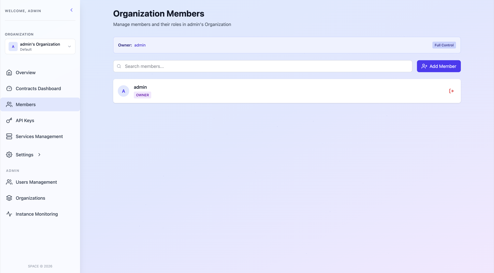
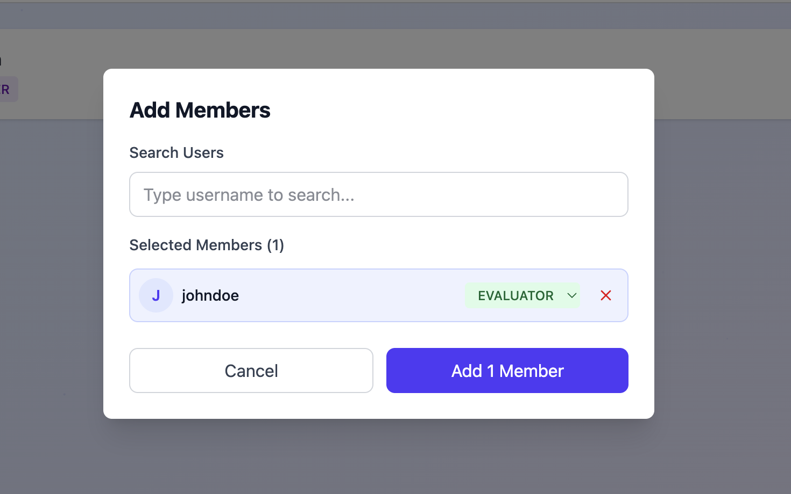
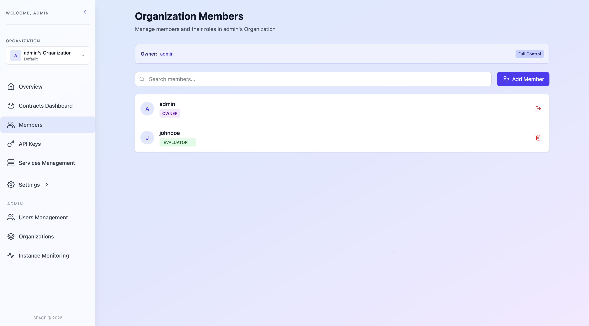

# 🔄 Manage Organization Members

Each SPACE organization consists of a set of members. These are users associated with the organization who, therefore, have access to its services, contracts, and other resources. However, the actions they can perform depend on their assigned role and permission level.

Although a detailed explanation of roles and permissions is provided in the [SPACE Roles](../../space-roles.md) section, the following summarizes the capabilities associated with each role:

- **OWNER**: Has full control over all aspects of the organization, including members, services, and contracts. This role can also transfer ownership of the organization to another member.

- **ADMIN**: Can manage all aspects of the organization, including members, services, and contracts, but cannot transfer ownership.

- **MANAGER**: Can manage the organization using only non-destructive operations. This includes creating and updating services, contracts, and other resources, but not deleting them. This role cannot transfer ownership.

- **EVALUATOR**: Has read-only access to the organization. This includes viewing members, services, contracts, and other resources, but not creating, updating, or deleting them. This role cannot transfer ownership.

---

Organization members can be managed from the **Members** section within the organization settings. Depending on their role, users can perform the following actions:

| Action               | OWNER | ADMIN | MANAGER | EVALUATOR |
|---------------------|:-----:|:-----:|:-------:|:---------:|
| Add users           |  ✅   |  ✅   |   ⚠️    |    ❌     |
| Change roles        |  ✅   |  ✅   |   ⚠️    |    ❌     |
| Remove users        |  ✅   |  ❌   |   ❌    |    ❌     |
| Transfer ownership  |  ✅   |  ❌   |   ❌    |    ❌     |

*⚠️: Only MANAGER or EVALUATOR roles can be assigned*

## Add members

To add a member to your organization, follow these steps:

1. On the **Members** page, click the **Add Member** button located in the top-right corner.

2. In the dialog that appears, enter the username of the user you want to add and select their role within the organization.

3. Click **Add member** to confirm. The user will be added to the organization with the selected role and will gain access to its resources according to their permissions.

## Change member roles

To change the role of an existing member, use the role selector displayed below the member’s name. This selector only shows the roles that you are allowed to assign based on your current permissions.

For example, if you have a MANAGER role, you can only assign MANAGER or EVALUATOR roles to other members, but not OWNER or ADMIN.

## Remove members

Only organization OWNERS can remove members. To do so, click the **Trash** icon located on the right side of the member you want to remove. This action will remove the member from the organization and revoke their access to all associated resources.