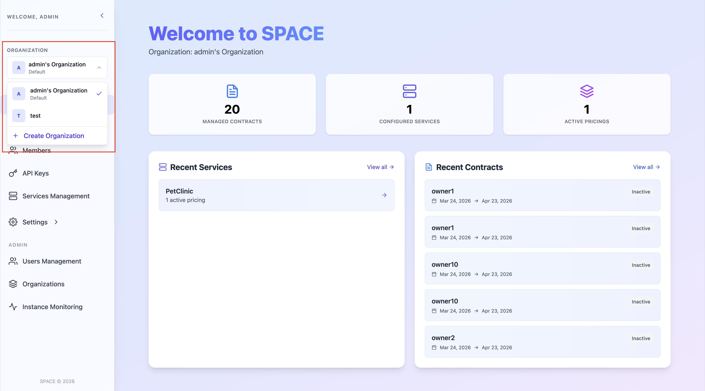
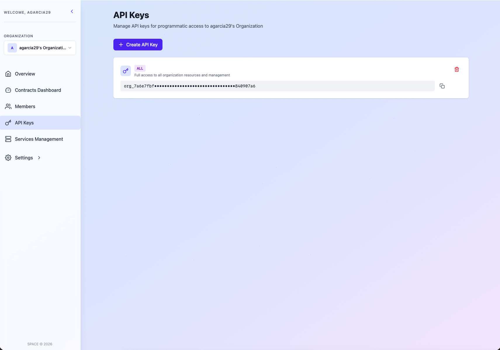

# 🔄 Manage API Keys

To interact with **SPACE** —whether through its API or via its SDKs— you need an organization level API key. This key acts as the **authentication token** for all requests.

Each organization in SPACE automatically receives an **API key** with `ALL` scope when created. Nonetheless, you can create additional API keys with specific scopes if needed. For more details on API key management, see [manage API keys](../manage-api-keys.md).

## 📥 How to Retrieve Your API Key

1. **Login** into SPACE.  
2. Select the organization for which you want to retrieve the API key using the selector in the left sidebar.

3. Then go to the **API Keys** section in the left sidebar.  
4. In this page, you will find a list of all API keys associated with the organization.

5. Copy the corresponding **API key** and use it in your integration/SDK configuration.

---

:::warning Important
- Keep your API key **secret** — it grants access based on its scope (`ALL`, `MANAGEMENT`, or `EVALUATION`).  
- If an API key is compromised, **replace** it by a new one **and delete** the original as soon as possible.  
- **Never** expose your API key directly in client-side code.
:::