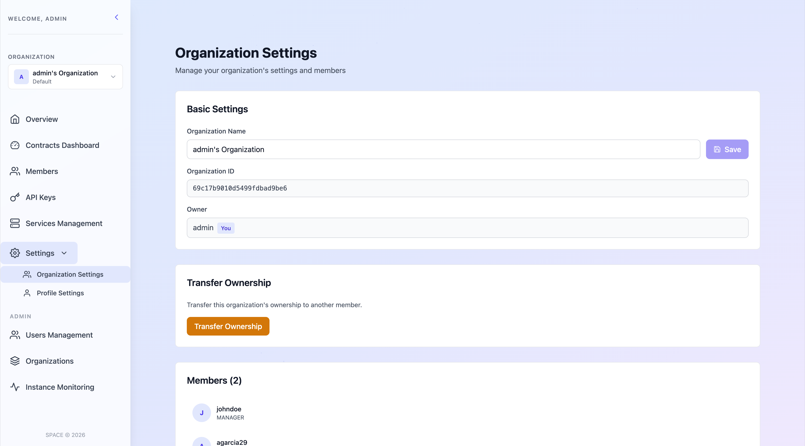
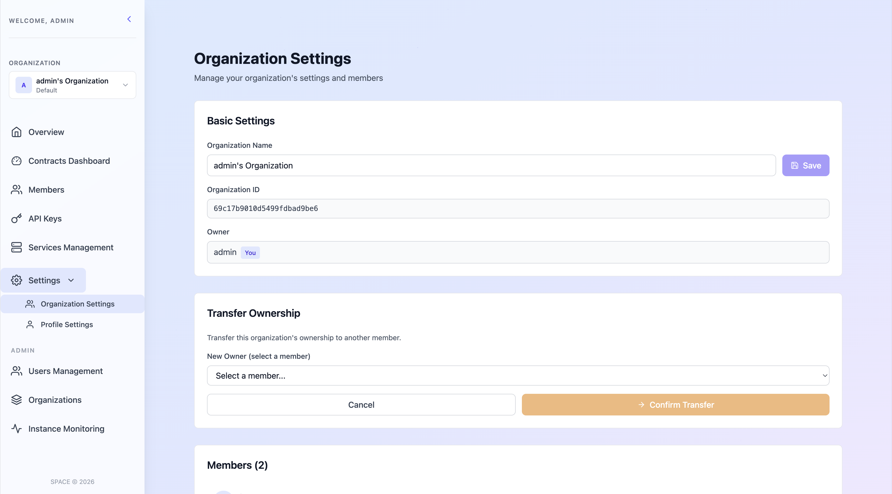

# 🔄 Transfer Organization's Ownership

If you are an owner of an organization in SPACE, you have the ability to transfer ownership to another member. This can be useful in scenarios such as when the current owner is leaving the company or wants to delegate ownership responsibilities to someone else.

To transfer ownership, follow these steps:

1. **Login** into SPACE.

2. Select the organization for which you want to transfer ownership using the selector in the left sidebar.

3. Go to the **Settings -> Organization Settings** section in the left sidebar.

4. Once your are there, scroll down to the **Transfer Ownership** section and press the **Transfer Ownership** button.

5. Then select a member of the organization to transfer ownership to and confirm the action.

:::warning ⚠️ Important
- Once the transfer is complete, the new owner will have full control over the organization, including the ability to manage users, API keys, and other settings.
- The previous owner will be downgraded to `ADMIN` role, losing ownership privileges but still able to manage the organization.
- Ownership cannot be transferred for organizations tagged as `default`, as these are personal to each user and are not intended to be shared or reassigned
:::

