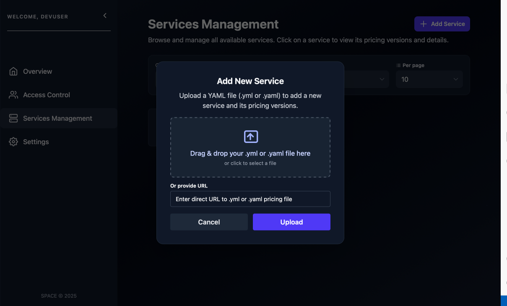

# ➕ Create a Service

To create a new service in **SPACE**, follow these steps:

---

## 1. Open the Services Management Panel
Navigate to the **Services Management** tab on the left sidebar and click the **Add Service** button.

---

## 2. Upload a Pricing2Yaml File
A dialog will appear prompting you to upload a YAML file.  

This file **must follow the [Pricing2Yaml specification](../../pricing-description-languages/Pricing2Yaml/the-pricing2yaml-syntax.md)**.

:::tip
Alternatively, you can **upload your pricing to SPHERE** and use the link of the desired pricing version to instantiate the service. See [this guide](../../sphere/user-guides/upload-pricing.md) for more details.
:::

---

## 3. Confirm and Create
Click the **Upload** button.  

Once uploaded, a new service will be created and the corresponding pricing will be automatically linked to it.

---

:::info
The **service name** is automatically taken from the `saasName` field in the uploaded **Pricing2Yaml** file. Make sure this field is **properly set** before uploading.
:::
