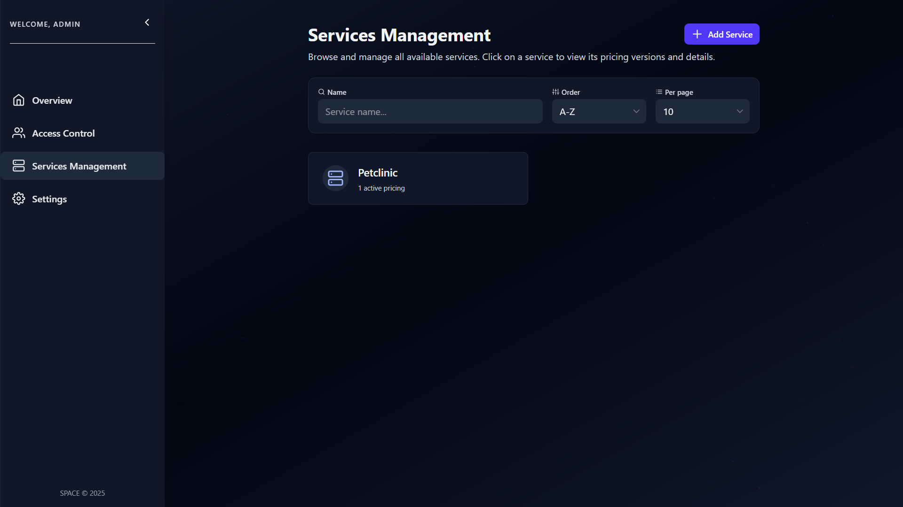

# ➕ Create a Service

To create a new service in **SPACE**, follow these steps:

---

## 1. Open the Services Management Panel
Navigate to the **Services Management** tab on the left sidebar and click the **Add Service** button.


---

## 2. Upload a Pricing2Yaml File
A dialog will appear prompting you to upload a YAML file.  

This file **must follow the [Pricing2Yaml specification](../../pricing-description-languages/Pricing2Yaml/the-pricing2yaml-syntax.md)**.


:::tip
Alternatively, you can **upload your pricing to SPHERE** and use the link of the desired
pricing version to instantiate the service. See [this guide](../../sphere/user-guides/pricing-card/03_files-and-versions.mdx) for more details.
:::

---

## 3. Confirm and Create
Click the **Upload** button.  

Once uploaded, a new service will be created and the corresponding pricing will be automatically linked to it.



:::info
The **service name** is automatically taken from the `saasName` field in the uploaded **Pricing2Yaml** file. Make sure this field is **properly set** before uploading.
:::

---

## 🛠️ Create a Service via the API

Besides the SPACE UI, you can also create a service programmatically using the **SPACE API**.  

This is especially useful for automation workflows (e.g., CI/CD pipelines) where you want to upload or update pricings without manual intervention.

### ▶️ Using curl

Run the following command in your terminal:

```bash
curl -H 'x-api-key: <your_api_key>' \
  --form pricing=@api/src/test/data/pricings/petclinic-2025.yml \
  http://localhost:5403/api/v1/services
```

- Replace `<your_api_key>` with a valid SPACE API key.
- Replace the path after @ with your own Pricing2Yaml file.

In this example, the file is located at api/src/test/data/pricings/petclinic-2025.yml.

This request sends a `multipart/form-data` form with a single field named pricing containing the uploaded YAML file.

### 📡 Simplified Request

```http
POST /api/v1/services HTTP/1.1
Host: localhost:5403
Accept: application/json
Content-Type: multipart/form-data; boundary=example
x-api-key: <your_api_key>

--example
Content-Disposition: form-data; name="pricing"; filename="petclinic-2025.yml"
Content-Type: application/octet-stream

saasName: Petclinic
syntaxVersion: "3.0"
etc...
--example--
```

### ✅ Example Response

If the request succeeds, SPACE will respond with a JSON body confirming the new service creation:

```json
{
  "name": "Petclinic",
  "disabled": false,
  "activePricings": {
    "2025-3-26": {
      "id": "68907e381570b332f02d05c1",
      "_id": "68907e381570b332f02d05c4"
    }
  },
  "_id": "68907e381570b332f02d05c3",
  "__v": 0
}
```

### 💡 Notes

- The field `activePricings` contains the list of currently active pricing versions for the created service.
- The property `disabled: false` indicates that the service is **enabled and available** immediately after creation.
- If the `saasName` in your Pricing2Yaml matches an existing disabled service, SPACE will **reactivate** it (see [Disabling Services](./disable-services.md) for more details).