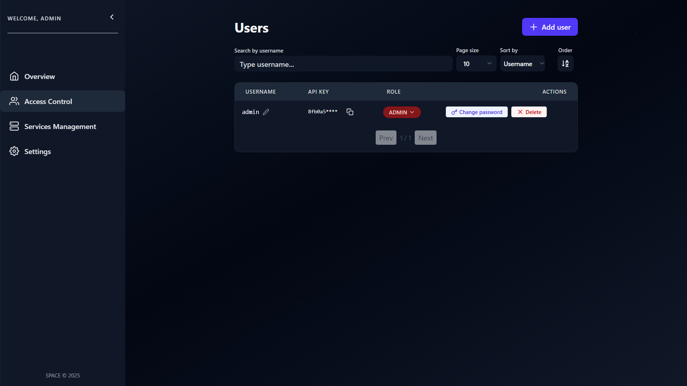
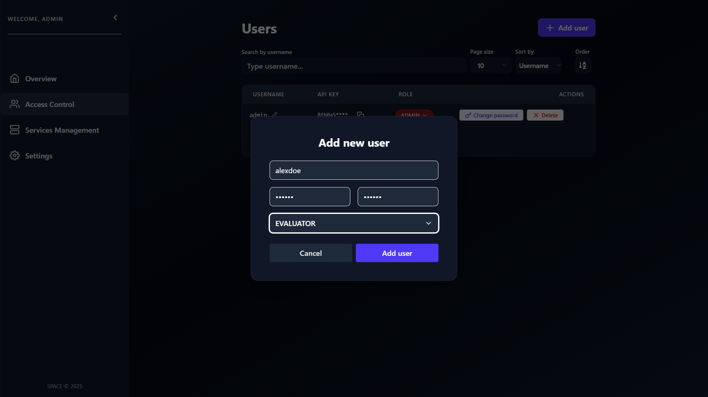

# ➕ Create User

Remember, in **SPACE**, users are not end-users of your SaaS application.  
Instead, they represent the **components** that need to interact with SPACE through an `apiKey`.

Each user account is assigned a **role**, which determines the operations they can perform.  
As a **quick reminder**, SPACE defines three roles:

- 👑 **ADMIN** – Can execute **all operations**, including user and service deletion.
- 🛠️ **MANAGER** – Can perform **all operations except destructive deletions** (e.g., cannot permanently remove users or services).
- 🔎 **EVALUATOR** – Can **only evaluate features**. This role is recommended for most components that only need to check feature access.

👉 For more details, see [SPACE Role Based Access Control](../space-roles.md).

To create a new user in SPACE, follow these steps:

---

## 1. Create Users via the UI

To create a new user account:  

1. Go to **Access Control** in the side panel.  
2. Click **Add User** at the top-right corner.  



A dialog will appear asking for the new user’s data.



3. Fill in the required fields, select a role, and click **Add user**.

:::warning
Remember that `ADMIN` users can create users with **any role**, while `MANAGER` users can only create `EVALUATOR` or `MANAGER` users.
:::

---

## 2. Create Users via the API

You can also create users programmatically using the **SPACE API**. To do this, you need either an `ADMIN` or `MANAGER` API key.

### Example with **curl**

```bash
curl --header 'x-api-key: <your_api_key>' \
  --json '{"username":"johndoe","password":"foobarbaz","role":"MANAGER"}' \
  http://localhost:5403/api/v1/users
```

### Simplified `POST /api/v1/users` request:

```http
POST /api/v1/users HTTP/1.1
Host: localhost:5403
Accept: application/json
Content-Type: application/json
x-api-key: <your_api_key>

{
  "username": "johndoe",
  "password": "foobarbaz",
  "role": "MANAGER"
}
```

### Example response body

```json
{
  "username": "johndoe",
  "role": "MANAGER",
  "createdAt": "2025-08-04T08:29:56.589Z",
  "updatedAt": "2025-08-04T08:29:56.589Z",
  "apiKey": "b2fb39e2407c47598ba4748189d32bb915c18357bc17c6a9d6e8064591f003dc"
}
```

✅ Once the user is created, copy its `apiKey` and use it in the x-api-key header to authenticate requests against the SPACE API for that user.