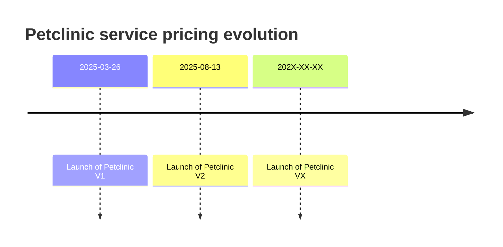
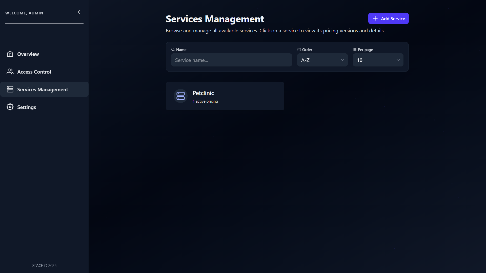
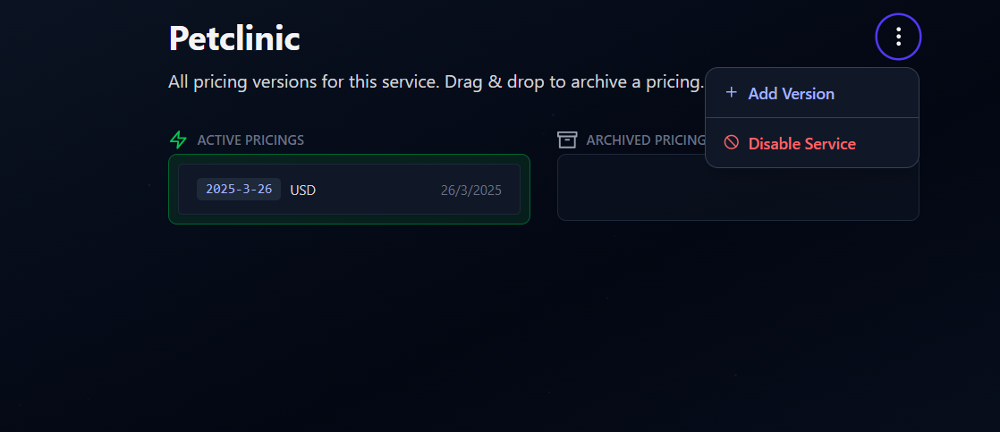
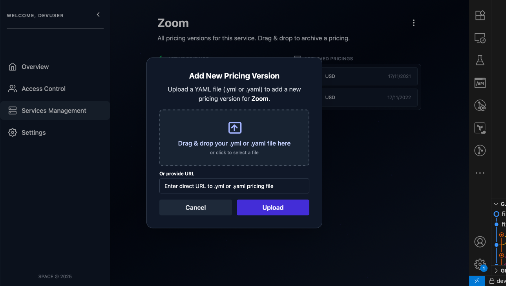

import Tabs from "@theme/Tabs";
import TabItem from "@theme/TabItem";

# ➕ Create a Pricing Version

One of SPACE’s most powerful features is its ability to act as a **Pricing Version Control System (PVCS)**.  

This means you can **easily track changes, activate or archive pricings, and evolve your SaaS offerings** without losing historical data.



The timeline above shows a sample evolution of **PetClinic**. Each new version represents an update to its pricing.

In the examples below, the **differences between Petclinic V1 and V2** are highlighted in grey.

<Tabs>
  <TabItem value="petclinic-v1" label="Petclinic V1">
  
  ```yaml
  syntaxVersion: "3.0"
  saasName: Petclinic
  version: v1
  createdAt: "2025-03-26"
  currency: USD
  features:
    pets:
      valueType: BOOLEAN
      defaultValue: true
      type: DOMAIN
    calendar:
      valueType: BOOLEAN
      defaultValue: false
      type: DOMAIN
  usageLimits:
    maxPets:
      valueType: NUMERIC
      defaultValue: 2
      unit: pet
      type: NON_RENEWABLE
      trackable: true
      linkedFeatures:
        - pets
  plans:
    BASIC:
      price: 0.0
      unit: user/month
      features: null
      usageLimits: null
    GOLD:
      price: 5.0
      unit: user/month
      features:
        calendar:
          value: true
      usageLimits:
        maxPets:
          value: 4
    PLATINUM:
      price: 12.0
      unit: user/month
      features:
        calendar:
          value: true
      usageLimits:
        maxPets:
          value: 7
  addOns: null
  ```
  </TabItem>

  <TabItem value="petclinic-v2" label="Petclinic V2">
  
  ```yaml
  syntaxVersion: "3.0"
saasName: Petclinic
// highlight-next-line
version: v2
createdAt: "2025-08-13"
currency: USD
features:
  pets:
    valueType: BOOLEAN
    defaultValue: true
    type: DOMAIN
  calendar:
    valueType: BOOLEAN
    // highlight-next-line
    defaultValue: true
    type: DOMAIN
// highlight-start
  smartClinicReports:
    valueType: BOOLEAN
    defaultValue: false
    type: DOMAIN
// highlight-end
usageLimits:
  maxPets:
    valueType: NUMERIC
    defaultValue: 2
    unit: pet
    type: NON_RENEWABLE
    trackable: true
    linkedFeatures:
      - pets
plans:
  BASIC:
    price: 0.0
    unit: user/month
    features: null
    usageLimits: null
  GOLD:
    price: 5.0
    unit: user/month
    features: null
    usageLimits:
      maxPets:
        value: 4
  PLATINUM:
    // highlight-next-line
    price: 14.99
    unit: user/month
    features:
      smartClinicReports:
        value: true
    usageLimits:
      maxPets:
        value: 7
// highlight-start
addOns:
  smartClinicReports:
    availableFor:
    - BASIC
    - GOLD
    price: 3.95
    features:
      smartClinicReports:
        value: true
// highlight-end
  ```
  </TabItem>
  </Tabs>

## 🚀 Uploading a New Pricing Version

Follow these steps to upload a new pricing version for an existing service in **SPACE**:

---

### 0. Prerequisites

- You must already have a service created in SPACE.  
  
  👉 If not, see [Create a Service](./create-service.md) first.

### 1. Open the Services Management Panel

Go to the **Services Management** tab in the left sidebar.  

Select the service you want to update (in this example, **PetClinic**).



### 2. Access the Service Details

Click on the **service card** to open its details.

Here you’ll find the list of existing pricing versions for that service.



### 3. Add a New Version

Click the **⋮ (three-dot menu)** at the top-right corner and select **Add Version**.

A dialog will appear asking you to upload a **Pricing2Yaml** file.

:::tip
Alternatively, you can **upload your pricing to SPHERE** and use the link of the desired pricing version to instantiate the service. See [this guide](../../sphere/user-guides/upload-pricing.md) for more details.
:::



:::danger Requirements

The pricing you upload must follow these rules in order to be added to the service:

- The `saasName` field must match your service’s name exactly.
- The `version` field must be unique compared to existing versions.

If your **Pricing2Yaml** file (no matter whether it has been provided as a link) contains a different `saasName` than the current service, SPACE will reject it with an error.
:::

## 4. Confirm Upload

Click **Upload** to finish.  

---

SPACE will create the new pricing version and automatically link it to your service.  
You’ll see it appear in the **versions list** inside the service details page.
