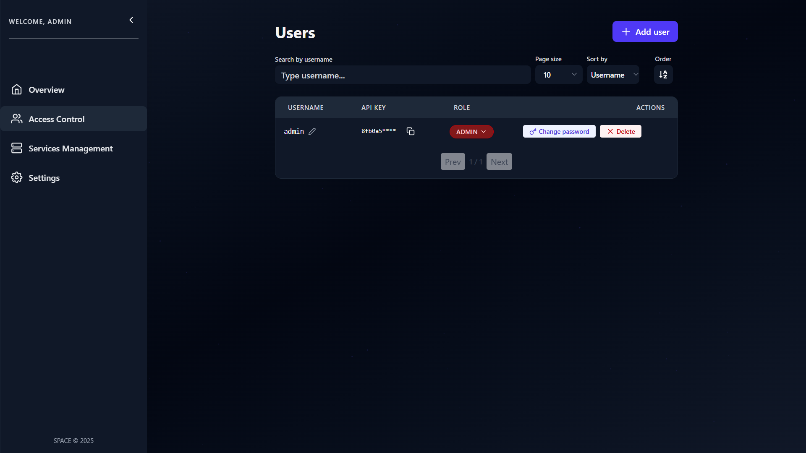

# 🗑️ Delete Users

As mentioned in the [Manage Users](./manage-users.md) guide, deleting a user is one of the operations available from the **Users Management** view in **SPACE**.

However, there are important conditions to keep in mind before performing this action:

1. ✅ **Only ADMIN users can delete other users.**  
   Managers and Evaluators do not have permission to perform this operation.  

2. ✅ **The last ADMIN cannot be deleted.**  
   SPACE always requires at least one administrator user to remain active.  
   If you attempt to delete the last administrator, the system will block the operation and return an error.  

---

:::warning Important
Once a user is deleted, their **API key stops working immediately**.  
Make sure that the corresponding component is either no longer in use or that its API key has already been replaced before deleting the user.  
:::