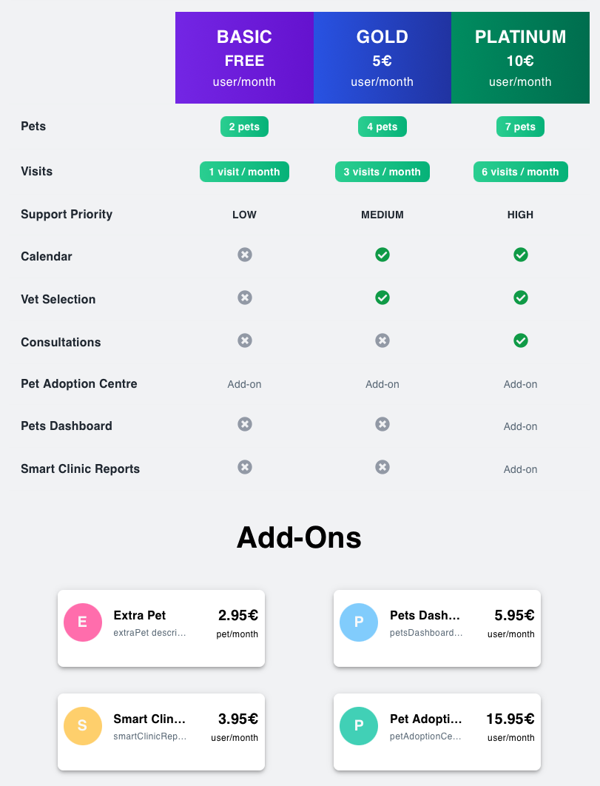

# Introduction

Welcome to the **SPACE User Guides** section.  

Here you’ll find **step-by-step tutorials** that explain how to perform common contracts and services management operations with SPACE, always grounded in a practical running example: **PetClinic**, a sample veterinary clinic management SaaS that is widely used to demonstrate the features of a particular software framework or technology in a real-world scenario.

## 🎯 What you’ll learn

:::danger 
This list has not been updated yet to reflect the real material. Some items may be missing or outdated.
:::

- How to create and authenticate SPACE users (services, not end-users)  
- How to register services and attach pricing models  
- How to create, update, and manage contracts  
- How to evaluate features and enforce usage limits in your SaaS  
- How SPACE supports microservice communication and role separation  

## 🐕 Our running example: PetClinic

The figure below illustrates a pricing for PetClinic. It includes **ten features** regulated by **three plans** and **three add-ons** (seven by plans, three by add-ons) and imposes **usage limits on the ***pets*** and ***visits*** features**. Moreover, some add-ons are not available for all plans. For instance, *Pets Dashboard* can be contracted only if the user subscribes to the *PLATINUM* plan.

---

👉 Use the sidebar to explore the available guides. Each one includes code snippets, request/response examples, and explanations tied back to the **PetClinic** scenario.
