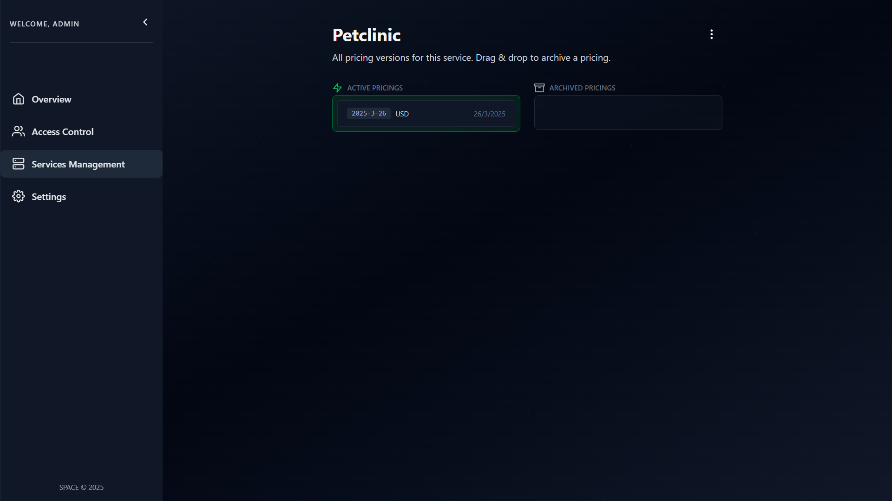

# 🔄 Manage Pricings Availability

Pricings in SPACE can transition between different availability states depending on their lifecycle.   This allows providers to **evolve their pricing** while maintaining traceability of past versions.

## 📊 Pricing Lifecycle

As shown in the figure, a pricing version within SPACE can be in one of three states:

- **Active**  
- **Archived**  
- **Deleted**  

---

## ✅ Active Pricings

Active pricings are those **currently used by the managed service**.

Users may be subscribed to them, and their subscriptions derive runtime configurations directly from these pricings.  

:::info Legacy Subscriptions
You might be wondering: *“If I only need the latest version, why would I ever keep multiple active pricings?”*  

The answer is **legacy subscriptions**. Keeping more than one version active allows you to support existing customers who subscribed under an older pricing version, **without forcing them into a contract novation** when a new version is released.  

For example:  

- A user subscribes under **PetClinic v1**.  
- Later, the provider launches **PetClinic v2**.  

Instead of forcing existing customers to migrate (contract novation), the provider can keep **both versions active simultaneously**:  

- **v1** remains active for users subscribed before the release of v2.  
- **v2** is offered to all new customers.  
:::

---

## 📦 Archived Pricings
Archived pricings are retained in **SPACE** for analytical purposes only.  
They represent historical versions of a service's pricing and have **no active subscribers**.  

:::info Contract Novation when Archiving
When an **active pricing** transitions to **archived**, all contracts linked to it will undergo **novation** into the most recent active pricing version.  

If this operation is done via the SPACE UI, each novated contract will be assigned to the **default cheapest plan** of the new pricing.  
:::

:::tip Recommended Practice
To avoid uncontrolled scenarios, we recommend handling **all contract novations** before archiving a pricing.  

In other words, **do not archive a pricing while it still has active contracts**.  
:::

---

## 🗑️ Deleted Pricings
When a pricing is deleted, it is **completely removed** from SPACE.  
This operation is **irreversible**, and deleted pricings cannot be recovered.  

Only **archived pricings** can be deleted.  

:::warning Important
- An **archived pricing** can be reactivated if needed.  
- A **deleted pricing** is permanently lost.  
:::

---

## 🎛️ How to Change Pricing State
Inside the **SPACE interface**, you can change the state of a pricing version by simply **dragging its card between states**.  

:::warning At least One Active Pricing Required
Each service must always have **at least one active pricing version**.  
It is not possible to archive all versions.  

If you wish to fully disable a service, refer to the guide on **[Disabling Services](./disable-services.md)**.  
:::