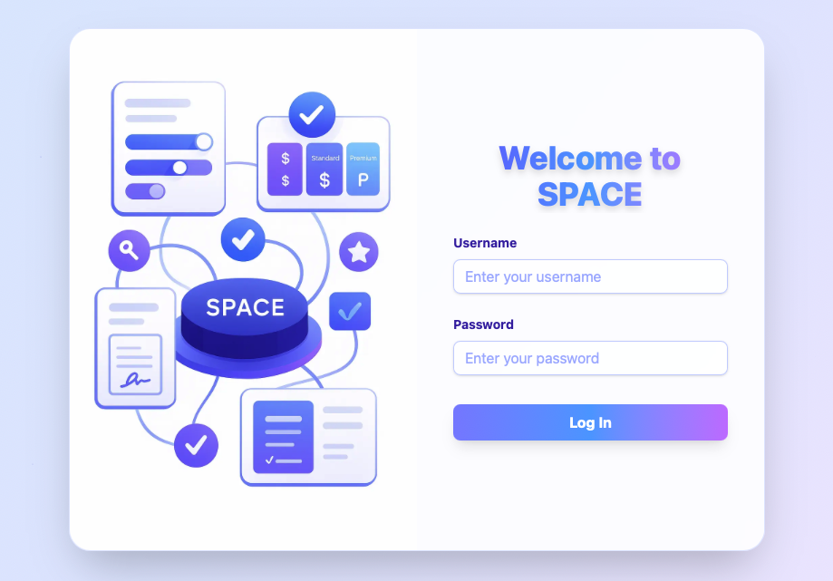
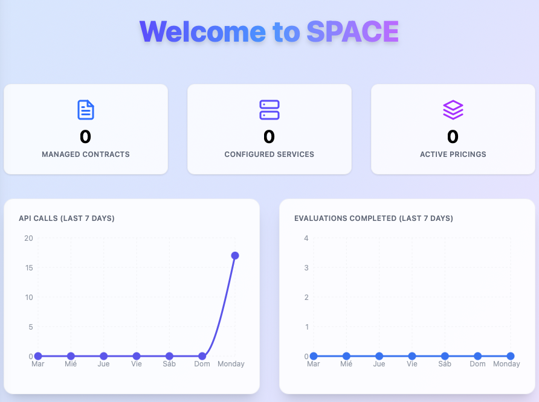

import Tabs from '@theme/Tabs';
import TabItem from '@theme/TabItem';

# 🚀 Run a SPACE Instance

This guide will walk you through the steps to set up and run your own instance of **SPACE**. You can choose to run it using **Docker** for a quick setup or set it up for **development purposes**.

:::info
You can find the SPACE repository on GitHub: [SPACE GitHub Repository](https://github.com/Alex-GF/space)
:::

<Tabs
  defaultValue="docker"
  values={[
    { label: '🐳 Docker', value: 'docker' },
    { label: '💻 Development', value: 'development' },
    { label: '☸️ Kubernetes', value: 'kubernetes' },
  ]}>

<TabItem value="docker">

### 0. Prerequisites

   - [Docker](https://www.docker.com/) and [Docker Compose](https://docs.docker.com/compose/) installed.

### 1. Clone the repository & run the application

```sh
git clone https://github.com/Alex-GF/space.git
cd space
docker-compose up -d
```

This will launch MongoDB, Redis, the backend API, the frontend client, and Nginx as a reverse proxy.

### 2. Log into SPACE

Then point your browser to [http://localhost:5403](http://localhost:5403), you should see this page:



Then log using:

- **Username:** `admin`
- **Password:** `space4all`

and you will be redirected to this page:



## Instance Configuration

In many cases, you may want to configure your SPACE instance to meet your specific needs while protecting your business secrets.

To do so, you can modify the environments of both the **server and client services** within the `docker-compose.yml` file that is located in the root directory of the repository.

The full documentation for each environment can be located in the [configuration section](../space-config.mdx).

:::warning
For **real-world applications** integrating SPACE, it's very important to change both the `JWT_SECRET` and `JWT_SALT` environment variables of the `server`service. This is because all pricing tokens generated by SPACE are signed using these values, and if they are not changed, anyone with access to the source code can generate valid tokens for any user, which could lead to unauthorized access to your services.
:::

</TabItem>

<TabItem value="development">

### 0. Prerequisites

   - [Node.js](https://nodejs.org/en/) (v18 or higher)
   - [npm](https://www.npmjs.com/) or [pnpm](https://pnpm.io/) (we recommend pnpm)
   - [MongoDB](https://www.mongodb.com/) (v7 or higher)
   - [Redis](https://redis.io/) (v7 or higher)

### 1. Clone the repository

```sh
git clone https://github.com/Alex-GF/space.git
cd space
```

### 2. Install dependencies

```sh
npm i
```

:::tip
We recommend using [pnpm](https://pnpm.io/) for package management, as it is faster and more efficient than npm or yarn. If you don't have pnpm installed, you can install it globally:

```sh
npm install -g pnpm
```

Then run:

```sh
pnpm install
```

This will install all dependencies for both the backend and frontend.
:::

### 3. Configure environment

For development purposes, SPACE can be configured using a `.env` file in both the `api/` and `frontend/` directories. Inside each one you'll find a `.env.example` file that you can use to configure your `.env` as desired. You find more details in the [configuration section](../space-config.mdx).

:::tip
If you don't care about the `.env` file configuration. You can also run:

```sh
pnpm run dev:setup:test
```

This will create both `.env` files in the `api/` and `frontend/` directories with default values for development.
:::

### 4. Start the development instance

To run SPACE in development mode, you can just run:

```sh
pnpm run dev
```

to start both the backend and frontend servers concurrently.

If you have used the default configuration, i.e. you executed `pnpm run dev:setup:test`, you can then access the frontend of SPACE at [http://localhost:5173](http://localhost:5173), and can log in as an admin user using these credentials:

- **Username:** `testAdmin`
- **Password:** `test4dm1n`

:::info
The SPACE server will run on port `3000` with this default configuration.
:::

</TabItem>

<TabItem value="kubernetes">

### 0. Prerequisites

- To have access to a kubernetes cluster wherein SPACE will be deployed

## 1. Run SPACE using kubernetes

Considering that you already have a cluster (we recommend using kubeadm from docker-desktop for testing purposes), you just need to navigate to the `k8s` folder within the [SPACE repository](https://github.com/Alex-GF/space). Considering that you are in the directory where the repository has been decompressed:

```bash
cd space/k8s
```

Then, you just need to run the deploy.sh script to deploy SPACE in your kubernetes cluster:

```bash
chmod +x deploy.sh
./deploy.sh
```

Then wait for the SPACE pods to start. If everything is set up correctly, you must have 3 replicas of the `server` pod running, and should be able to access SPACE at http://localhost.

If you want to explore SPACE, you can log in into the app using the following default credentials (this will be needed for retrieving API keys):

- **Username:** admin
- **Password:** space4all


:::info
If you are interested in learning more about SPACE, you can check out the SPACE documentation for more details on how to set it up, configure it, and use its features.
:::

</TabItem>

 </Tabs>
