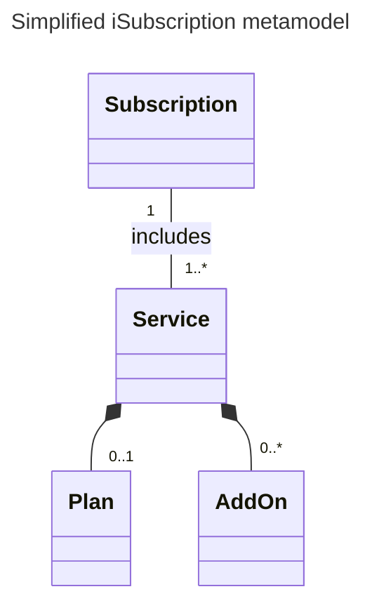
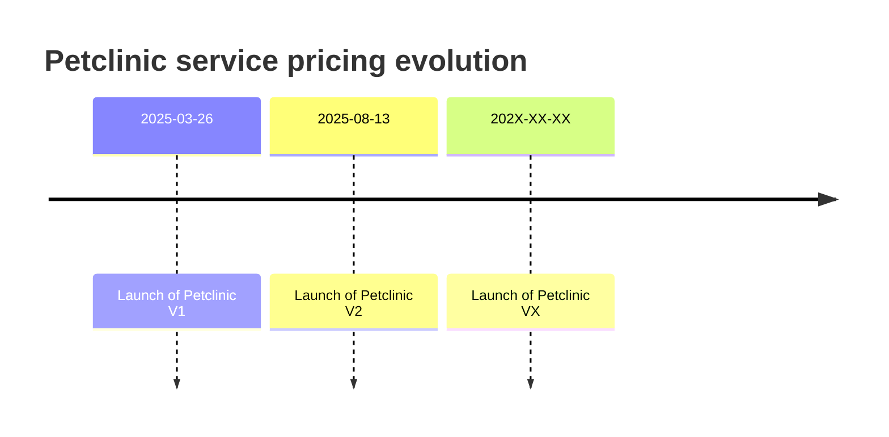
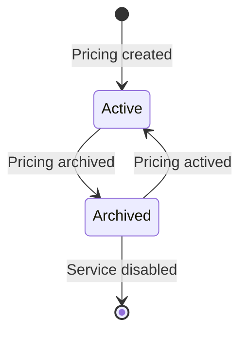
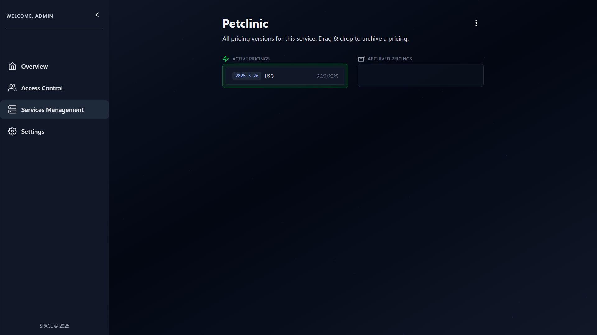

import Tabs from '@theme/Tabs';
import TabItem from '@theme/TabItem';

# Services and Pricings management

## SaaS providers with multiple services

Driven by market opportunities SaaS providers tend to innovate their products and offer new
features to their consumers progresivelly, rolling out extra features with add-ons and a fixed
pricing subscribing to a plan.

At some point the choice architect[^1] involved in the pricing may split the service into separated services
to reduce user cognitive overload in decision making.

To support these *multi-service* models *iSubscription* model propose a machine readable specification to 
solve this problem. Here is a very simple class diagram showing *iSubscription* model:



<Tabs>
  <TabItem value="single-service" label="Single service subscription">
  
  Overleaf is a cloud latex editor:
  
    ```mermaid
    ---
    title:  A subscription with Overleaf Standard and AI Assist add-on
    ---
    classDiagram
        class Sub["<u>Single: Subscription</u>"]
        class Overleaf["<u>Overleaf: Service</u>"]
        
        class Plan["<u>Standard: Plan</u>"]
        class AddOn["<u>AI Assist: AddOn</u>"]
        
        Sub -- Overleaf
        Overleaf -- Plan
        Overleaf -- AddOn
    ```
  </TabItem>
  <TabItem value="multi-service" label="Multiple service subscription" default>
  
    For example Cake.com offers the following services:
    - [Plaky](https://plaky.com): tasks and project management tool
    - [Pumble](https://pumble.com): team communication tool
    - [Clockify](https://clockify.com): time tracking tool

    Within a single subscription, you can purchase plans for each service individually:
  
    ```mermaid
    ---
    title:  A subscription with Placky FREE, Pumble PRO and Clockify STANDARD
    ---
    classDiagram
        class Sub["<u>Multi: Subscription</u>"]
        class Placky["<u>Placky: Service</u>"]
        class Pumble["<u>Pumble: Service</u>"]
        class Clockify["<u>Clockify: Service</u>"]
            
        class PlackyPlan["<u>Placky FREE: Plan</u>"]
        class PumblePlan["<u>Pumble PRO: Plan</u>"]
        class ClockifyPlan["<u>Clockify STANDARD: Plan</u>"]
            
        Sub -- Placky
        Placky -- PlackyPlan
        Sub -- Pumble
        Pumble -- PumblePlan
        Clockify -- ClockifyPlan
        Sub -- Clockify
    ```
  </TabItem>
</Tabs>


We can instantiate previous class diagram into an **object diagram** with our Cake.com products:


## Service management


## Pricing management

SPACE includes a pricing version control system allowing you to easily track changes
and archive or active pricings if necessary.



These represent two different versions of **Petclinic** SaaS, a fictional veterinary management application.
Petclinic V1 and V2 pricing **changes** are highlighted in **grey**:

<Tabs>
  <TabItem value="petclinic-v1" label="Petclinic V1">
  ```yaml
  syntaxVersion: "3.0"
  saasName: Petclinic
  version: v1
  createdAt: "2025-03-26"
  currency: USD
  features:
    pets:
      valueType: BOOLEAN
      defaultValue: true
      type: DOMAIN
    calendar:
      valueType: BOOLEAN
      defaultValue: false
      type: DOMAIN
  usageLimits:
    maxPets:
      valueType: NUMERIC
      defaultValue: 2
      unit: pet
      type: NON_RENEWABLE
      trackable: true
      linkedFeatures:
        - pets
  plans:
    BASIC:
      price: 0.0
      unit: user/month
      features: null
      usageLimits: null
    GOLD:
      price: 5.0
      unit: user/month
      features:
        calendar:
          value: true
      usageLimits:
        maxPets:
          value: 4
    PLATINUM:
      price: 12.0
      unit: user/month
      features:
        calendar:
          value: true
      usageLimits:
        maxPets:
          value: 7
  addOns: null
  ```
  </TabItem>
  <TabItem value="petclinic-v2" label="Petclinic V2">
  ```yaml
  syntaxVersion: "3.0"
  saasName: Petclinic
  // highlight-next-line
  version: v2
  createdAt: "2025-08-13"
  currency: USD
  features:
    pets:
      valueType: BOOLEAN
      defaultValue: true
      type: DOMAIN
    calendar:
      valueType: BOOLEAN
      // highlight-next-line
      defaultValue: true
      type: DOMAIN
  // highlight-start
    smartClinicReports:
      valueType: BOOLEAN
      defaultValue: false
      type: DOMAIN
  // highlight-end
  usageLimits:
    maxPets:
      valueType: NUMERIC
      defaultValue: 2
      unit: pet
      type: NON_RENEWABLE
      trackable: true
      linkedFeatures:
        - pets
  plans:
    BASIC:
      price: 0.0
      unit: user/month
      features: null
      usageLimits: null
    GOLD:
      price: 5.0
      unit: user/month
      features: null
      usageLimits:
        maxPets:
          value: 4
    PLATINUM:
      // highlight-next-line
      price: 14.99
      unit: user/month
      features:
        smartClinicReports:
          value: true
      usageLimits:
        maxPets:
          value: 7
  // highlight-start
  addOns:
    smartClinicReports:
      availableFor:
      - BASIC
      - GOLD
      price: 3.95
      features:
        smartClinicReports:
          value: true
  // highlight-end
  ```
  </TabItem>
</Tabs>


### Versions

If you want to upload more versions of your service click on the one you are interested and
then click on the three aligned button at the top right corner and click on **Add Version**.


A dialog will prompt you to upload a new **Pricing2Yaml** file. Make sure the `saasName`
field matches your service exactly, and the `version` field is unique compared to previous
versions for that service.


## Pricing Lifecycle






<details>

<summary>**Usage in terminal**</summary>

Using your terminal go to the location where you cloned the SPACE repository and make the following
request:

```bash
curl -H 'x-api-key: <your_api_key>' \
  --form pricing=@api/src/test/data/pricings/petclinic-2025.yml \
  http://localhost:5403/api/v1/services
```

This command will submit a form with a field `pricing` containing the Pricing2Yaml file
you specify in the path `@your/file/path`, in our case, `api/src/test/data/pricings/petclinic-2025.yml` file.


`POST /api/v1/users` request simplified:

```http
POST /api/v1/services HTTP/1.1
Host: localhost:5403
Accept: application/json
Content-Type: multipart/form-data; boundary=example
x-api-key: <your_api_key>

--example
Content-Disposition: form-data; name="pricing"; filename="petclinic-2025.yml"
Content-Type: application/octet-stream

saasName: Petclinic
syntaxVersion: "3.0"
etc...
--example--
```

If you have successfully make the request you will see the following JSON body
confirming the upload:

```json
{
  "name": "Petclinic",
  "disabled": false,
  "activePricings": {
    "2025-3-26": {
      "id": "68907e381570b332f02d05c1",
      "_id": "68907e381570b332f02d05c4"
    }
  },
  "_id": "68907e381570b332f02d05c3",
  "__v": 0
}
```

</details>

[^1]: Nudge theory: https://en.wikipedia.org/wiki/Nudge_theory

