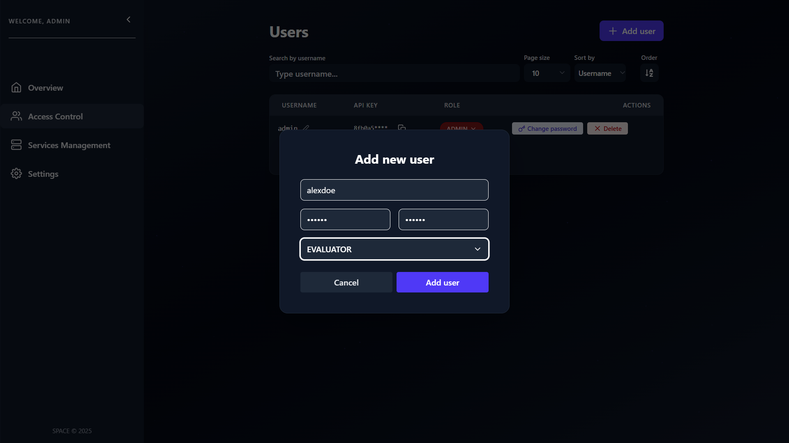
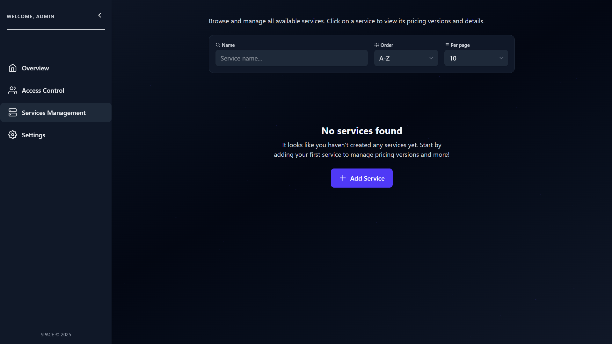

import Tabs from '@theme/Tabs';
import TabItem from '@theme/TabItem';

# Space starter guide

## Prerequisites

### Docker

In order to run Space on your machine you will have to install **Docker Engine**
and **Docker compose**. If you have already installed Docker you are good to go, but, if not please
follow the official [installation guide](https://docs.docker.com/engine/install/)

### HTTP Client

In order to make requests to SPACE API you will have to install a HTTP client.
There are plenty of options from CLIs to GUIs, choose the tool that you feel most
comfortable. Having said that here is a non-exhaustive list of tools you can use:

- GUIs:
  - [Postman](https://www.postman.com/)
  - [HTTPie](https://httpie.io/desktop)
- Text editors and IDEs:
  - IntelliJ HTTP Client
  - VS Code [REST Client](https://marketplace.visualstudio.com/items?itemName=humao.rest-client) plugin
- CLIs:
  - [curl](https://curl.se/)
  - [HTTPie](https://httpie.io/cli)

In this tutorial we will be using curl as it is very powerful and is already installed many Linux distributions.

## Initial Setup

Clone the SPACE repository: 

```
git clone https://github.com/Alex-GF/space.git
cd space
```

And run the `docker-compose.yml` file located inside:

```bash
docker compose up -d
```

This command will look at the `docker-compose.yml` file and start all containers necessary.
 
It will start the following containers:
- MongoDB database to store `iSubscription` schemas
- Redis cache to store feature and pricing tokens evaluations
- A node container hosting a SPA. Open the SPACE UI in your browser in `http://localhost:5403`. The UI helps 
non-technical users to manage pricings, user contracts, API Keys and much more.s
- A node container hosting the RESTful SPACE API
- A container with NGINX proxying the API and the UI. 

## Tutorial

### Login

You will need to have an API Key in order to access the SPACE API so head to your
browser and go to `http://localhost:5403`, you will see a form asking to
input your user credentials.


Please login as an `ADMIN` using username `admin` and password `space4all` it will
grant access to all the operations of the API.

:::info

If `ENVIRONMENT` environment variable is set to `development` or `testing` a fresh account
with `ADMIN` role is registered automatically with username `admin` and password `space4all`.

SPACE API authorization is design around Role Based Access Control (RBAC) you can see more details
in [SPACE Role based Access Control](../space-roles).

:::

After you successfully login go to your user account a grab your **API KEY**.


**Using curl**

You can also use curl to authenticate and get the API key directly from
your terminal:

```bash
curl --json '{"username":"admin","password":"space4all"}' \
  http://localhost:5403/api/v1/users/authenticate
```

`POST /api/v1/users/authenticate` request simplified:

```http
POST /api/v1/users/authenticate HTTP/1.1
Host: localhost:5403
Accept: application/json
Content-Type: application/json

{
  "username": "admin",
  "password": "space4all"
}
```

If you correctly entered your credentials you will see the following body as JSON with
an `apiKey` field.

```json
{
  "username": "admin",
  "apiKey": "6814727e91b328813a240586cd9ee5d7b2b29ce2ea44c1887d0f4653e6544f39",
  "role": "ADMIN"
}
```

Independently on the method you have used to get the API API key you will need it in every request.

### Create an user account

To create an user account go to **Access Control** in the side panel then click on **Add user** at the top right
corner.


A dialog will pop up asking to fulfill the user data in our case we are only interested in registering
an user with `EVALUATOR` role since your app will only need to evalutate features.



**Using curl**

Assuming you have an `ADMIN` API key you can create users with `EVALUATOR`, `MANAGER` or `ADMIN` role.
See the section [SPACE Role based Access Control](../space-roles) to see user account creation restrictions.

```bash
curl --header 'x-api-key: <your_api_key>' \
  --json '{"username":"johndoe","password":"foobarbaz","role":"MANAGER"}' \
  http://localhost:5403/api/v1/users
```

`POST /api/v1/users` request simplified:

```http
POST /api/v1/users HTTP/1.1
Host: localhost:5403
Accept: application/json
Content-Type: application/json
x-api-key: <your_api_key>


{
  "username": "johndoe",
  "password": "foobarbaz",
  "role": "MANAGER"
}
```

`POST /api/v1/users` example response body:

```json
{
  "username":"johndoe",
  "role":"MANAGER",
  "createdAt":"2025-08-04T08:29:56.589Z",
  "updatedAt":"2025-08-04T08:29:56.589Z",
  "apiKey":"b2fb39e2407c47598ba4748189d32bb915c18357bc17c6a9d6e8064591f003dc"
}
```

### Creating your first service

In order to create a service go to **Services Management** tab located at the side panel:



Click on **Add service** at the top right corner of your screen and dialog will submit a yaml file. Notice that this
yaml file has to be compliant with the **Pricing2Yaml** specification.


Hit upload button and a service will be registered with the pricing you submitted. If you want
to upload more versions of your service click on the three aligned button at the top right corner and click on
"Add Version".


**Using curl**

Using your terminal go to the location where you cloned the SPACE repository and make the following
request:

```bash
curl -H 'x-api-key: <your_api_key>' \
  --form pricing=@api/src/test/data/pricings/petclinic-2025.yml \
  http://localhost:5403/api/v1/services
```

This command will submit a form with a field `pricing` containing the Pricing2Yaml file
you specify in the path `@your/file/path`, in our case, `api/src/test/data/pricings/petclinic-2025.yml` file.


`POST /api/v1/users` request simplified:

```http
POST /api/v1/services HTTP/1.1
Host: localhost:5403
Accept: application/json
Content-Type: multipart/form-data; boundary=example
x-api-key: <your_api_key>

--example
Content-Disposition: form-data; name="pricing"; filename="petclinic-2025.yml"
Content-Type: application/octet-stream

saasName: Petclinic
syntaxVersion: "3.0"
etc...
--example--
```

If you have successfully make the request you will see the following JSON body
confirming the upload:

```json
{
  "name": "Petclinic",
  "disabled": false,
  "activePricings": {
    "2025-3-26": {
      "id": "68907e381570b332f02d05c1",
      "_id": "68907e381570b332f02d05c4"
    }
  },
  "_id": "68907e381570b332f02d05c3",
  "__v": 0
}
```

### Creating your first contract

Imagine that an user of your SaaS has purchased GOLD plan of `petclinic`. Then after
verifying the payment, you will have to register it in SPACE to keep track of the
state of the subscription.

In order to upload a contract correctly you will have to provide:
- User contract information containing at least the id of the user purchasing
the service and its username
- A billing period detailing if the subscription automatically renewed `autorenew`
and the number of days until the next charge
- An object indicating the plan the user has contracted

ou can do it using several methods:

<Tabs>
  <TabItem value="space-node-client" label="SPACE Node client" default>
    ```js
    const newContract = {
        userContact: {
            userId: "72ee0357-e34b-4d8f-9e0f-b710391cb298",
            username: "petclinicuser01"
        },
        billingPeriod: {
            "autoRenew": true,
            "renewalDays": 365
        },
        contractedServices: {
            petclinic: "2025-3-26"
        },
        subscriptionPlans: {
            petclinic: "GOLD"
        },
        subscriptionAddOns: {
            petclinic: {
                petAdoptionCentre: 1
            }
        }
    }
    spaceClient.contracts.addContract(newContract)
    ```
  </TabItem>
  <TabItem value="curl" label="curl">
    ```bash
    curl -H 'x-api-key: <your_api_key>' \
      http://localhost:5403/api/v1/contracts \
      --json @- << EOF
    {
      "userContact": {
        "userId": "72ee0357-e34b-4d8f-9e0f-b710391cb298",
        "username": "petclinicuser01"
      },
      "billingPeriod": {
        "autoRenew": true,
        "renewalDays": 365
      },
      "contractedServices": {
        "petclinic": "2025-3-26"
      },
      "subscriptionPlans": {
        "petclinic": "GOLD"
      },
      "subscriptionAddOns": {
        "petclinic": {
          "petAdoptionCentre": 1
        }
      }
    }
    EOF
    ```
  </TabItem>
</Tabs>


**Using curl**


`POST /api/v1/contracts` request simplified:

```http
POST /api/v1/contracts HTTP/1.1
Host: localhost:5403
Accept: application/json
Content-Type: application/json
x-api-key: <your_api_key>

{
  "userContact": {
    "userId": "72ee0357-e34b-4d8f-9e0f-b710391cb298",
    "username": "petclinicuser01"
  },
  "billingPeriod": {
    "autoRenew": true,
    "renewalDays": 365
  },
  "contractedServices": {
    "petclinic": "2025-3-26"
  },
  "subscriptionPlans": {
    "petclinic": "GOLD"
  },
  "subscriptionAddOns": {
    "petclinic": {
      "petAdoptionCentre": 1
    }
  }
}
```

If you have successfully make the request you will see the following JSON body
confirming the contract upload:

```json
{
  "userContact": {
    "userId": "72ee0357-e34b-4d8f-9e0f-b710391cb298",
    "username": "petclinicuser01"
  },
  "billingPeriod": {
    "startDate": "2025-08-04T10:31:46.010Z",
    "endDate": "2026-08-04T10:31:46.010Z",
    "autoRenew": true,
    "renewalDays": 365
  },
  "usageLevels": {
    "petclinic": {
      "maxPets": {
        "consumed": 0
      },
      "maxVisits": {
        "resetTimeStamp": "2025-09-04T10:31:46.012Z",
        "consumed": 0
      },
      "calendarEventsCreationLimit": {
        "resetTimeStamp": "2025-09-04T10:31:46.012Z",
        "consumed": 0
      }
    }
  },
  "contractedServices": {
    "petclinic": "2025-3-26"
  },
  "subscriptionPlans": {
    "petclinic": "GOLD"
  },
  "subscriptionAddOns": {
    "petclinic": {
      "petAdoptionCentre": 1
    }
  },
  "history": [],
  "id": "68908c121570b332f02d05d9"
}
```


