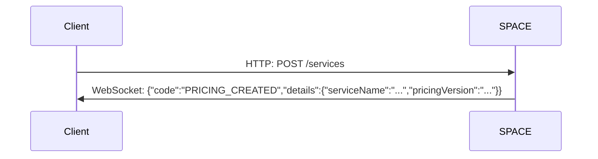
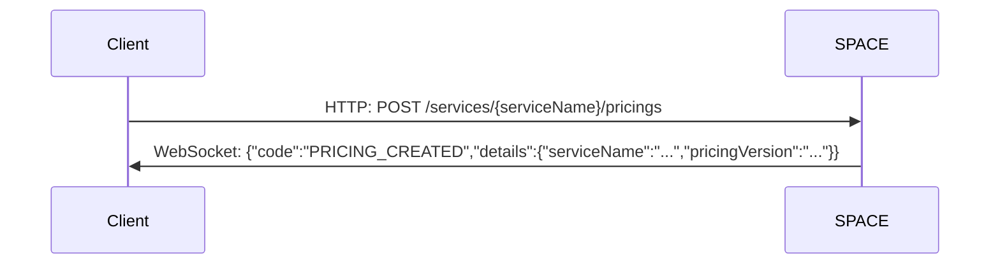
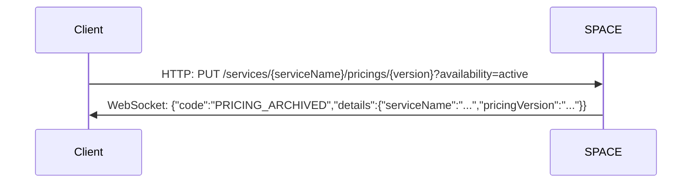
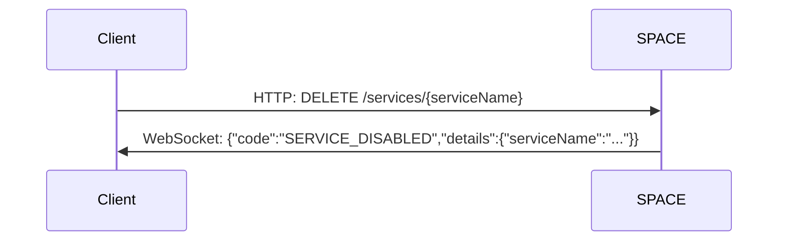

import Tabs from '@theme/Tabs';
import TabItem from '@theme/TabItem';


# SPACE and Socket.io

SPACE uses the Socket.IO library to emit events when certain operations are performed in the SPACE API.

> Socket.IO is a library that enables low-latency, bidirectional and event-based communication between a client and a server.

For an application to receive events from the SPACE Socket.IO server, the developer must install in
their application a library compatible with the Socket.IO protocol. You can see a list of client-side
libraries compatible with Socket.IO at the following [link](https://socket.io/docs/v4/#client-implementations).

## Socket.IO Client Installation

If you want to connect to SPACE Socket.IO server you will have to install a Socket.IO client 
library:

<Tabs groupId="language">
  <TabItem value="js" label="Javascript">
    
  ```bash
  npm install socket.io-client
  ```

  </TabItem>
  <TabItem value="java" label="Java">

  Include the following Maven coordinates in your `pom.xml` file to install 
  Socket.IO client library for Java:

  ```xml
  <dependency>
    <groupId>io.socket</groupId>
    <artifactId>socket.io-client</artifactId>
    <version>2.1.2</version>
  </dependency>
  ```
  </TabItem>
</Tabs>

## Socket.IO Client Configuration

SPACE Socket.IO server is configured to do the handshake connection with a Socket.IO client 
in `events` path (not related to the REST API endpoints, it is used solely for the handshake process).
By default the SPACE Socket.IO server will listen on port `5403`.

The SPACE Socket.IO server provides only the ``/pricings`` namespace. Within this namespace,
message events are emitted with different payloads depending on the API operation performed on the server.

Below are several examples showing how to connect to the server using a Socket.IO client in various programming languages:

<Tabs groupId="language">
  <TabItem value="js" label="Javascript">

  ```js
  import { io } from "socket.io-client";

  const socket = io("ws://localhost:5403/pricings", {
    path: "/events",
    transports: [ "websocket" ]
  })

  socket.on("message", (args) => console.log(args))
  // { code: 'PRICING_ARCHIVED', details: { serviceName: 'Zoom', pricingVersion: '2024' }}
  ```  


  </TabItem>
  <TabItem value="java" label="Java">


  ```java
  URI uri = URI.create("http://localhost:5403/pricings");

  IO.Options options = IO.Options.builder()
    .setPath("/events/")
    .setTransports(new String[] { WebSocket.NAME })
    .build();

  Socket socket = IO.socket(uri, options);
  socket.connect();
  socket.on("message", objects -> Arrays.stream(objects).forEach(System.out::println));
  ```

  </TabItem>
</Tabs>

:::info Code explanation

  Then create a socket that binds to `/pricings` namespace, you will have to provide an url providing the 
  the host or ip a port of SPACE and the namespace to connect in this case to `http://localhost:5403/pricings`.

  After configuring a socket you can attach a listener to listen to events emmited in `/pricings` namespace.
  Only `message` events are emmitted but depending on the API operation every payload is different.  

Configure your Socket.IO client to use the /events path and restrict it to use only the WebSocket transport.

Next, create a socket that connects to the ``/pricings`` namespace. To do this, specify the SPACE
server's host (or IP address) and port, along with the namespace URL (i.e, http://localhost:5403/pricings).

Once the socket is configured, attach a listener to handle events emitted within the ``/pricings`` namespace.
Only ``message`` events are emitted, but their payloads vary depending on the API operation that triggered them.
:::

## Events

Events are emitted within the ``/pricings ``namespace. By attaching a listener to handle ``message`` events
in this namespace, you can receive various SPACE events such as:

- PRICING_CREATED
- PRICING_ARCHIVED
- PRICING_ACTIVED
- SERVICE_DISABLED

### PRICING_CREATED

The `PRICING_CREATED` event is triggered when you upload a new service to SPACE or when
you add a new pricing version to an existing service. The API operations that trigger this event are:

- `POST /services`
- `POST /services/{serviceName}/pricings`

**JSON Schema**:

- **code** *(string)*: `PRICING_CREATED`
- **details** *(object)*
  - **serviceName** *(string)*
  - **pricingVersion** *(string)*

**Example**

```json
{
  "code": "PRICING_CREATED",
  "details": {
    "serviceName": "Zoom",
    "pricingVersion": "2024"
  }
}
```

When `POST /services` operation is triggered, SPACE sends the previous schema in the WebSocket connection:



When `POST /services/{serviceName}/pricings` operation is triggered, SPACE
sends the previous schema in the WebSocket connection:



### PRICING_ARCHIVED

The `PRICING_ARCHIVED` event is triggered when you archive a certain pricing version of a service.
The API operation that trigger this event is:

- `PUT /services/{serviceName}/pricings/{version}?availability=archived`

**JSON Schema**:

- **code** *(string)*: `PRICING_ARCHIVED`
- **details** *(object)*
  - **serviceName** *(string)*
  - **pricingVersion** *(string)*

**Example**

```json
{
  "code": "PRICING_ARCHIVED",
  "details": {
    "serviceName": "Zoom",
    "pricingVersion": "2024"
  }
}
```


When `PUT /services/{serviceName}/pricings/{version}?availability=archived` operation is triggered, SPACE
sends the previous schema in the WebSocket connection:


### PRICING_ACTIVED

The `PRICING_ACTIVED` event is triggered when you active a previous archived pricing version of a service.
The API operation that trigger this event is:

- `PUT /services/{serviceName}/pricings/{version}?availability=active`

**JSON Schema**:

- **code** *(string)*: `PRICING_ACTIVED`
- **details** *(object)*
  - **serviceName** *(string)*
  - **pricingVersion** *(string)*

**Example**

```json
{
  "code": "PRICING_ACTIVED",
  "details": {
    "serviceName": "Zoom",
    "pricingVersion": "2024"
  }
}
```

When `PUT /services/{serviceName}/pricings/{version}?availability=active` operation is triggered, SPACE
sends the previous schema in the WebSocket connection:



### SERVICE_DISABLED

The `PRICING_ACTIVED` event is triggered when you delete a service.
The API operation that trigger this event is:

- `DELETE /services/{serviceName}`

**JSON Schema**:

- **code** *(string)*: `SERVICE_DISABLED`
- **details** *(object)*
  - **serviceName** *(string)*

**Example**

```json
{
  "code":"SERVICE_DISABLED",
  "details": {
    "serviceName": "Zoom"
  }
}
```

When `DELETE /services/{serviceName}` operation is triggered, SPACE
sends the previous schema in the WebSocket connection:



## Debugging Socket.IO packets

If you want to intercept the WebSocket connection between SPACE Socket.IO server and a
Socket.IO client you will need to use a network packet analyzer like [Wireshark](https://www.wireshark.org/).

Socket.IO protocol messages are encapsulated within Engine.IO packets (the underlying protocol used by Socket.IO).
These packets are then transmitted as WebSocket frames, which are ultimately sent over TCP to the Socket.IO server.
You can further read more about Socket.IO protocol and packet encoding [here](https://github.com/socketio/socket.io-protocol) and Engine.IO
[here](https://github.com/socketio/engine.io-protocol).

Hex dump of a WebSocket text frame with a payload:

```txt
0000   81 6f 34 32 2f 70 72 69 63 69 6e 67 73 2c 5b 22
0010   6d 65 73 73 61 67 65 22 2c 7b 22 63 6f 64 65 22
0020   3a 22 50 52 49 43 49 4e 47 5f 43 52 45 41 54 45
0030   44 22 2c 22 64 65 74 61 69 6c 73 22 3a 7b 22 73
0040   65 72 76 69 63 65 4e 61 6d 65 22 3a 22 57 69 72
0050   65 4d 6f 63 6b 22 2c 22 70 72 69 63 69 6e 67 56
0060   65 72 73 69 6f 6e 22 3a 22 32 30 32 34 22 7d 7d
0070   5d
```

The payload of the previous WebSocket frame contains an Engine.IO packet, which
turn includes a Socket.IO packet. From bytes 0x02 to 0x70 in the previous hex dump,
you can see an example of an Engine.IO packet containing a Socket.IO packet,
encoded in ASCII as follows:

```txt
42/pricings,["message",{"code":"PRICING_CREATED","details":{"serviceName":"WireMock","pricingVersion":"2024"}}]
```
