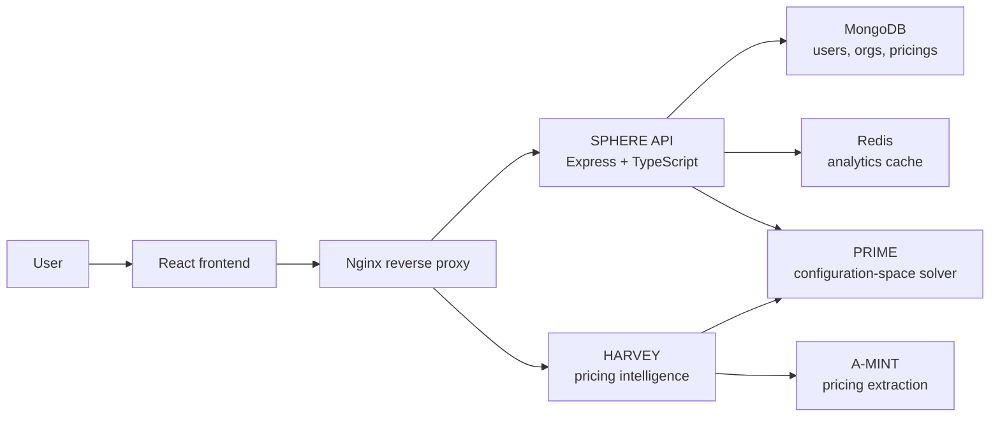

# 🌌 What is SPHERE?

**SPHERE (SaaS Pricing Holistic Evaluation and Regulation Environment)** is an open-source, multi-tenant platform for treating SaaS pricing as an engineering artifact. It brings pricing design, version control, configuration-space analysis, dataset management, and pricing intelligence into one workspace.

The platform addresses a practical problem in SaaS engineering: plans and add-ons create a combinatorial configuration space, while pricing changes continuously as providers add capabilities, revise limits, and reposition products. SPHERE makes those changes inspectable and reproducible by representing each pricing as an **iPricing**, serializing it in the human-readable **Pricing2Yaml** format, and storing every revision as a versioned document.

:::info Research context
This overview is based on *SPHERE: A web platform for holistic SaaS pricing modelling, versioning, and analysis* (SoftwareX). The paper describes SPHERE's multi-tenant architecture, pricing editor, Pricing Version Control System (PVCS), configuration-space analysis, and HARVEY pricing-intelligence assistant.
:::

## Scope

SPHERE supports the complete pricing lifecycle:

- **Model** a pricing in code or through the visual editor.
- **Version** each pricing revision and preserve stable YAML URLs.
- **Organize** related pricings into collections and organizations.
- **Analyse** configuration-space size, structure, and price ranges.
- **Explore** valid plan/add-on configurations interactively.
- **Collaborate** through organization membership, hierarchies, and granular permissions.
- **Reason** about pricing with HARVEY, using stored pricings, uploaded iPricings, or external pricing pages as context.

## Core concepts

| Concept | Meaning in SPHERE |
| --- | --- |
| **iPricing** | The machine-oriented representation of a SaaS pricing. |
| **Pricing2Yaml** | The YAML syntax used to author, validate, exchange, and persist an iPricing. |
| **Pricing version** | An immutable revision of a pricing document, ordered over time and addressable through a stable URL. |
| **Configuration space** | The set of valid subscriptions produced by the plans, add-ons, features, and constraints in a pricing. |
| **Organization** | The ownership and access boundary for pricings and collections. |
| **Collection** | A curated, permission-aware group of related pricings. |
| **PVCS** | SPHERE's pricing version-control workflow: multiple versions, temporal analytics, and reproducible source files. |

## Architecture

SPHERE separates the browser presentation layer, the application API, the data layer, and pricing-intelligence services. Nginx routes frontend traffic, API requests, static files, and HARVEY requests to their respective components. The frontend is a React single-page application; the backend is a TypeScript/Node.js Express API; MongoDB stores persistent entities; Redis caches expensive configuration-space computations.

The API integrates `pricing4ts` to parse Pricing2Yaml and exposes configuration-space results through the UI. HARVEY uses PRIME and A-MINT as tools: PRIME computes and optimizes valid configurations, while A-MINT extracts pricing information from external SaaS pages.

## Pricing intelligence capabilities

SPHERE combines four operations that are often separated across pricing tools:

1. **Authoring**: the code editor gives technical users immediate syntax feedback and a rendered pricing table; the visual editor exposes the same model to users who do not want to learn YAML first.
2. **Analysis**: each version receives configuration-space metrics, plan and feature counts, usage-limit classifications, and minimum/maximum subscription prices. Redis caches these results so repeated inspection does not invoke the solver unnecessarily.
3. **Exploration**: versions with up to 2,000 valid configurations expose every configuration through a searchable, plan-filterable explorer.
4. **Assistance**: HARVEY answers natural-language questions with a pricing version as context, compares stored or external pricings, and delegates extraction and optimization to A-MINT and PRIME.

These operations make a pricing change traceable: a user can edit a source document, publish a new version, inspect how its configuration space changed, and use the resulting data in an integration or research workflow.

## Integration and communication

SPHERE is designed to sit alongside pricing-driven development tools rather than replace the application that consumes a pricing. The web interface communicates with the API over HTTP(S); server-sent events deliver platform notifications to the browser. External tools can call the same API with a bearer token or scoped API key, download a stable Pricing2Yaml URL, or use the OpenAPI contract to generate a client.

Keep the API behind the deployment's trusted boundary when possible. Public pricing pages and HARVEY extraction URLs are intentionally different from authenticated management operations: the former support discovery, while the latter enforce organization and entity permissions.

## Research and teaching use

The SoftwareX paper reports SPHERE's use in software-engineering education, pricing-evolution studies, pricing-driven self-adaptation, and the consolidation of research artifacts such as Pricing2Yaml, the iPricing metamodel, configuration-space analysis, and automated pricing extraction. That provenance explains the platform's emphasis on reproducible versions, permanent source URLs, organization-aware access control, and analytics that can be compared over time.

## Multi-tenancy and access control

Every account receives a personal organization. Users can create additional organizations, invite collaborators, and create parent/child hierarchies. Administrative authority is inherited from a parent organization to its descendants.

Within an organization, the roles are:

- **Owner**: full control over resources, members, roles, and settings.
- **Admin**: resource and membership management, except demoting another administrator or performing owner-only operations.
- **Member**: no implicit unrestricted access; permissions are granted explicitly.

Permission flags are evaluated at the organization, collection, and pricing scopes. A collection-level permission takes precedence for the pricings it contains. API-key scopes provide an additional upper bound: view keys expose member-level operations, management keys expose at most admin-level operations, and all keys preserve the user's authorized role.

## Where to go next

- Follow the [user guide](user-guides/01-getting-started.mdx) for UI workflows.
- Read the [SPHERE API reference](sphere-api.mdx) for programmatic integration.
- Consult the [Pricing2Yaml syntax](../pricing-description-languages/Pricing2Yaml/the-pricing2yaml-syntax.md) when authoring files.
- Review the [SPHERE repository](https://github.com/Alex-GF/SPHERE) for deployment and development instructions.
