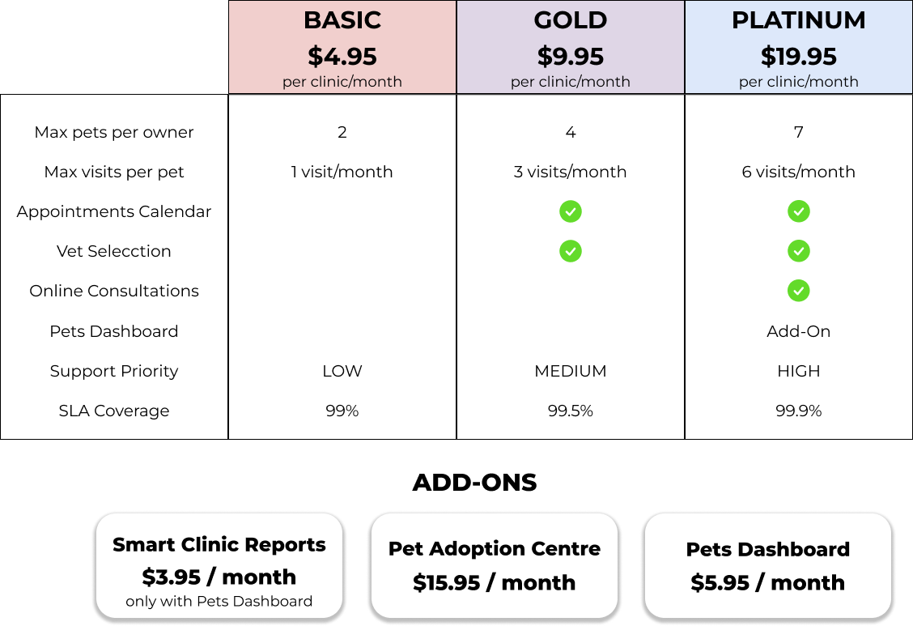

# What is a pricing?

A pricing is a part of a SaaS customer agreement ([García et al., 2021](https://doi.org/10.1016/j.future.2015.03.006)). According to [García-Fernández et al., 2024](https://doi.org/10.1007/978-3-031-61000-4_6), it structures the **features** of a service —i.e., distinctive characteristics whose presence or absence may guide a user’s decision toward a particular subscription— into **plans** and/or **add-ons** to control users' access to such features. When the pricing includes plans, users must subscribe to one of them and may subscribe to as many add-ons as are available for the selected plan. In pricings without plans, where only add-ons are offered, users can subscribe to the allowed combination of add-ons of their choice.

The figure above illustrates a pricing for PetClinic, a sample veterinary clinic management service that developers use to demonstrate the features of a particular software framework or technology in a real-world scenario ([Base version of PetClinic](https://github.com/spring-projects/spring-petclinic)). It includes ten features regulated by three plans and three add-ons (seven by plans, three by add-ons) and imposes **usage limits** on the "pets" and "visits" features. Moreover, the "Pets Dashboard" can be contracted only if the user subscribes to the PLATINUM plan.

Given this running example, it is important to note that not all pricing features are necessarily translated into code within the service. Those that are will be referred to as **functional features**, while those that aren't will be referred to as **extra-functional features**. The latter represents service-level guarantees, such as "Support Priority" and "SLA Coverage" in PetClinic.

Therefore, a SaaS pricing can be considered as the intersection of two distinct, yet complementary, paradigms: the modularity and configurability typical of feature models (FM) in Software Product Lines (SPLs) ([Benavides et al.](https://doi.org/10.1016/j.is.2010.01.001)), and the guarantee-driven approach of service-level agreements (SLAs) ([Keller and Ludwig](https://doi.org/10.1023/A:1022445108617)). While feature models emphasize technical modularity, typically defining variability at the functional feature level, SLAs focus on representing and enforcing non-functional guarantees (e.g., coverage, support levels), i.e. extra-functional features. Pricing models unify these perspectives, capturing both dimensions in a single variability structure. As a result, they become powerful artifacts for addressing the broader business and technical needs of SaaS providers.

In order to interact with the service, a customer establishes a contract. Through it, they accept the terms and conditions exposed in the service’s customer agreement and select a subscription, i.e., a “bundle” that may include a plan and optionally a set of add-ons, ensuring that:

1. The subscription is not empty, i.e., it contains at least a plan or an add-on.
2. If the pricing do have plans, the subscription contains exactly one plan.
3. If the subscription includes a plan, all add-ons it contains must not be excluded for such plan, e.g., the “Pets Dashboard” add-on of PetClinic is only available for the PLATINUM plan, meaning the add-on is excluded for BASIC and GOLD plans.
4. All add-ons on which another add-on depends are also included in the subscription, e.g., in PetClinic, the PetsDashboard add-on depends on the SmartClinicReport add-on, meaning that in order to include the former in a subscription, the latter must be contracted.

Once customers have made their selection, they commit to paying the periodic fee associated with the selected subscription to access the configuration of the SaaS that it grants them. In other words, they gain access to a “version” of the SaaS where features and usage limits are enforced according to the selected plan and add-ons. For example, in PetClinic, customers with a subscription to the BASIC plan can register up to two pets in their account, cannot select a vet, etc.

Given this structure, determining the set of different configurations within a pricing may become very challenging. We thus define the configuration space —i.e., the set of different configurations within a pricing— as the first dimension of variability in such models. In this regard, add-ons play a crucial role in pricing design by enabling a compact set of plans to support a much larger configuration space —accommodating a wide range of user needs without overwhelming customers with too many plan choices. This approach helps to mitigate decision fatigue, in line with the Paradox of Choice ([Schwartz](https://doi.org/10.1002/9781118996874.ch8)), which suggests that an excess of options can reduce satisfaction and hinder decision-making. Unfortunately, such growth of the configuration space also increases the complexity and cost of managing pricing-driven development and operation tasks.