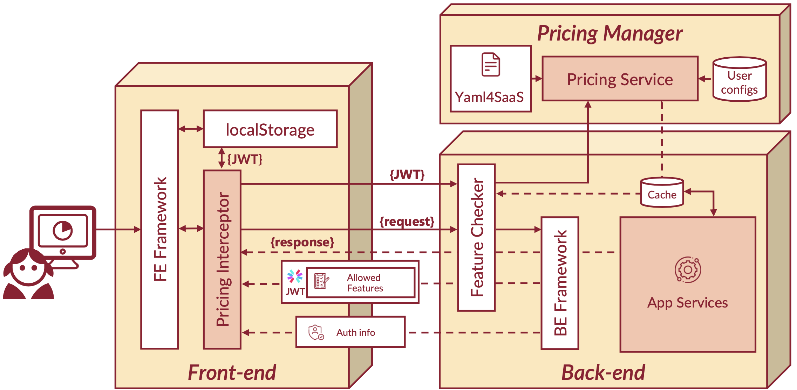

# Pricing4SaaS Global Architecture

Pricing4SaaS is presented as a specification of a reference architecture that addresses some of the challenges outlined in [A. García-Fernández et al.](https://doi.org/10.48550/arXiv.2403.14007). In particular:

1. It simplifies the implementation of pricing-driven changes 
2. Supports stateful and dynamic pricing-driven feature toggling
3. Ensures a secure transmission of the subscription status. 

In general, it elevates pricing plans to a first-class citizen within the architecture of the system, leveraging feature toggles technology to enable dynamic adjustments to the system's functionality without needing to modify the source code, as highlighted by [Martin Fowler](https://martinfowler.com/articles/feature-toggles.html).

The figure above represents the process of a request within the architecture a system that integrates Pricing4SaaS. 

The journey begins at the front-end, where users interact with the system's User Interface (UI). Each user's session is associated with a JWT that contains user subscription details, and optionally user permissions. When a client uses a feature *F*, the front-end can send a request to the back-end, carrying the JWT. 

In the back-end, a **Feature Checker** middle-ware component intercepts the request, and use the **Pricing Service** to evaluate the user's permissions against a [**Pricing2Yaml**](../Pricing2Yaml/the-pricing2yaml-syntax) specification, a YAML-based syntax that models the rules and conditions of a pricing, providing the information needed to determine which features are available under certain circumstances. If the user can access the feature *F*, and the token signature is valid, which means it has not suffered any alterations during the transmission over the network, the back-end processes the request and returns the required data back to the Feature Checker which, in the case that the list of allowed features has changed, generates a new JWT the new list.

Finally, the response is sent back to the front-end, where the new pricing JWT, if present, is processed by the **Pricing Interceptor** and utilized to update the UI according to the new list of allowed features, ensuring a user experience tailored to his subscription.

In such process, the **Feature Checker** is the cornerstone, since it offers two significant enhancements to streamline the system's responsiveness and security. Firstly, it has the capability to preemptively terminate the invocation of feature *F*'s business logic on the back-end, or even to roll back transactions that involve said logic. This is particularly useful in preventing unnecessary processing if *F* is not available to the user, thereby optimizing system resources. Secondly, every time an updated JWT is generated and returned to the front-end through standard API response headers, the front-end is immediately aware of any changes, avoiding the need of making specific requests to update such variables, further enhancing system performance and saving resources. Although there is some extra work in transmitting and evaluating the list of allowed features, this is counterbalanced by the reduction of unnecessary requests handled by the server. 

These advancements not only ensure that the system adheres to the principles of efficiency but also maintains the access controls imposed by the pricing.

:::note
This explanation has been extracted from a subssion to the ICWE 2024 demo track that is currently in revision.
:::