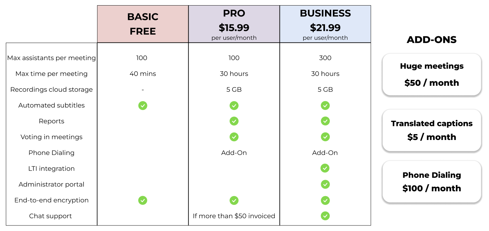
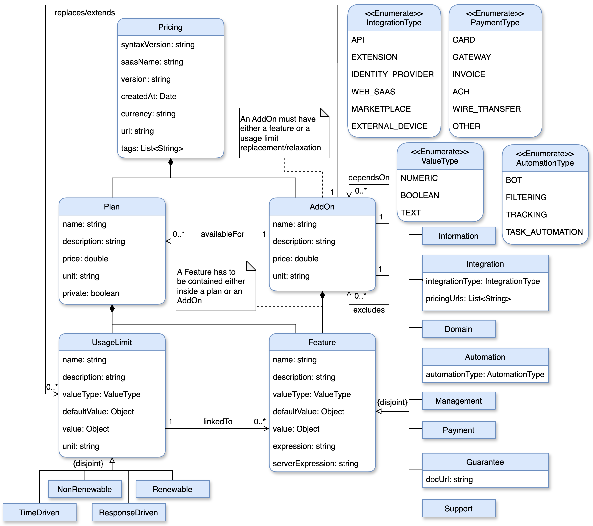

# The iPricing Metamodel

The iPricing metamodel represents one of the first attempts to formalize pricing, so that they can all be designed following the same structure, which favors the creation of automated tools for their generation, analysis, validation, operation, etc.

In order to illustrate the upcomming concepts, we will introduce Zoom, a cloud-based video conferencing service that enables users to conduct virtual meetings (see figure above). In this example, nine features are managed through plans, one feature is associated with an add-on ("translated captions"), and one is governed by both ("phone dialing"). The pricing also enforces usage limits on the "meetings" feature (e.g., maximum assistants per meeting and maximum meeting duration) meaning that although the feature is available in all plans, the extent of their usage differs –higher-priced plans offer higher limits.

:::tip
Pricing entries that impose or extend limits on meetings are considered usage limits rather than individual features –the overarching feature in this case is “meetings”.
:::

Returning to the iPricing metamodel (see figure above), it dictates that the user interacts with the pricing —encompassing **plans**, **add-ons**, or a combination thereof— through a **subscription**, which acts as a pivotal component in regulating the user’s access to the information system (IS) functionalities according to the contract. In addition plans and add-ons consist of **features**, which are the minimum unit within the dissection of the structure. Depending on their contribution to the system they can be classified in one of these types:

- **Domain:** Provide functionality related to the domain of the system, allowing users to perform new operations or access exclusive services.
Example: Voting in meetings in Zoom, which allows meeting organizers to create polls.
- **Integration:** Enable users to interact with the system via its API, or integrate third-party functionalities.
Example: LTI Integration in Zoom allows meeting links to be added to LMS platforms like Blackboard.
- **Automation:** Allow the system to perform actions autonomously, such as monitoring thresholds or triggering bots/AI-based functionality.
Example: Zoom’s automated subtitles.
- **Management:** Target administrators and team leaders to manage accounts, users, or projects.
Example: Zoom’s Administrator portal, which centralizes billing and user management.
- **Information:** Allow users to extract, view, or visualize data from other features.
Example: Zoom’s Reports feature provides statistics on account usage.
- **Guarantee:** Reflect technical commitments or assurances from the provider to the user.
Example: Zoom’s end-to-end encryption for meetings.
- **Support:** Represent the level of customer support provided.
Example: Zoom offers chat support only for PRO and BUSINESS plans.
- **Payment:** Specify available payment methods or billing conditions.

Additionally, the model enables a second-level classification: features can be marked as common or specific, depending on whether they are offered uniformly across all plans. Example: Zoom’s automated subtitles is a common feature.

Features may also be subject to **usage limits**, a concept also found in APIs. These limits are grouped into four types:

- **Renewable:** Limits that reset after a defined period (e.g., daily, monthly). Example: Max participants per meeting in Zoom resets each session.
- **Non-renewable:** Fixed caps that do not reset during the subscription period. Example: Cloud storage capacity for recordings in Zoom.
- **Response-driven:** Quota usage depends on system workload per request. Example: OpenAI’s LLM pricing is token-based, with consumption varying by response length.
- **Time-driven:** Quota is consumed based on active time usage, often tied to a non-renewable cap. Example: Max time per meeting in Zoom.

Finally, iPricings also distinguishes between **public and private plans**:

- **Private plans:** Custom offerings negotiated through direct contact with the sales team, usually with customized pricing. Example: Zoom Enterprise plan.
- **Public plans:** Freely available to all users, with standard fixed pricing.