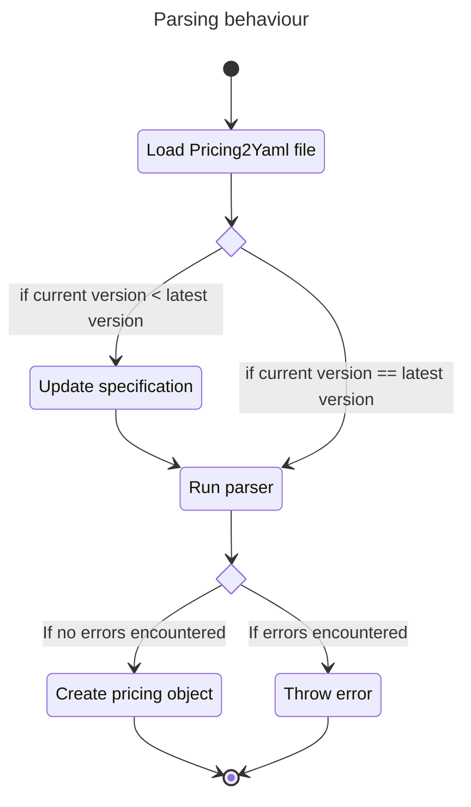
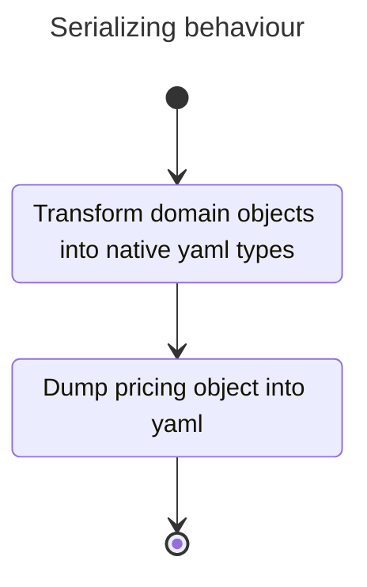

# Contributing to Pricing2Yaml

Contributing to Pricing2Yaml consist of modifying the behaviour
of parsing and serialization of the different libraries.

A state diagram is provided to show how we aproach parsing a Pricing2Yaml file:



A state diagram is provided to show how we dump a pricing object into a yaml file:



At the moment, we have these libraries to parse a Pricing2Yaml specification:

- [Pricing4Java](https://github.com/isa-group/Pricing4Java) written in Java
- [Pricing4TS](https://github.com/Alex-GF/Pricing4TS) written in Typescript

## Think about the extension

:::warning
Please before contributing, read the [latest version](../api/Pricing2Yaml/pricing2yaml-v20-specification.mdx)
of the specification, duplicated extensions will be ignored.
:::

**Before even coding**, you must **answer** the following questions:

- How your extension is called?
- Which domain objects your extension affects?
- What does your extension do?
- What is your motivation to contribute with your extension?
- What is the YAML type of your extension?
- Is your field required or optional?,
- If your field is optional, Any default values are assumed?
- Are there any field constraints or business logic involved?
- How do you use your extension? Provide a `yaml` example demonstrating your extension.

**Write your answers** in a file as you will need them later when filling the issue/PR.

:::info[About Pricing2Yaml example]
Try to create an example that closely mirrors a real-world scenario. This will help us
to understand the value of your contribution from the very beginning.
However,
synthetic data is also acceptable if the provided example is clear enough.

Example of a real world scenario:

```yaml
plans:
  FREE:
  TEAM:
  ENTERPRISE:
  #
```

Example of a synthetic example:

```yaml
plans:
  FOO:
  BAR:
  BAZ:
  #
```

:::

:::info[Suggest an extension with the issue template]
We have written an [issue template](https://github.com/isa-group/Pricing4Java/issues/new?template=01-issue-template.yaml) that includes all questions that should be fullfiled. You can contribute with an extension
opening the issue template in the `docs` [repository](https://github.com/isa-group/Pricing4SaaS-docs).
:::

## Writing code

When you have a clear idea of you extension, now is the time to code.
Indepently of the library you are working on, you have to **make** the **following
changes** in the source code:

1. Update the respective domain object to include your field
2. Create an updater component that al least bumps the minor version of the specification field.
   This is where the code that keeps backwards compatibility should be placed.
3. Link your updater with the previous updaters and make sure it works
4. Code your extensions validations and business logic
5. Update the serializer to include your extension when dumping
   the yaml

## Write tests

### Write positive tests

Write tests checking the behaviour you expect to have
the field. It can be as simple as just asserting the correct
loading of the field or testing complex business logic.

### Write negative tests

Write tests checking if exceptions are thrown or some constraints
are not met.

## Write a PR

Put inside the issue/PR all the answers made in `Think about the extension`
section and submit it.
