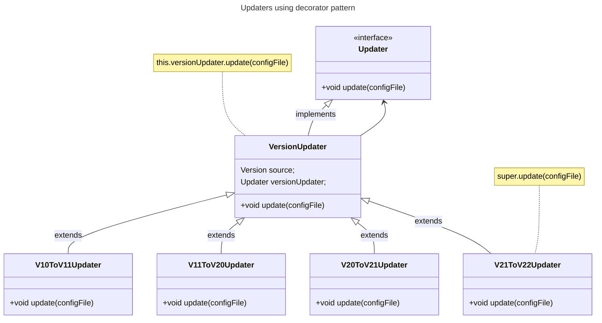

# Pricing4Java guide

## Prerequisites

- Install JDK 17.
- Install a [Maven](https://maven.apache.org/index.html) version
  greater than or equal to `3.8.6` and less than or equal to `3.9.9`.

## Commands

Run test suite:

```bash:
mvn test
```

Run a single test file:

```bash
mvn test -Dtest="PricingManagerTest"
```

Build Pricing4Java package:

```bash
mvn package
```

## Contribution guide

We are going to answer the questions from the _[Think about the extension](./introduction.md#think-about-the-extension)_ section:

**How your extension is called?**

`highlight`

**Which domain objects your extension affects?**

`highlight` only affects plans

**What does your extension do?**

The `highlight` attribute is used to emphasize a plan in the user interface,
making it stand out from others and encouraging the user to purchase it
due to its benefits. When the `highlight` attribute is enable for a plan,
the UI should visually emphasize that specific plan. If `highlight`
is disable, no plans should stand out in the UI.

**What is your motivation to contribute with your extension?**

I saw in Github [pricing](https://github.com/pricing) that Enterprise plan
was surrounded by a box called `recommended`. I think is a good way to draw attention to users.

**What is the YAML type of your extension?**

bool

**Is your field required or optional?**

optional

**If your field is optional, Any default values are assumed?**

If highlight is missing `false` should be assumed by default

**Are there any field constraints or business logic involved?**

Only one plan can have the highlight attribute enabled at a time.

**How do you use your extension?** Provide a `yaml` example demonstrating your extension:

```YAML
plans:
  FREE:
    # highlight not present therefore false
  TEAM:
    # highlight not present therefore false
  ENTERPRISE:
    highlight: true
```

### Writing code

Fork the [Pricing4Java](https://github.com/isa-group/Pricing4Java) and clone it:

```bash
git clone https://github.com/<username>/Pricing4Java.git
```

We are going to add the code needed to make the `highlight` extension following
the steps defined in _Writing code_ section in [Contributing to Pricing2Yaml](introduction.md)

1. Update the respective domain object to include your field

Go to `Plan.java` located inside `models` package and include your new field.

```java title="src/main/java/io/github/isagroup/models/Plan.java"
@Getter
@Setter
@EqualsAndHashCode
public class Plan {
    private String name;
    private String description;
    private Object price;
    private String unit;
    private Boolean isPrivate;
    //highlight-next-line
    private Boolean highlight;
    private Map<String, Feature> features;
    private Map<String, UsageLimit> usageLimits;
}
```

2. Create an updater component that al least bumps the minor version of the specification field.
   This is where the code that keeps backwards compatibility should be placed.

Create a new class called `V21ToV22Updater` that extends `VersionUpdater`.

:::info[Updaters class naming]
An updater class name must be named like `VXYToVYZUpdater.java`, i.e, I take `VXY` file and
transform it into `VYZ` file.
:::

Override the `update` method of inherited `VersionUpdater` class and put inside
the method at least the the following:

- Create a constructor taking as a parameter an updater, then call parent
  constructor with the config file source version it expects and the updater given by parameter.
- Inside override update method, call the parent `update` method and modify the config file with the new bumped version.

```java title="src/main/java/io/github/isagroup/services/updaters/V21ToV22Updater.java"
package io.github.isagroup.services.updaters;

import java.util.Map;

import io.github.isagroup.exceptions.UpdateException;

public class V21ToV22Updater extends VersionUpdater {

    public V21ToV22Updater(Updater updater) {
        super(Version.V2_1, updater);
    }

    @Override
    public void update(Map<String, Object> configFile) throws UpdateException {

        super.update(configFile);
        configFile.put("syntaxVersion", "2.2");
    }

}

```

:::info[Decorator pattern and Updaters]

In Pricing4Java, **updaters** are implemented as **decorators**. This means:

- Each updater wraps another updater, forming a chain of updaters.
- Each updater calls the `update` method of the "wrapped" updater,
  ensuring the updates are applied in a sequence.

`VersionUpdater` is one of the updaters in this decorator chain.
It calls the `update` function of the updater that it wraps (stored in `this.versionUpdater`).

Each updater must invoke `super.update(configFile)` to ensure the base behavior is executed.
If `super.update(configFile)` is not called, the chain of updates could break and the parsing
might not behave as expected.



:::

3. Link your updater with the previous updaters and make sure it works

Put inside the static map of `YamlUpdater` class the new updater you have have
just created. The `key` of the map will be the source version it transforms and
the `value` will be the instantiated `V21ToV22Updater` class. When creating a
`V21ToV22Updater` object query the previous updater of the updater chain inside the
constructor.

After including you updater in the updater map chain modify the line of code
that queries the latest updater available.

```diff title="src/main/java/io/github/isagroup/services/updaters/YamlUpdater.java"
package io.github.isagroup.services.updaters;

public class YamlUpdater {

    static {
        updaters.put(Version.V1_0, new V10ToV11Updater(null));
        updaters.put(Version.V1_1, new V11ToV20Updater(updaters.get(Version.V1_0)));
        updaters.put(Version.V2_0, new V20ToV21Updater(updaters.get(Version.V1_1)));
+       updaters.put(Version.V2_1, new V21ToV22Updater(updaters.get(Version.V2_0)));
    }

    public static void update(Map<String, Object> configFile) throws UpdateException {

        if (versionField instanceof Double || versionField instanceof String) {
            Version version = Version.version(versionField);
            if (updaters.get(version) == null) {
                return;
            }

-            updaters.get(Version.V2_0).update(configFile);
+            updaters.get(Version.V2_1).update(configFile);
        }else{
            throw new PricingParsingException("The syntax version field of the pricing must be a string or a double. Please ensure that the version field is present and correctly formatted");
        }
    }
}

```

Then create a new version of Pricing2Yaml inside `Version` enum called `V2_2(2,2)` , update the
`LATEST` version of `Version` enum and add some validation code:

```diff title="src/main/java/io/github/isagroup/services/updaters/Version.java"

public enum Version {

-    V1_0(1, 0), V1_1(1, 1), V2_0(2, 0), V2_1(2, 1);
+    V1_0(1, 0), V1_1(1, 1), V2_0(2, 0), V2_1(2, 1),
+    V2_2(2, 2);

    private final int major;
    private final int minor;

-    public static final Version LATEST = V2_1;
+    public static final Version LATEST = V2_2;

    public static Version version(int major, int minor) {

        if (major == 1) {
            if (minor == 0) {
                return V1_0;
            } else if (minor == 1) {
                return V1_1;
            }
        } else if (major == 2) {
            if (minor == 0) {
                return V2_0;
            }

            if (minor == 1) {
                return V2_1;
+            } else if (minor == 2) {
+                return V2_2;
+            }
        }

        return null;
    }

    public int getMajor() {
        return major;
    }

    public int getMinor() {
        return minor;
    }

    public static boolean isValid(int major, int minor) {
        boolean oneDotVersions = major == 1 && (minor == 0 || minor == 1);
-        boolean twoDotVersions = major == 2 && (minor == 0 || minor == 1);
+        boolean twoDotVersions = major == 2 && (minor == 0 || minor == 1 || minor == 2);
        return oneDotVersions || twoDotVersions;
    }
```

4. Code your extensions validations and business logic

```java title="src/main/java/io/github/isagroup/services/parsing/PlanParser.java"

public class PlanParser {

    private PlanParser() {
    }

    public static Plan parseMapToPlan(String planName, Map<String, Object> map, PricingManager pricingManager) {

        // ---------- price ----------

        PricingValidators.checkPriceType(map.get("price"), planName);


        if (map.get("price") instanceof String && map.get("price").toString().contains("#")) {
            plan.setPrice(PricingManagerParser.evaluateFormula(map.get("price").toString(), pricingManager));
        } else {
            plan.setPrice(map.get("price"));
        }


        // ---------- highlight ----------
        // highlight-start
        if (map.get("highlight") == null) {
            map.put("highlight", false);
        } else if (!(map.get("highlight") instanceof Boolean)) {
            throw new PricingParsingException("plan " + planName + " received a "
                    + map.get("highlight").getClass().getSimpleName() + " but was expecting a bool");
        }
        plan.setHighlight((Boolean) map.get("highlight"));
        // highlight-end

```

```java title="src/main/java/io/github/isagroup/services/parsing/PricingManagerParser.java"
public class PricingManagerParser {

    private static void setPlans(Map<String, Object> map, PricingManager pricingManager) {

        // code

        for (String planName : plansMap.keySet()) {
            try {
                Map<String, Object> planMap = (Map<String, Object>) plansMap.get(planName);
                Plan plan = PlanParser.parseMapToPlan(planName, planMap, pricingManager);

                plans.put(planName, plan);
            } catch (ClassCastException e) {
                throw new PricingParsingException(
                        "An error has occurred while parsing the plan " + planName + ". Error: " + e.getMessage());
            }
        }

        // highlight-start
        if (plansHaveMultipleHighlight(plans)) {
            throw new PricingParsingException("Multiple highlighted plans are not allowed");
        }
        // highlight-end

        pricingManager.setPlans(plans);
    }

    // highlight-start
    private static boolean plansHaveMultipleHighlight(Map<String, Plan> plans) {
        return plans.entrySet().stream().filter(plan -> plan.getValue().getHighlight()).count() > 1;
    }
    // highlight-end

```

5. Update the serializer to include your extension when dumping
   the yaml

```java title="src/main/java/io/github/isagroup/models/Plan.java"

@Getter
@Setter
@EqualsAndHashCode
public class Plan {

    public Map<String, Object> serializePlan() {

        attributes.put("price", price);
        attributes.put("unit", unit);
        attributes.put("private", isPrivate);
        // highlight-next-line
        attributes.put("highlight", highlight);
    }
```

### Write tests

Writing tests in `Pricing4Java` consist of writting _positve_ and _negative_ yamls
and doing assertions based on the field under test.

:::info[Positive and Negative tests]

- Positive tests are yamls that are well written according to the specification.
- Negative tests are yamls bad written according to Pricing2Yaml specification or
  other yamls that does not satisfy any other business rules.
- Negative tests are parametrized its input is `src/test/resources/negative-parsing-tests.csv` file
  :::

Each leaf `field` in the specification should have a folder with yaml test cases. If a
field has other fields, put child fields inside a parent folder like `addOn`.

```txt tittle="Positive and Negative yaml test structure"
.
└── src/
    └── test/
        └── resources/
            └── parsing/
                ├── positive/
                │   ├── addOn/
                │   │   ├── availableFor/
                │   │   │   └── null-availableFor.yml
                │   │   ├── dependsOn
                │   │   └── ...
                │   ├── billing
                │   └── createdAt
                └── negative/
                    ├── addOn/
                    │   ├── availableFor/
                    │   │   └── ...
                    │   └── dependsOn/
                    │       └── ...
                    ├── billing
                    └── createdAt
```

#### Write positive tests

Add a test that checks if `higlight` is missing `false` gets loaded by default.

Create a folder inside `postive/plan` named `highlight` and copy the following
yaml inside:

```yaml title="src/test/resources/parsing/positive/plan/highlight/no-highlight.yml"
saasName: Test
version: "2.0"
createdAt: 2024-01-09
currency: EUR
features:
  feature1:
    description: Feature 1 description
    valueType: BOOLEAN
    defaultValue: true
    type: DOMAIN
plans:
  BASIC:
    description: Basic plan
    price: 0.0
    unit: user/month
```

Load the yaml file inside the test with `YamlUtils.retrieveManagerFromYaml` methods that takes
the relative path from `resources` folder and assert that the value is false.

```java title="src/test/java/io/github/isagroup/parsing/positive/PlanParserTest.java"
@Test
@DisplayName(value = "When plan 'highlight' is not provided by default is false")
void givenNullHighlightShouldParse() {
    String planName = "BASIC";
    PricingManager pricingManager = YamlUtils.retrieveManagerFromYaml("parsing/positive/plan/highlight/no-highlight.yml");
    assertFalse(pricingManager.getPlans().get(planName).getHighlight());
}
```

Now in the following test we check that a plan can enable `higlight`.

Create the file `higlight.yml` and put it inside `higlight` folder. Put the following content
inside that file:

```yaml title="src/test/resources/parsing/positive/plan/highlight/highlight.yml"
saasName: Test
version: "2.0"
createdAt: 2024-01-09
currency: EUR
features:
  feature1:
    description: Feature 1 description
    valueType: BOOLEAN
    defaultValue: true
    type: DOMAIN
plans:
  BASIC:
    highlight: false
    description: Basic plan
    price: 0.0
    unit: user/month
  PRO:
    highlight: true
    description: Pro plan
    price: 10.0
    unit: user/month
```

```java title="src/test/java/io/github/isagroup/parsing/positive/PlanParserTest.java"
@Test
@DisplayName(value = "PRO plan is higlihted")
void givenHighlightShouldParse() {
    String planName = "PRO";
    PricingManager pricingManager = YamlUtils.retrieveManagerFromYaml(TEST_CASES + "highlight/highlight.yml");
    assertTrue(pricingManager.getPlans().get(planName).getHighlight());
}
```

#### Write negative tests

When writting negative test try to `break` the behaviour of parsing and assert
the exceptions thrown.

Since `higlight` is a `bool` according to the specification, we can assert
that if a `int` is provided an exception should be throw. Put the following file
inside `higlight` under `plan` folder under `negative` tests folder:

```yaml title="src/test/resources/parsing/negative/plan/highlight/number-highlight.yml"
saasName: Test
version: "2.0"
createdAt: 2024-01-09
currency: EUR
features:
  feature1:
    description: Feature 1 description
    valueType: BOOLEAN
    defaultValue: true
    type: DOMAIN
plans:
  BASIC:
    description: Basic plan
    price: 0.0
    highlight: 3
    unit: user/month
```

We can also check if there are multiple `highlight` provided it should throw an exception.
Created the file and put it inside `highlight` folder under `plan` folder under `negative` folder:

```yaml title="src/test/resources/parsing/negative/plan/highlight/multiple-highlight.yml"
saasName: Multiple highlight
version: "2.0"
createdAt: 2024-01-09
currency: EUR
features:
  feature1:
    description: Feature 1 description
    valueType: BOOLEAN
    defaultValue: true
    type: DOMAIN
plans:
  BASIC:
    highlight: true
    description: Basic plan
    price: 0.0
    unit: user/month
  PRO:
    highlight: true
    description: Pro plan
    price: 10.0
    unit: user/month
```

Finally, you have to add two entries in negative tests
file named `negative-parsing-tests.csv` under resources `folder`.
The first entry of the csv file is a test description that summarizes what it does,
second entry is the relative path that is located the file under `resouces` folder and
the third entry is the message thrown by the exception.

Add the following to `negative-parsing-test.csv` file:

```diff title="src/test/resources/negative-parsing-tests.csv"
Throw an error if plan 'private' is not a boolean;parsing/negative/plan/private/string-private.yml;The field "private" should be a boolean
# plan.highlight
+Throw an error if plan 'highlight' is not a boolean;parsing/negative/plan/highlight/number-highlight.yml;plan BASIC received a Integer but was expecting a bool
+Throw an error if plans has multiple 'highlight' set;parsing/negative/plan/highlight/multiple-highlight.yml;Multiple highlighted plans are not allowed
# plans
Throw an error if 'plans' is not a map;parsing/negative/plans/plans-is-boolean.yml;The plans are not defined correctly. It should be a map of plans and their options
```

Check that all went ok running the test suite with `mvn test`.
