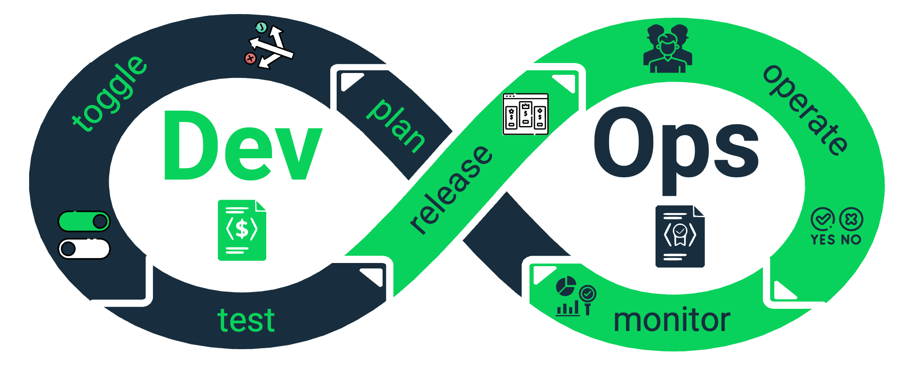

# Welcome to the SPHERE Documentation 🌐

Discover **SPHERE**, a comprehensive platform for **pricing-driven solutions**.

SPHERE brings the paradigm of **pricing-driven development and operation** to life —enabling the continuous optimization of software and infrastructure processes where **pricing models become a primary driver**, directly shaped by **market dynamics and competition**.

Far beyond a single tool, **SPHERE is an ecosystem** —bringing together **libraries, datasets, and tools** into a unified environment designed to help you **model, design, operate, test, and analyze pricings** with intelligence and agility.

---

## Overview: An Ecosystem for Innovation 🔧

SPHERE offers a broad suite of capabilities, making it the foundation for next-generation SaaS pricing and service engineering.  

With SPHERE you can:

- **Model Pricing Structures and Contracts:** – Capture the complexity of modern SaaS pricing.
- **Methodologically design and improve pricings** — Apply best practices and frameworks to enhance pricing strategies.

- **Perform pricing-driven self-adaptation:** – Enable your services to atonomously adapt in real-time based on pricing rules.

- **Testing Enforcement:** – Validate pricing models and their impact on service behavior.

- **Analyze & Compare Plans:** – Users and providers can evaluate different pricing strategies to find the optimal fit for them.

All components are designed to integrate seamlessly, offering a **unified workflow** across the full pricing lifecycle.

---

## Inside the Guide

This documentation introduces you to the core of SPHERE:  

- **User Guides 📖**: Step-by-step tutorials for modeling, managing, and deploying pricing-driven services.  
- **API References ⚙️**: Detailed endpoints, parameters, and examples to integrate SPHERE into your workflows.  
- **SDKs & Clients 💻**: Explore official libraries (Node.js, React, etc.) to accelerate development.  
- **Advanced Tools 🔬**: Learn about the analytical engines and datasets included within SPHERE.  

---

## Getting Started 🚀

We recommend starting with the **[Core concepts section](../api/core-concepts/terminology.md)**, to understand the terminology behind this ecosystem.

This foundation will help you fully appreciate SPHERE’s capabilities along the other sections, so that you can effectively leverage them in your SaaS ecosystem.

---

## Support & Feedback 📣

Our team is committed to helping you succeed.  

If you encounter challenges or have suggestions, we welcome your feedback — SPHERE is continuously evolving to support cutting-edge research and industry needs.  

---

Embark on your journey with **SPHERE** today, and transform the way you think about **pricing-driven SaaS engineering**.