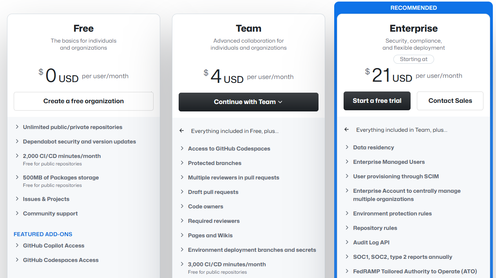
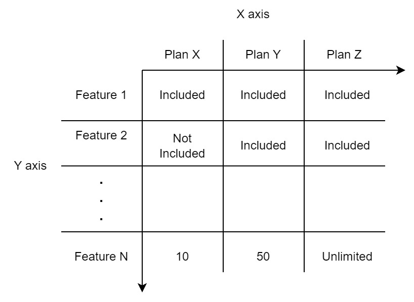
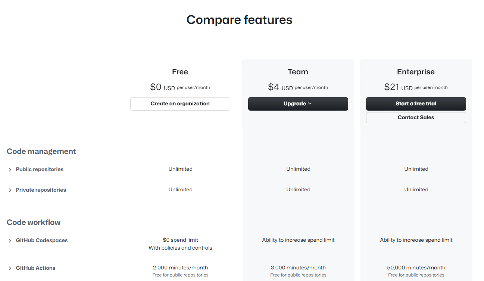
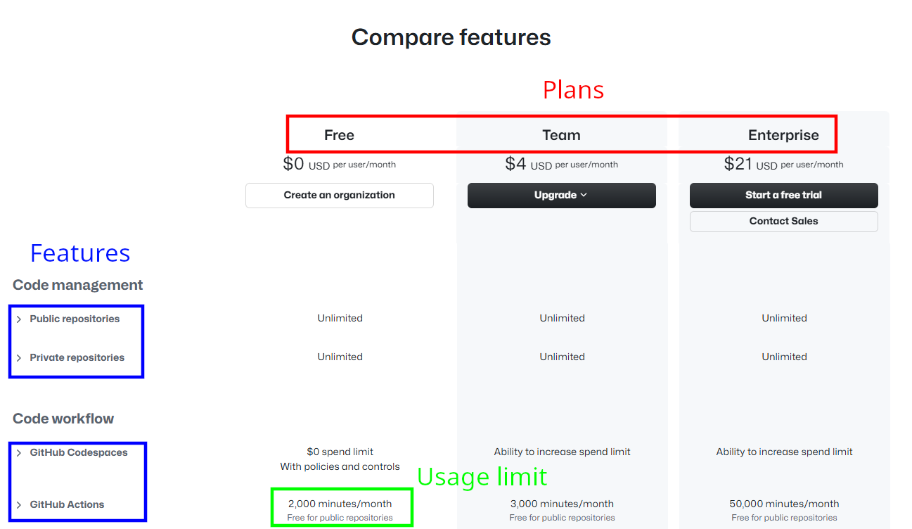

# 🔄 Turn your pricing into iPricing

In this tutorial, we'll model a portion of GitHub Pricing step by step to help you become familiar with the
**Pricing2Yaml** syntax.

:::warning
Some fields are intentionally omitted to reduce the verbosity of the yaml snippets. These examples are **INVALID** in Pricing2Yaml syntax unless explicitly stated otherwise.
:::

## Search the pricing

Our first task is to locate the main pricing page. Currently it is hosted [here](https://github.com/pricing).

:::info
Some SaaS providers may have different pricing page URLs for each country where the product is sold.
For example, take a look at:

- English version of [Trustmary](https://trustmary.com/pricing/)
- Spanish version of [Trustmary](https://trustmary.com/es/precios/)

:::

In this page we can see two different views of the same pricing

### Pricing overview

This type of view gives a quick snapshot of the main features of the SaaS, making it easier to avoid overwhelming your clients with too much detail. Check out the GitHub pricing breakdown:



### Detailed pricing

This type of view breaks down all the features available to end users. Features are arranged in a **matrix**, where the
**X-axis** represents the available plans and the **Y-axis** lists the features. Each cell in the matrix indicates whether a feature is included in a given plan or specifies any restrictions on its usage.



Take a look at Github pricing matrix:



## Describing the pricing

The detailed pricing **matrix** is usually the most **informative**, so we’ll start by modeling it from scratch using _Pricing2Yaml_.

:::info
In 99.9% of cases, all pricing information is found on the main pricing page. However, in some situations, you may need to explore other pages or sections of the provider's site to uncover additional details.
:::

The first step in modeling a pricing is to review the [Pricing2Yaml Syntax](../api/pricing-description-languages/Pricing2Yaml/the-pricing2yaml-syntax.md) and choose a specific version to follow. In this tutorial, I’ll be using version `2.1`.

Next, we’ll begin by filling in the required pricing metadata, i.e, `syntaxVersion`, `saasName`, `createdAt` and `currency`.

```yaml
syntaxVersion: "2.1"
saasName: Github
createdAt: "2025-04-24"
currency: USD
```

Pay attention to the use of [currency codes](https://en.wikipedia.org/wiki/ISO_4217) to specify the currency of the pricing, as well as the quotation marks around `syntaxVersion` and `createdAt`.

Now that we’ve completed the required metadata, we can begin modeling the **basic building blocks** of the pricing. A pricing consists of `features`, `usageLimits`, `plans` and `addOns`. Let's break down the pricing matrix to
identify these parts:



We can model these elements in the pricing using the `features`, `usageLimits`, and `plans` mappings. Each of these fields accepts a map where the **key** represents the **name** of the corresponding feature, usage limit, or plan, and the **value** is another **map** that holds the **attributes** for that feature, usage limit, or plan:

```yaml
syntaxVersion: "2.1"
saasName: Github
createdAt: "2025-04-24"
currency: USD
// highlight-start
features:
  publicRepositories:
  privateRepositories:
  githubCodespaces:
  githubActions:
usageLimits:
  publicRepositoriesLimit:
  privateRepositoriesLimit:
  githubCodespacesLimit:
plans:
  free:
  team:
  enterprise:
// highlight-end
```

### Defining Features

Let's dive into the details of the feature fields.

A feature must define at least `type`, `valueType` and `defaultValue`. According to Pricing2Yaml, there are 8 feature types: `AUTOMATION`, `DOMAIN`, `GUARANTEE`,
`INFORMATION`, `INTEGRATION`, `MANAGEMENT`, `PAYMENT` and `SUPPORT`. Given that GitHub's primary focus is to host Git repositories and simplify code management with features like GitHub Codespaces and GitHub Actions, the most appropriate feature `type` for these features is `DOMAIN`.

```yaml
syntaxVersion: "2.1"
saasName: Github
createdAt: "2025-04-24"
currency: USD
features:
  publicRepositories:
    // highlight-next-line
    type: DOMAIN
  privateRepositories:
    // highlight-next-line
    type: DOMAIN
  githubCodespaces:
    // highlight-next-line
    type: DOMAIN
  githubActions:
    // highlight-next-line
    type: DOMAIN
```

After defining the feature type, you must specify the `valueType` and `defaultValue` it holds. In `Pricing2Yaml` syntax, the possible `valueType` options are `BOOLEAN`, `NUMERIC`, and `TEXT`. If you choose `BOOLEAN` as the value `type`, only boolean values are allowed in the `defaultValue` field. If `NUMERIC` is selected, only integers or floats are permitted, and with `TEXT`, only strings can be used.

For example, Public Repositories, Private Repositories, GitHub Codespaces, and GitHub Actions are all `BOOLEAN` features with a `defaultValue` of `true`, as they are available across all plans. We will address features usage limits in the [Usage limits and Features](#usage-limits-and-features) section later.

```yaml
syntaxVersion: "2.1"
saasName: Github
createdAt: "2025-04-24"
currency: USD
features:
  publicRepositories:
    type: DOMAIN
    // highlight-start
    valueType: BOOLEAN
    defaultValue: true
    // highlight-end
  privateRepositories:
    type: DOMAIN
    // highlight-start
    valueType: BOOLEAN
    defaultValue: true
    // highlight-end
  githubCodespaces:
    type: DOMAIN
    // highlight-start
    valueType: BOOLEAN
    defaultValue: true
    // highlight-end
  githubActions:
    type: DOMAIN
    // highlight-start
    valueType: BOOLEAN
    defaultValue: true
    // highlight-end
```

Next, add a `description` field to each feature to clearly explain its purpose and usage to end users. After that, we’ll organize features into groups using the global `tags` field along with the individual `tag` field within each feature. This makes it easier to **locate** and **manage** features in your text editor and it is especially helpful when working with large _Pricing2Yaml_ files:

```yaml
syntaxVersion: "2.1"
saasName: Github
createdAt: "2025-04-24"
currency: USD
// highlight-start
tags:
- Code management
- Code workflow
// highlight-end
tags:
features:
  publicRepositories:
    // highlight-start
    description: Host open source projects in public GitHub repositories,
      accessible via web or command line. Public repositories are accessible to anyone at GitHub.com.
    tag: Code management
    // highlight-end
    type: DOMAIN
    valueType: BOOLEAN
    defaultValue: true
  privateRepositories:
        // highlight-start
    description: Host code in private GitHub repositories, accessible via appliance,
      web, and command line. Private repositories are only accessible to you and people you share them with.
    tag: Code management
    // highlight-end
    type: DOMAIN
    valueType: BOOLEAN
    defaultValue: true
  githubCodespaces:
    // highlight-start
    description: Spin up fully configured dev environments in the cloud with the
      power of your favorite editor. A "core hour" denotes compute usage. On a 2-core machine,
        you would get 60 hours free. On a 4-core machine, you would get 30 hours free, etc.
        Free hours are assigned to personal accounts, rather than free organizations.
    tag: Code workflow
    // highlight-end
    type: DOMAIN
    valueType: BOOLEAN
    defaultValue: true
  githubActions:
    // highlight-start
    description: Use execution minutes with GitHub Actions to automate your
      software development workflows. Write tasks and combine them to build, test,
      and deploy any code project on GitHub. Minutes are free for public repositories.
    tag: Code workflow
    // highlight-end
    type: DOMAIN
    valueType: BOOLEAN
    defaultValue: true
usageLimits:
  githubCodespacesLimit:
plans:
  free:
  team:
  enterprise:
```

### Usage limits and Features

After we have defined our set of features we can step through each feature and see
if usage limits should be defined.

Public and private repositories are unlimited for all plans. We have two options

Once we've defined our set of features, the next step is to evaluate whether any of them require usage limits.

In the case of public and private repositories, they are _Unlimited_ across all plans. This leaves us with two options:

- Create usage limits with an infinite value
- Omit defining usage limits entirely, since all plans shared the same limit.

We'll go with the first approach.

When defining a usage limit, you must specify at least the `type`, `valueType`, and `defaultValue` fields, following the same logic used for features. For usage limits, a `NUMERIC` `valueType` is the most suitable, with a `defaultValue` of `.inf` to represent infinity/unlimited:

```yaml
features:
  publicRepositories:
    valueType: BOOLEAN
    defaultValue: true
  privateRepositories:
    valueType: BOOLEAN
    defaultValue: true
  githubCodespaces:
    valueType: BOOLEAN
    defaultValue: true
  githubActions:
    valueType: BOOLEAN
    defaultValue: true
usageLimits:
  publicRepositoriesLimit:
    // highlight-start
    type: NON_RENEWABLE
    valueType: NUMERIC
    defaultValue: .inf
    // highlight-end
  privateRepositoriesLimit:
    // highlight-start
    type: NON_RENEWABLE
    valueType: NUMERIC
    defaultValue: .inf
    // highlight-end
```

:::info
If you want to specify an infinite amout you can use `.inf` [keyword](https://yaml.org/spec/1.2.2/#10214-floating-point)
in YAML.
:::

Now the next step is to link your defined usage limits with the features previously defined with `linkedFeatures` field.
The default behaviour when you miss `linkedFeatures` fields is to link usage limits with the plan, and that is not
what we intend. Put the name of the feature inside an array in `linkedFeatures`.

The next step is to link your defined `usageLimits` to the corresponding `features` using the `linkedFeatures` field.
By default, if `linkedFeatures` is omitted, the usage limit is associated directly with the plan (which is not
what we want in this case). To establish the link, specify the feature's name inside an array assigned to `linkedFeatures`:

```yaml
features:
  publicRepositories:
    valueType: BOOLEAN
    defaultValue: true
  privateRepositories:
    valueType: BOOLEAN
    defaultValue: true
  githubCodespaces:
    valueType: BOOLEAN
    defaultValue: true
  githubActions:
    valueType: BOOLEAN
    defaultValue: true
usageLimits:
  publicRepositoriesLimit:
    type: NON_RENEWABLE
    valueType: NUMERIC
    defaultValue: .inf
    // highlight-start
    linkedFeatures:
      - publicRepositories
    // highlight-end
  privateRepositoriesLimit:
    type: NON_RENEWABLE
    valueType: NUMERIC
    defaultValue: .inf
    // highlight-start
    linkedFeatures:
      - privateRepositories
    // highlight-end
```

Next, define an usage limit for Github actions.

```yaml
features:
  publicRepositories:
    valueType: BOOLEAN
    defaultValue: true
  privateRepositories:
    valueType: BOOLEAN
    defaultValue: true
  githubCodespaces:
    valueType: BOOLEAN
    defaultValue: true
  githubActions:
    valueType: BOOLEAN
    defaultValue: true
usageLimits:
  publicRepositoriesLimit:
    type: NON_RENEWABLE
    valueType: NUMERIC
    defaultValue: .inf
    linkedFeatures:
      - publicRepositories
  privateRepositoriesLimit:
    type: NON_RENEWABLE
    valueType: NUMERIC
    defaultValue: .inf
    linkedFeatures:
      - privateRepositories
  // highlight-start
  githubActionsLimit:
    type: RENEWABLE
    valueType: NUMERIC
    defaultValue: 2000
    linkedFeatures:
      - githubActions
  // highlight-end
```

Plain numbers without setting a unit lacks meaning, so add `unit` field to usage limits:

```yaml
features:
  publicRepositories:
    valueType: BOOLEAN
    defaultValue: true
  privateRepositories:
    valueType: BOOLEAN
    defaultValue: true
  githubCodespaces:
    valueType: BOOLEAN
    defaultValue: true
  githubActions:
    valueType: BOOLEAN
    defaultValue: true
usageLimits:
  publicRepositoriesLimit:
    type: NON_RENEWABLE
    valueType: NUMERIC
    defaultValue: .inf
    // highlight-next-line
    unit: repository
    linkedFeatures:
      - publicRepositories
  privateRepositoriesLimit:
    type: NON_RENEWABLE
    valueType: NUMERIC
    defaultValue: .inf
    // highlight-next-line
    unit: repository
    linkedFeatures:
      - privateRepositories
  githubActionsLimit:
    type: RENEWABLE
    valueType: NUMERIC
    defaultValue: 2000
    // highlight-next-line
    unit: minute/month
    linkedFeatures:
      - githubActions
```

### Configuring Plans

With `features` and `usageLimits` now modeled, we can begin defining the specific values
for each feature and usage limit within each plan.

Define the `price` field for every plan. If you want to offer some kind of discount annually, refer to
`billing` in the [Pricing2Yaml 2.1](../api/pricing-description-languages/Pricing2Yaml/versions/pricing2yaml-v21-specification.mdx) documentation:

```yaml
plans:
  free:
    // highlight-next-line
    price: 0.0
  team:
    // highlight-next-line
    price: 4.0
  enterprise:
    // highlight-next-line
    price: 21.0
```

To override the default values defined in the `features` and `usageLimits` blocks, you can
use the `features` and `usageLimits` fields within each plan. These fields accept a map
where each **key** is the name of the corresponding feature or usage limit, and the **value**
is a **map** containing a **value** field. When used, this structure **overrides**
the `defaultValue`s specified earlier. If you do not want to override any feature or usage
limit `defaultValue` just specify a `null`:

```yaml
plans:
  free:
    price: 0.0
    // highlight-start
    features: null
    usageLimits: null
    // highlight-end
  team:
    price: 4.0
    features: null
    // highlight-start
    usageLimits:
      githubCodespacesLimit:
        value: 3000
    // highlight-end
  enterprise:
    price: 21
    features: null
    // highlight-start
    usageLimits:
      githubCodespacesLimit:
        value: 50000
    // highlight-end
```

Finally, add a `unit` field just like in `usageLimits` to indicate what
the plan price represents. In this case, the plan is billed monthly per user:

```yaml
plans:
  free:
    price: 0.0
    // highlight-next-line
    unit: user/month
    features: null
    usageLimits: null
  team:
    price: 4.0
    // highlight-next-line
    unit: user/month
    features: null
    usageLimits:
      githubCodespacesLimit:
        value: 3000
  enterprise:
    price: 21
    // highlight-next-line
    unit: user/month
    features: null
    usageLimits:
      githubCodespacesLimit:
        value: 50000
```

## Result

Here is the final **VALID** Pricing2Yaml configuration file:

```yaml
syntaxVersion: "2.1"
saasName: Github
createdAt: "2025-04-24"
currency: USD
tags:
  - Code management
  - Code workflow
features:
  publicRepositories:
    description: Host open source projects in public GitHub repositories,
      accessible via web or command line. Public repositories are accessible to anyone at GitHub.com.
    tag: Code management
    type: DOMAIN
    valueType: BOOLEAN
    defaultValue: true
  privateRepositories:
    description:
      Host code in private GitHub repositories, accessible via appliance,
      web, and command line. Private repositories are only accessible to you and people you share them with.
    tag: Code management
    type: DOMAIN
    valueType: BOOLEAN
    defaultValue: true
  githubCodespaces:
    description: Spin up fully configured dev environments in the cloud with the
      power of your favorite editor. A "core hour" denotes compute usage. On a 2-core machine,
      you would get 60 hours free. On a 4-core machine, you would get 30 hours free, etc.
      Free hours are assigned to personal accounts, rather than free organizations.
    tag: Code workflow
    type: DOMAIN
    valueType: BOOLEAN
    defaultValue: true
  githubActions:
    description: Use execution minutes with GitHub Actions to automate your
      software development workflows. Write tasks and combine them to build, test,
      and deploy any code project on GitHub. Minutes are free for public repositories.
    tag: Code workflow
    type: DOMAIN
    valueType: BOOLEAN
    defaultValue: true
usageLimits:
  publicRepositoriesLimit:
    type: NON_RENEWABLE
    valueType: NUMERIC
    defaultValue: .inf
    unit: repository
    linkedFeatures:
      - publicRepositories
  privateRepositoriesLimit:
    type: NON_RENEWABLE
    valueType: NUMERIC
    defaultValue: .inf
    unit: repository
    linkedFeatures:
      - privateRepositories
  githubCodespacesLimit:
    type: RENEWABLE
    valueType: NUMERIC
    defaultValue: 2000
    unit: minute/month
    linkedFeatures:
      - githubCodespaces
plans:
  free:
    price: 0.0
    unit: user/month
    features: null
    usageLimits: null
  team:
    price: 4.0
    unit: user/month
    features: null
    usageLimits:
      githubCodespacesLimit:
        value: 3000
  enterprise:
    price: 21
    unit: user/month
    features: null
    usageLimits:
      githubCodespacesLimit:
        value: 50000
```
