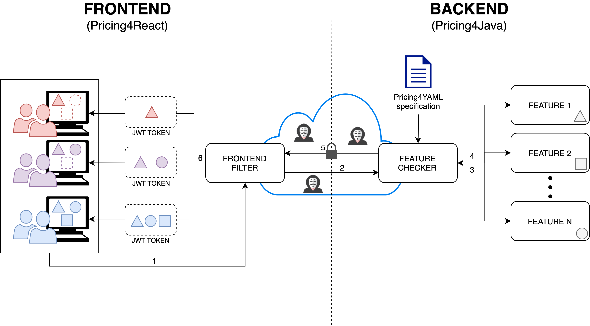

# Pricing4SaaS Global Architecture

The following figure represents the global architecture of Pricing4SaaS along with the journey of a request within this model.

The journey begins at the front-end (1), where users interact with the system's User Interface (UI). Each user's session is associated with a JWT token that encodes permissions and subscription details. When a client uses a feature `F`, the front-end sends a request to the back-end, carrying his JWT token (2). 

In the back-end, *Pricing4Java* acts as the **Feature Checker** middleware component (3) and intercepts the request to evaluate the client's JWT token against a **Yaml4SaaS** specification, a YAML-based syntax that models the rules and conditions of a pricing and determine the features available under certain circumstances. If `F` is enabled for the user, and the token signature is correct, which means it has not suffer any alterations during the transmission over the network, the back-end processes the request and returns the required data again to the Feature Checker (4), which wraps an updated version of the feature evaluation into the JWT if it has changed, e.g. limit of `F` has been reached by the user after using it. 

Finally, the response is sent to the front-end (5), where *Pricing4React* process the new JWT, if exists, and updates the UI according with the feature evaluations received (6), ensuring a seamless user experience tailored to user's subscription. In this case, the button activating `F` should disappear.